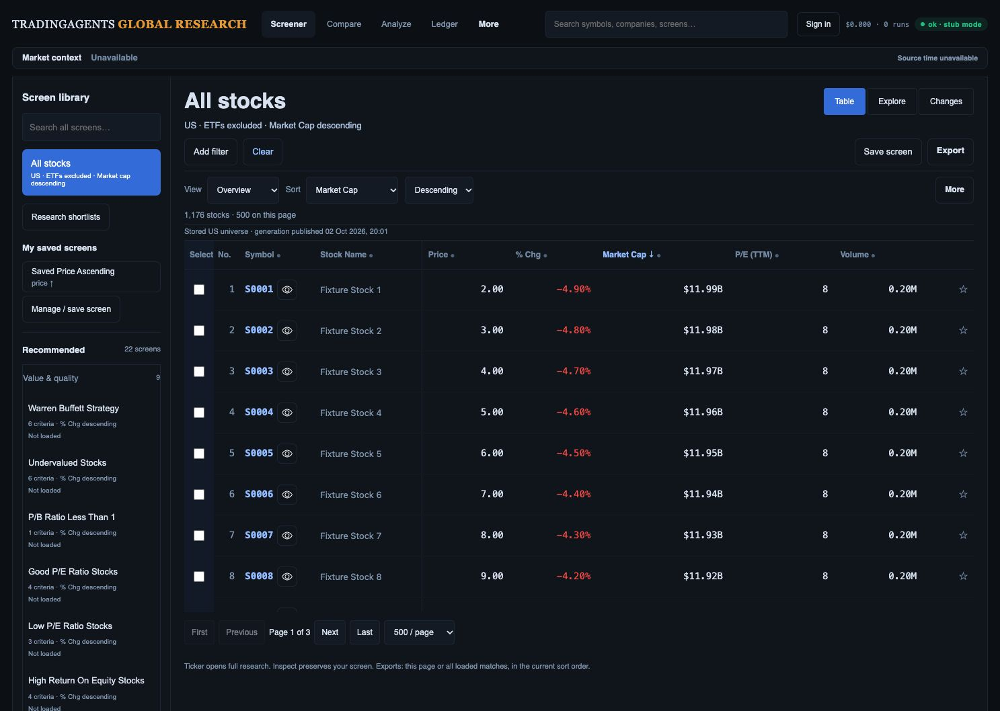
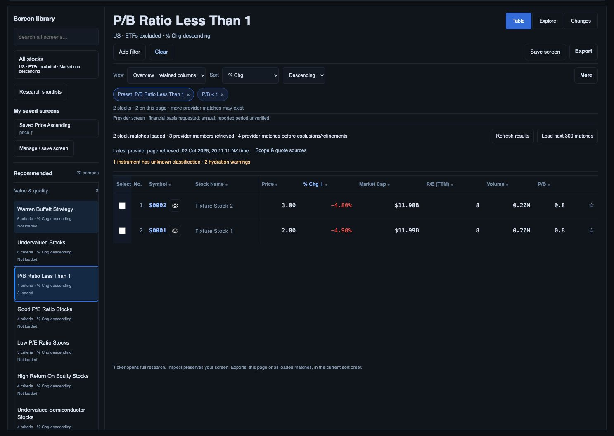
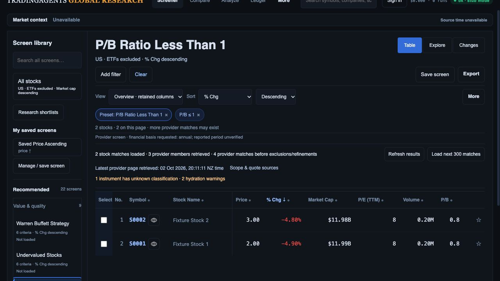
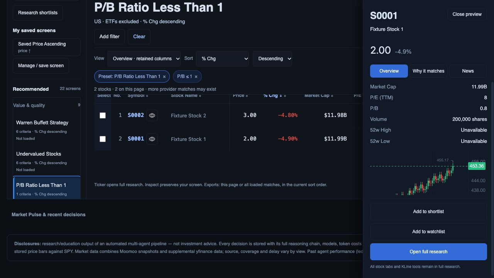
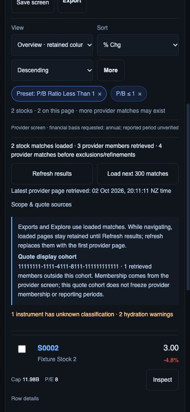

# Compact provider coverage and inspector hierarchy

2 October 2026, following `811d595`. Local presentation checkpoint; no merge/deployment or live financial qualification.

## Changes

Provider coverage groups loaded-stock/retrieved-member/provider-total counts with refresh/paging actions. Latest-page retrieval and expandable scope/quote sources share a row. Unknown classification and hydration-warning counts remain visible; detailed warnings expand in place. Refresh failure/previous-results status remains explicit. Phone controls/disclosure summaries retain 44 px height; source UUIDs wrap without document overflow. No provider criterion, sort, identity, membership, quote or export value changed.

Inspector Overview puts all six existing quote metrics before the chart and raises source/history text to 12 px. The bundled KLineCharts 9.8.10 preview uses its supported `follow_cross` tooltip rule and date/close fields, removing the always-visible OHLC overlay. Full research's shared theme, chart tools and adapter are unchanged. The preview's ranges, unavailable metrics, source details and research/list/watchlist actions remain reachable.

## Fresh rendered evidence

All five screenshots were saved and opened. Actual API routes use controlled offline provider transport, synthetic stock identities and recorded chart data. S0001 quote 2.00 and chart near 453 remain deliberately incompatible fixtures; these captures qualify layout/interaction only.

1. Default Table at **1487 × 1058**, scrollY 0: table top **357.625 CSS px**, document width 1487. The original ≤360 px default table-start criterion passes in this state. All 22 original recommendations remain visible in the DOM.

   

2. P/B preset at 1487 × 1058: two stocks, three retrieved members, four provider matches before exclusions, one unknown and two warnings. Declared % change descending retained. Screenshot captured scrolled context (scrollY 100); table viewport top 425.625, document position 525.625. Quality disclosure opened to the actual warning messages and closed again.

   

3. Same warning-bearing P/B state at **1280 × 720**: measured table document position **525.625 px**, versus the previous 570.2 px laptop checkpoint. Approximately **45 px less vertical space**; this is not a ≤360 px filtered-state claim. Initial resize screenshot showed transient scaling and was rejected/replaced with the settled laptop capture. Final capture includes scrolled context.

   

4. Inspector at laptop width: six quote metrics precede the chart; no persistent OHLC block obscures the plot. Close, shortlist, watchlist and full research actions remain visible. Range/source content remains in the inner scrolling pane; the complete evidence hierarchy is not closed.

   

5. **390 × 844 phone**: document width 390. Both paging/refresh buttons and both source/quality disclosure summaries measured **44 px high**. Expanded source UUID/retention disclosure fits the viewport. Paging produced three stocks/four members, explicit refresh restored two stocks/three members, and Clear settled on All stocks, ETFs excluded, market-cap descending. Temporary viewport override reset. Final browser warning/error logs empty.

   

## Verification and remaining work

**82 JavaScript tests pass**, including existing all-22/reset/declared-sort/retention/race/export checks and a new partial-coverage/warning/escaping/refresh-busy test. `git diff --check` passes. The API/worker suite last passed **379 tests** at the preceding unchanged-backend checkpoint; it was not rerun for this presentation-only change.

D02/D03 remain open: company taxonomy/website qualification, criterion-first evidence, typography/contrast/focus/full AT/zoom/devices and analyst-task/p95 acceptance. Original mockups' advanced factors/trends must be backed by qualified data and bounded lazy loading. R04 reload/deep-link/screen-version/full research/Compare preservation remains open, as do team/pair review, Explorer apply/save/collisions, capture automation, real financial/Moomoo reconciliation, all-scope downloaded exports and native/production migration/cutover/rollback/release gates.
