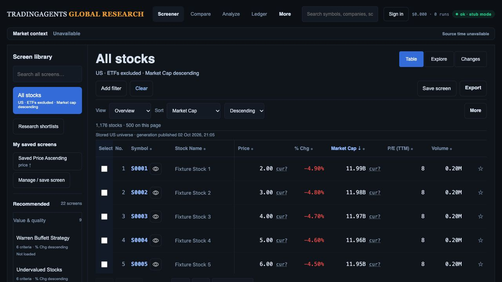
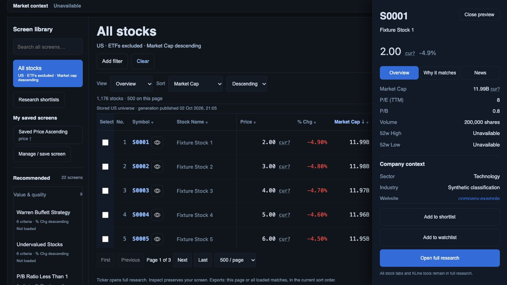
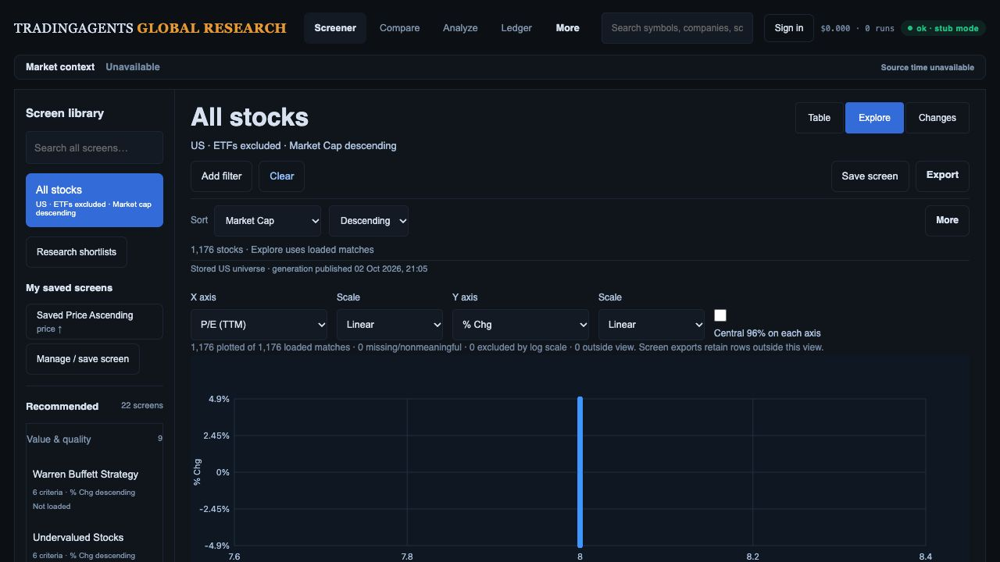
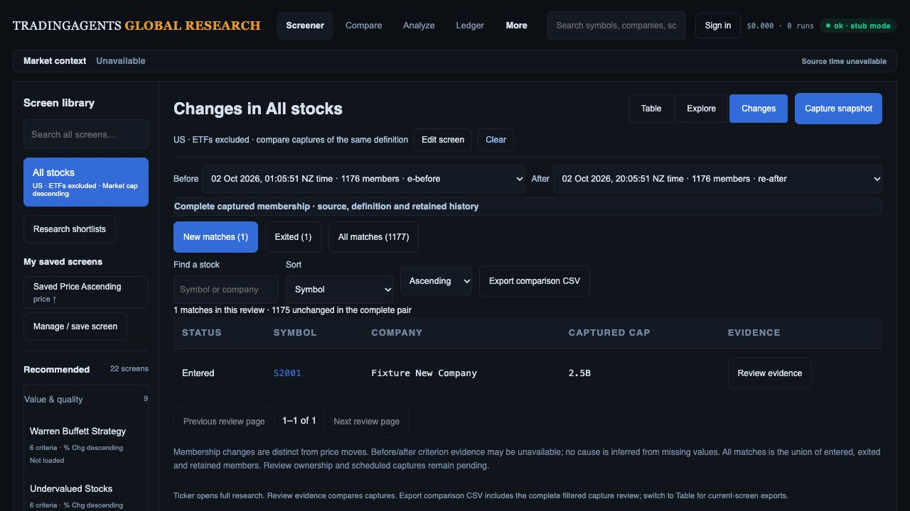
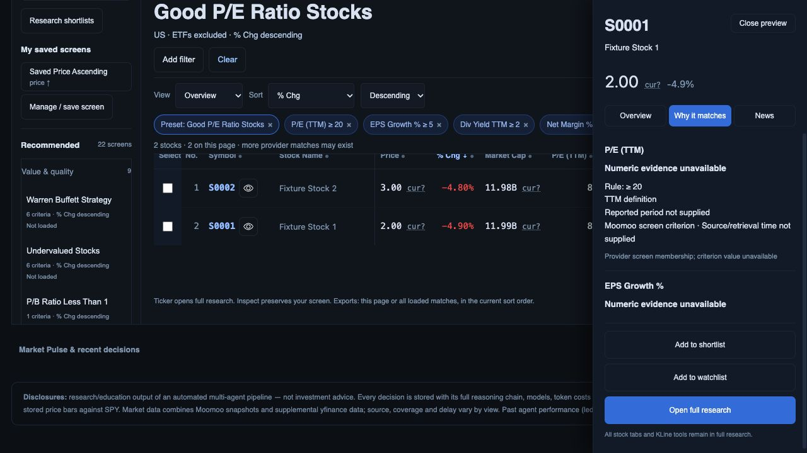

# Current build against the approved three concepts

Reviewed 2 October 2026 on `codex/investment-team-release-evidence`, baseline `1d5b1b1` plus the company-context/evidence changes in this checkpoint. This review supersedes the implementation-status statements in earlier reviews. The approved architecture remains screen → inspect → full research/Compare → shortlist/export → review changes. Preserve all 22 original preset definitions and sorts; the shorter illustrated library is not a replacement.

## Evidence and limits

Five fresh screenshots below were captured through the in-app browser, saved and opened for inspection. The actual application/API preview on port 8896 loaded the current backend and static files, with immutable-generation, provider-generation and company-context fixtures enabled. Viewport 1280 × 720; the original concepts are 1487 × 1058. Both sets were inspected in this run. This is a hierarchy and workflow comparison, not matched-state pixel acceptance.

The 1,176 stocks, company.example website and classifications are synthetic. The recorded chart is incompatible with the fixture quote and cannot qualify investment data. The filtered provider fixture deliberately lacks criterion values: its membership must not be justified using hydrated quote values. No live Moomoo reconciliation, production Auth/migrations, performance percentile or full accessibility claim follows from these checks. Browser warning/error log was empty. No merge/deployment occurred.

## Reviewed flow

1. **Desk — functional core; presentation and data attribution incomplete.** All stocks, ETFs excluded, cap descending, persistent Clear, grouped 22-screen library and export control are visible. Clear after opening a preset restored that default and Overview columns. Monetary values now identify unknown currency consistently rather than implying dollars. Compared with the original [Desk](../references/02-research-desk.png), small secondary text and tall library metadata still reduce scanning; row trends remain absent. Optional trends need lazy batched retrieval, coherent instrument identity, span/interval/source labels and a request budget.

   

2. **Inspector — company context implemented locally; continuity and disclosure placement incomplete.** The new cached endpoint supplies fresh sector/industry/site for the exact canonical code, uses the existing supplemental freshness contract, and performs no vendor retrieval. Structured/stale data stays unavailable; website links reject non-HTTP schemes and embedded credentials. A bounded 30-second cache avoids repeat calls and an inspector generation guard rejects obsolete DOM writes. The screenshot shows metrics and company context before the chart. The footer remains reachable, but source detail falls below the visible content. Opening the inspector moves the document and hides navigation: fix focus with scroll preservation and verify close restores the originating row. Show actual field retrieval dates on demand; current company context is explicitly separate from the pinned quote generation.

   

3. **Explorer — plot and existing handoffs implemented; analytical panel incomplete.** Current counts describe loaded/plotted coverage. Region apply/save/reload and coordinate-collision keyboard/pointer selection are existing local work, not new missing-feature tickets. Against the original [Explorer](../references/03-factor-explorer.png), bounds/apply/save/Compare remain below the working viewport; sector legend, currency-consistent bubble sizing, qualified forward valuation/growth and cohort-labelled percentiles remain missing or gated. Constant fixture P/E produces a vertical line; do not alter observations with jitter. Move a concise selection summary alongside the plot before adding analytical encodings.

   

4. **Changes — membership comparison works; analyst queue incomplete.** The settled pair shows 1 entered, 1 exited, 1,175 retained and a 1,177-member union. Pair controls, search/sort, evidence and CSV exist. Against the original [Changes](../references/04-change-monitor.png), pair-specific review status/notes, Next unreviewed, selection/bulk actions and opt-in schedules remain missing. Captured cap still lacks the Desk's explicit currency treatment: extend the shared contract to Changes, Compare, private lists and their exports. Existing criterion columns/matrix require a meaningful filtered pair and compatible observations before cause labels.

   

5. **Filtered evidence — more honest period labels; criterion/display alignment incomplete.** Good P/E Ratio applies its original four rules and declared % change sort; criterion columns are present. The inspector now separates TTM/annual basis requested from actual reported period, retains valid numeric zero, rejects booleans as numeric evidence, and discloses missing criterion values. It does not borrow hydrated quote observations to justify provider membership. The fixture displays P/E 8 beside a ≥20 rule while criterion evidence is unavailable: visibly distinguish displayed quote versus membership observation and reconcile actual provider evidence. Supplemental custom filters appended to a preset also need per-criterion source routing; a blanket provider flag is insufficient. Percentage formatting must be consistent in dynamically added table columns.

   

Visible accessibility risks are small secondary labels, dense controls, icon-only row actions, below-fold plot handoffs and inspector-induced page movement. Keyboard/focus, screen-reader announcements, contrast, zoom, reduced motion and phone/tablet task completion still need independent checks.

## Ordered build plan and checklist

The [R01–R15 register](../../investment-workspace-current-gap-plan.md#gap-register) remains the complete release checklist. Each packet needs implementation, regression preservation, real data contracts and fresh browser evidence. Local progress is not release acceptance.

| Order | Build elements and touchpoints | Required exit evidence |
| --- | --- | --- |
| 1 — field and membership truth | API provider parsing/hydration and field observations; shared UI/exports registry. Route each rule to its actual source, preserve criterion retrieval clocks independently of display origins, reject invalid numeric inputs, qualify Yahoo share classes and payout-ratio units. Extend currency display to Changes/Compare/lists; never infer currency or annual periods. | Exact identity/value/unit/currency/period/source tests; explicit display-versus-membership UI; per-field eligible n/N and dated provider samples. Actual source retrieval time cannot become fiscal or last-trade time. Finish generation/PostgREST and publication-between-pages/capture qualification. R01/R02/R11. |
| 2 — complete Desk and evidence | Existing CSS/JS, company-context endpoint, criteria columns. Compact library metadata; readable secondary labels; filtered inspector prioritizes criteria while preserving Overview and full research. Prevent document movement, restore row focus/scroll, expose field dates. Optional lazy trends after coherent bars. | Default/filtered screenshots at 1487 × 1058, 1280, 768, 390 and 200% zoom; original default table top ≤360 px; visible sort/Clear/source detail and meaningful supported evidence; no eager per-row requests. R03/R12/R13. |
| 3 — full research/Compare continuity | Existing routes and KLine/Compare engine, selection state and exports. Preserve seven research tabs, six financial subtabs, drawing/study/session/layout/sync controls. Restore filters, columns, sort, page, selection, scroll and focus on Back/reload/deep links, including private routes. | Original feature inventory exercised end to end; no leaked/obsolete charts or private responses; downloaded selected/page/loaded cohorts match exact IDs/order/generation; request and interaction baseline recorded. R04/R11/R13. |
| 4 — Explorer workflow then peers | Existing region and collision machinery. Place bounds/count/apply/Compare summary near plot; retain expandable detailed provenance. Then add sourced sector legend, same-currency cap sizing, supported growth/forward axes and labelled peer percentiles. | Keyboard/numeric/pointer cohorts and saved/reloaded/exported IDs agree; ties, negatives, missing values, small peer cohorts and rank direction defined. Enable each encoding only with qualified source/period/currency coverage. R08/R09. |
| 5 — analyst review queue | Additive owner/team and pair-review API/schema, Changes table/drawer. Key status/notes by owner/team, definition version, both captures and canonical code; add bulk shortlist/export and cross-page Next unreviewed, preserve conflicting drafts. | Real two-owner/two-role Auth isolation, revocation/concurrency and legacy ownership mapping; independent status across pairs; changing pair clears selection; actual selected/filtered exports reconcile. R05/R06/R11. |
| 6 — trustworthy causes and monitoring | Compatible observation comparison first, then explicitly enabled saved-screen schedules and durable bounded jobs. Keep universe refresh separate. Surface last success/running/failure/retry. | Every supported criterion/repeated bound tested; missing/incompatible/partial captures never imply exits or causes. Duplicate dispatch/restart produces one capture and prior success survives failures; timezone/session and schedule on/off tested. R07/R10/R12. |
| 7 — investment-team release | Cross-device/accessibility and real-data acceptance; Moomoo default/all-22 screen membership/count reconciliation; complete downloads; additive migrations/cutover/rollback, then authorized merge/deploy. | Dated like-for-like raw samples and discrepancy explanations, preset definition/hash preservation including both RSI screens; measured warm feedback <100 ms p95, cached inspector <150 ms and warm usable results <1 s under recorded conditions; 5–8 analyst tasks; exact production commit/assets and smoke evidence. R11/R13/R14/R15. |

### Preservation and completion checks

- [ ] All 22 preset IDs, rules and declared sorts plus existing user definitions retain counts/hashes.
- [ ] Initial, Clear and second preset click restore selected-market stocks excluding ETFs, cap descending and default presentation.
- [ ] Full ticker analysis, all KLine tools, Compare and original CSV/SpreadsheetML formats remain reachable.
- [ ] Query, selection, screen version, source and generation remain consistent through navigation and each export scope.
- [ ] Live coverage/Moomoo/Auth/PostgREST, accessibility/performance and production release evidence close the applicable register entries.

## This checkpoint's implementation and verification

Implemented cached company context plus safe attributed rendering, criterion basis/period/source separation and conservative bound-status wording. Website now participates in the existing worker replacement/freshness lifecycle. CSS asset version changed so the new section styling reloads.

396 API/worker tests pass; 94 JavaScript tests pass. New checks cover exact-code/fresh/stale company metadata, structured website rejection, safe links, obsolete inspector response rejection/cache reuse, actual-versus-requested periods, zero/boolean evidence and incompatible observation identity. The existing late-chart test was updated to resolve company metadata separately from the independently pending chart; its late-response assertion remains intact. `git diff --check` passes. Broader R01–R15 gates remain open.
