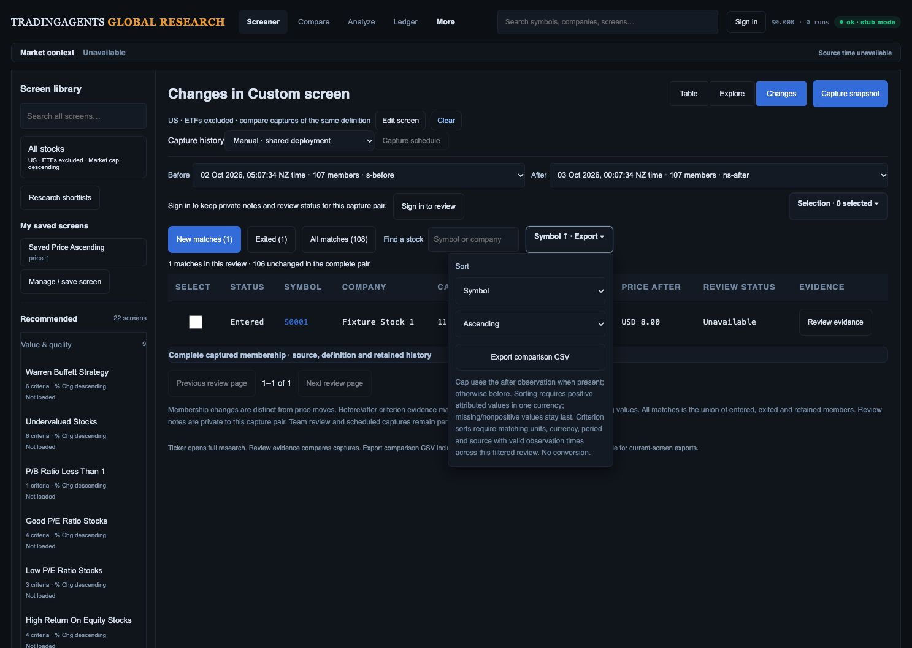
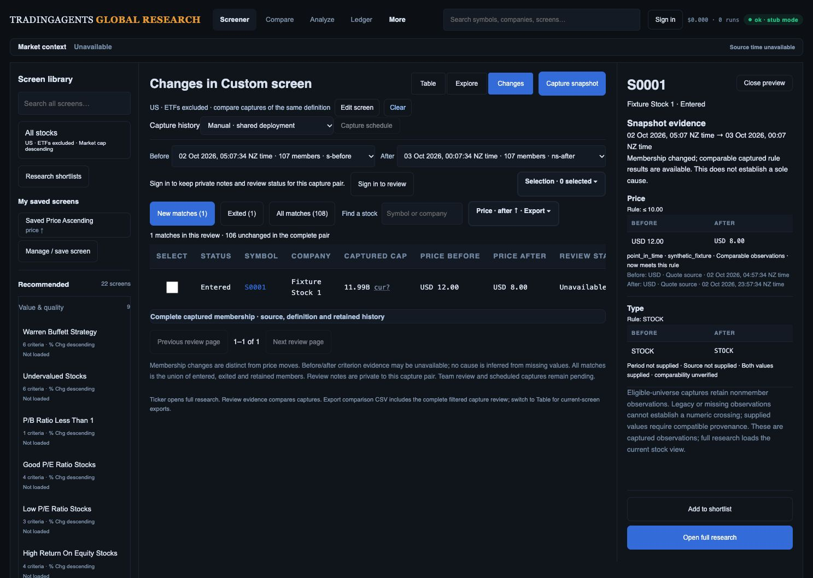

# Captured criterion sorting and monetary presentation

Local checkpoint, 3 October 2026. R02/R07/R11/R13/R15 remain open.

The shared manual/private comparison engine now qualifies each numeric criterion and capture side across the complete filtered review before paging. A finite captured value must have the exact criterion/value attribution, supported unit and source clock, supplied source and period, and a timezone-aware observation time no later than capture and within the existing evidence freshness allowance (one day, or seven days for financial-report clock). Currency values require an explicit uppercase currency code. All finite values must share one source/period/unit/currency/clock contract. Missing or nonnumeric values remain last; incompatible/unknown attribution returns 409 for numeric sorting without changing captured membership. Symbol, Company and status remain available.

The side-specific readiness metadata uses canonical criterion slots and unique-field aliases. Repeated window criteria stay independent. Legacy evidence without attribution remains visible but cannot authorize numeric sorting. This does not prove complete market coverage, causal attribution, aligned market sessions, or field-specific financial definitions.

The UI disables unqualified criterion sorts and describes the requirement in the sort disclosure. Captured monetary criterion cells and both inspector/matrix presentations retain exact supplied currency; mismatched or unavailable attribution displays `cur?`. Client CSV and private server CSV/SpreadsheetML append sort qualification metadata without replacing existing columns or formats. Preset definitions were not edited.

## Verification

- Full API/worker suite: 627 passed. JavaScript suite: 152 passed.
- Synthetic tests cover exact before/after ordering before pagination, both directions with missing-last behavior, independent 30/60-day slots, private HTTP plus actual capture builder, mixed currency/units/periods/providers, wrong clock/criterion/value, absent/future/stale timestamps, and legacy missing attribution. A bad record beyond the first page cannot be hidden by paging; intentionally filtering to a qualified cohort can restore sorting.
- Actual HTTP/browser preview uses the existing `RESEARCH_OBSERVATION_FIXTURE=1` synthetic capture builder on localhost:8905. Price ≤10 plus STOCK criteria produce 107 members per capture, one entered, one exited, 106 unchanged. Entered S0001 retains USD 12 before and USD 8 after. Both price sorts enabled, unqualified cap sort disabled. Choosing after-price sort commits successfully and inspector retains currency/source/time/rule evidence.
- At 1487 × 1058, screenshot inspection and `elementFromPoint` confirm the desktop sort control is visible and hittable. These screenshots are synthetic functional/presentation evidence, not live vendor accuracy.
- One local helper timing: 40,000 rows × 12 side/criterion passes took 0.7968 seconds. This is a single synthetic helper measurement, not HTTP/UI p95. Maximum 60-criterion and real unique-observation performance remain unqualified and need optimization/measurement before release.

## Remaining acceptance

Fresh live-provider attribution and session/financial-period reconciliation, full download reconciliation, phone/tablet/zoom/accessibility checks for these criterion-heavy states, maximum-size performance, real Auth/PostgREST and production release remain outstanding. No overall gate is closed by this packet. A UI-created filter with null bounds/display labels can differ structurally from the minimal fixture definition; browser verification used the exact supported deep link. Semantic definition normalization requires a separate compatibility audit before changing immutable capture identity.

## Bounded timestamp reuse follow-up

Qualification now reuses up to 512 timestamp checks within one criterion-side call. Keys include source clock; each call has its own capture time and cache. Every row still validates numeric value, exact criterion attribution, units/currency and full-cohort contract consistency. Beyond the cache bound, observations are parsed normally. A new test exercises clock-specific one/seven-day allowances, capture-local freshness, 1,000 repeated timestamps and 600 unique timestamps plus a future observation. Full backend suite: 628 passed; `git diff --check` passes. UI code did not change in this follow-up; the preceding 152-test UI result applies.

[Reproducible helper benchmark](helper-timing.py) and [raw timings](helper-timing.json) compare the preceding uncached implementation with the bounded cache on the same 40,000-row inputs, 12 criterion-side passes, three runs per case. Repeated-timestamp median is 0.684 → 0.602 seconds (about 12% lower); unique-timestamp median is 0.746 → 0.711 seconds. Results match the prior implementation for these valid inputs. These timings do not qualify HTTP/UI p95, 60-criterion worst cases, browser responsiveness, or production performance.

The observed UI-created versus minimal-definition history mismatch has a [specific additive compatibility migration plan](definition-compatibility-plan.md). Direct hash normalization was deliberately not applied because it would make existing raw-key histories/schedules unreachable. The migration and its owner-isolation/rollback acceptance remain open.
