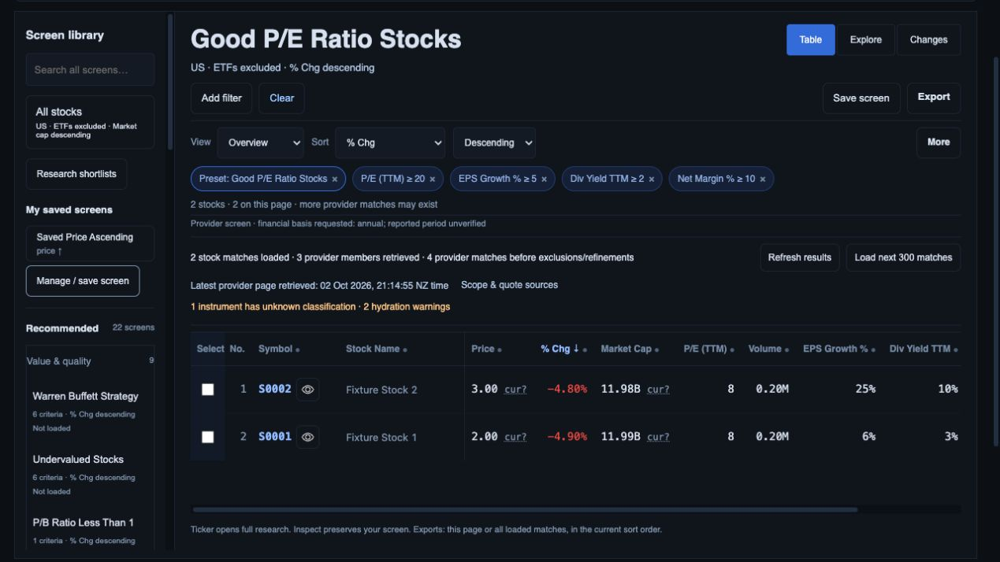
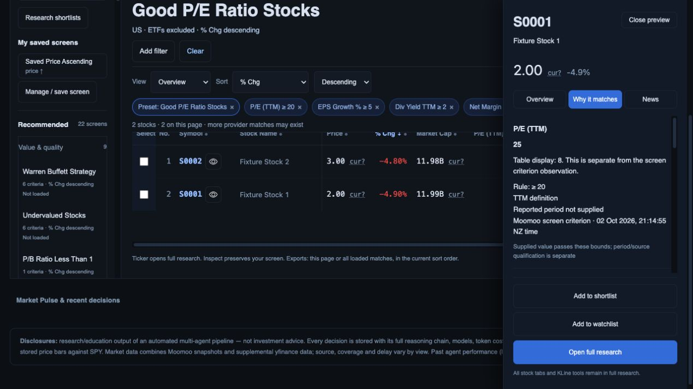

# Per-criterion source and retrieval integrity

2 October 2026. Baseline `1d76e74` plus this checkpoint; local build only. The prior goal turn was verified progress (company context and build-to-design review committed). This packet advances R02/R03/R11 without closing live financial, UX or release acceptance.

## Problem and resulting behavior

Provider retrieval always requested 30-day average volume even when a saved rule requested a different window. Field-only dictionaries could overwrite repeated properties. The inspector treated every added custom rule as a provider criterion, borrowed display origins for its retrieval time, and omitted column filters. Dynamic percentage columns omitted the percent sign.

- Retrieve each requested average-volume window and deduplicate identical queries. Retain per-criterion evidence with exact rule, canonical code, value, provider source and retrieval clock.
- Distinct/repeated rules do not borrow another window. Ambiguous duplicate results or absent window identifiers when several windows were requested leave evidence unavailable. Explicit incompatible financial terms cannot support requested annual evidence or fill financial display values.
- Reject booleans, structured values, blank/nonfinite values and overflow before converting provider numbers. Empty typed results do not fall back to legacy flat values. Invalid property identities fail the response instead of crashing attribution.
- Keep criterion retrieval clocks independent of quote hydration. Protect evidence from quote copies; legacy field-only values remain a compatibility representation and cannot resolve repeated properties.
- Route original provider rules to their own observations; added custom/column filters use the data actually filtered. Column criteria appear in Why it matches; the automatic stock-only universe rule does not appear as an invented custom criterion.
- Explain table display versus criterion observation in the inspector. Actual fiscal period and currency remain unavailable until independently supplied; requested annual/TTM/window definitions are not reported periods.
- Percentage columns now use the shared formatter. CSV/SpreadsheetML preserve structured criterion values/evidence and retrieval clocks alongside the existing display provenance.

## Actual-route browser and download evidence

Current backend preview on port 8897 used immutable-generation/provider-generation/company-context fixtures plus opt-in `RESEARCH_CRITERION_EVIDENCE_FIXTURE=1`. This controlled transport returns independent P/E 25, EPS growth 6%, dividend yield 3% and margin 12% for US.S0001; US.S0002 has no criterion values. It uses the actual application/API route, not a mocked execute endpoint. These are synthetic observations and do not validate current Moomoo units or membership. The quote/chart fixture remains incoherent and cannot qualify prices.

The existing tab was authoritatively missing, so a new tab was created in the already selected in-app browser. The preview was deliberately restarted after adding the fixture (the prior live process was stopped and returned exit 0); no process was restarted merely because observation timed out.

1. Good P/E Ratio retained its four original rules and % change descending sort. Percentage cells include units; provider totals, retrieved/stock counts and warnings stay visible. Screenshot saved and opened.

   

2. Why it matches shows P/E 25, table display 8, its ≥20 bound and independent provider retrieval time. The supplied value passes the bounds but period/source qualification is explicitly separate. The remaining criteria have their own supplied values. Screenshot saved and opened; browser warning/error log empty.

   

3. Actual CSV and Excel-compatible `.xls` downloads were parsed from Downloads. Both contain exactly US.S0002 then US.S0001, matching % change descending; display P/E 8 stays separate from the four membership observations 25/6/3/12. All evidence records retain US.S0001 and the matching criterion retrieval timestamp; US.S0002 evidence is unavailable. Period/currency are null, not invented. See [download reconciliation](download-reconciliation.json).

The screenshots support visible desktop presentation, not full phone/keyboard/accessibility acceptance. Table criterion/display alignment still needs a coherent presentation and real-source reconciliation; this packet makes the distinction inspectable and exportable rather than claiming the discrepancy is solved financially.

## Verification and remaining gates

408 API/worker tests and 98 JavaScript tests pass. Tests cover 10-/30-day retrieval and repeated bounds, missing-window/duplicate ambiguity, incompatible financial terms, invalid numbers, independent actual execute-route clocks/hydration, per-rule source routing, column criteria, exact-code rejection and structured CSV/SpreadsheetML evidence. The isolated API fixture now resets the stored-universe cache as well as execute cache so prior test databases cannot supply unrelated rows. All 22 preset definitions are unchanged; `git diff --check` passes.

Still open: current provider response dimension/period/currency/session qualification; immutable criterion observations across captures/nonmembers; complete page refresh/deep-link handoffs; sourced criteria-led table presentation and every export scope; Yahoo share-class and payout-ratio audits; full data/UX/device/performance/Auth/PostgREST/Moomoo and production cutover acceptance. R01–R15 remain open; no merge or deployment occurred.
