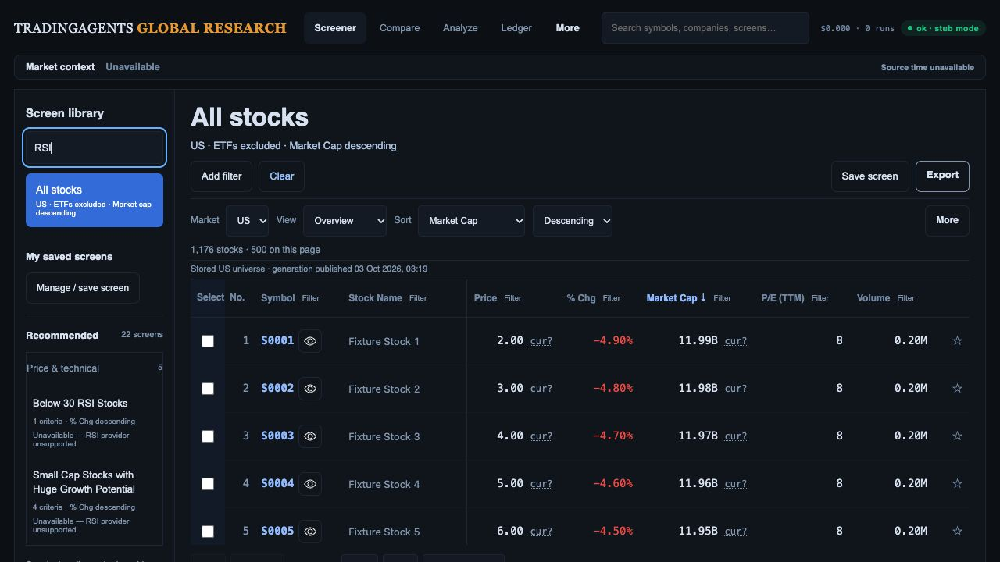
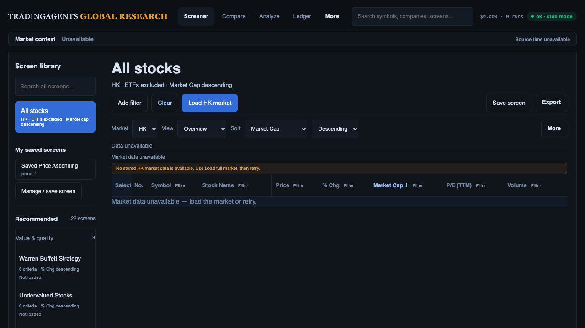

# Desk MVP implementation checkpoint — 3 October 2026

Latest progress: [complete live US cohort and field presence](live-data-check.md) and [six actual browser downloads](downloads/README.md). Public US count/order consistency passes for 12,045 retrieved rows; HK remains empty without a timestamp. Stock/ETF/REIT qualification and live production downloads remain open. [Measured desktop responsiveness](responsiveness/README.md): fresh state defaults to 100 displayed rows after the 500-row warm-sort check took 316 ms; six 100-row warm-sort checks took 60–94 ms in the same synthetic cohort. Saved page sizes, larger-page choices and complete-cohort exports are retained.

Confirmed scope: US + HK, desktop first, Desk + existing analysis/KLine, 20 executable presets and two preserved unavailable RSI presets. No team/Auth, Explorer, Changes, capture schedules or private review feature acceptance is required for this release.

## Changes implemented locally

- Deferred presentation navigation and private shortlist/account entry points are hidden by default. `researchExtendedWorkspaceEnabled()` defaults false; extended foundations remain available for later qualification. Old Explore/Changes links render Table without dropping filters, sort or saved definitions. Direct shortlist navigation returns home.
- All 22 definitions remain unchanged. `rsi-30` and `small-growth` are visibly unavailable in the library and modal before execution; warm and run requests are suppressed. Existing preset second-click/reset behavior remains intact.
- US/HK market selection is in the main toolbar. HK refresh jobs no longer reuse US jobs; unsupported markets are rejected before DB access.
- Missing stored market data reports unavailable instead of a successful zero-match result. The Desk retains this status, offers a visible market-load action, disables failed-cohort downloads and does not persist failure as a successful dataset. Failed background refresh retains the previous rows and clock.
- All server exports above 20,000 rows fail with an explicit 413 instead of silent truncation. Current-page export remains available.
- Render blueprint now defines separate HK universe and enrichment schedules, and explicitly assigns the existing universe cron to US. This configuration has not been applied to Render.

## Verification

- Full API/worker suite: **772 passed**, 10.40 seconds, including new refresh-market, cold-data and oversized-export tests.
- Combined UI suites: **171 passed**. New parsed CSV/XML tests cover US/HK available/page-2/selected exports across 211 filtered rows, canonical identities, order, currency and generation provenance. Actual `researchReturn` restores preset/filter/sort/page/selection and both table scroll axes after full research.
- Actual synthetic browser: Desk loads; two RSI entries remain visible and disabled; modal also has two disabled unavailable controls; a supported preset applies and second click restores All stocks/cap descending; visible Market selector switches markets and Clear retains HK. The new preview at port 8910 shows missing-HK disclosure and reachable Load HK market. No console errors observed in that check.
- YAML parses, with explicit US/HK universe and enrichment environment values. `git diff --check` passes.
- Earlier browser download-event waits timed out. Subsequent inspection found the files, and six fresh Chrome CSV/SpreadsheetML downloads passed exact full-cohort/page-2/selected reconciliation against synthetic US fixtures. Live US/HK production download acceptance remains open; see [actual download evidence](downloads/README.md).

These screenshots use synthetic fixture data and do not establish financial accuracy. The final missing-HK browser check confirms Market data unavailable provenance.

## Live read-only findings and remaining release work

Production `screener_universe` metadata query returned US rows only and no HK rows. Raw US category counts are metadata inventory, not current stock eligibility or a complete market count. The deployed HK full-market endpoint (`watchlist_only=0`) returns available true with zero rows and no universe clock; the new local unavailable fix is not deployed. An earlier probe omitting `watchlist_only=0` hit the separate watchlist path and returned 500; it is not evidence that the full-market provider failed.

1. Apply only enabled-path migrations: immutable generation publication and prepared server-owned data access, plus both subtype storage/lease migrations if that acquisition route is needed and enabled. The [combined local rehearsal and ordered cutover](mvp-cutover.md) now pass for all four actual files; target-platform qualification remains open. Reconcile the recorded/local historical migration filename discrepancy; omit deferred private/review/schedule migrations. Supabase advisors approval remains pending from the earlier request; no bypass or production mutation occurred.
2. Qualify stock/ETF/REIT classification using existing evidence-bound normalization. Do not enable unverified subtype collection or represent unknown instruments as stocks.
3. Publish and validate complete successful US/HK observed cohorts before enabling their refreshed writers/schedules. Verify all 20 presets in HK and the exact release candidate; retain unavailable RSI definitions.
4. Complete actual US/HK downloads and analysis/KLine/Back smoke, core timing and focused desktop usability checks.
5. Review the complete candidate dependency inventory, merge/deploy the exact commit, verify production assets/default/presets/data/downloads and keep additive rollback practical. Production is unchanged at this checkpoint.

No overall investment-platform gap is declared closed; the narrower MVP acceptance plan governs this release.
