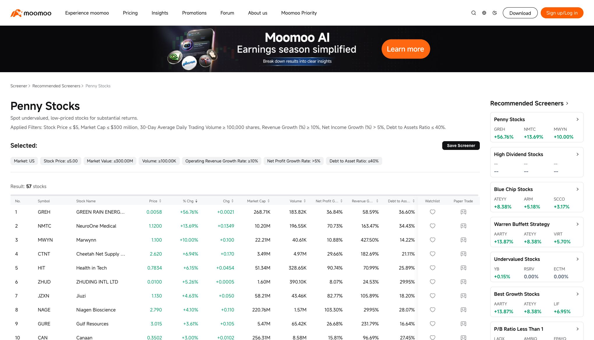

# Live Moomoo browser comparison — 3 October 2026 NZDT

Read-only public source observations. No login, private database queries, refresh, production writes or optional feature activation. Browser captures are fresh in this run; JSON records exact UTC observation dates. `compare.py` reads public deployed endpoints with TLS verification enabled and preserves responses. The initial system Python attempt lacked a trusted issuer; the configured Python 3.12 runtime succeeded without disabling verification.

## Results

| Scope | Moomoo website | Public deployed API | Result |
| --- | --- | --- | --- |
| US default, market cap descending | 12,141 declared stocks | 12,045 matches | Count differs by 96; first 50 identities/order differ |
| HK default, market cap descending | 2,825 declared stocks, 15min Delay | 0 matches, available=true, no universe date | Release gate fails; qualified HK cohort is required |
| US Penny Stocks, default preset sort | 57 stocks, both pages captured | 57 provider members | Complete captured membership and order match |
| Penny financial criterion percentages | Net profit/revenue growth and debt/assets for all 57 | Provider criterion values for all 57 | 171/171 agree within two-decimal display rounding |

Penny source page states price <=5, cap <=300M, average 30-day volume >=100K, revenue growth >=10%, profit growth >5%, debt/assets <=40%; default displayed order is daily change descending. Current daily volume can be below the 30-day criterion without invalidating membership. Preserve this distinction in the UI.

GREH illustrates a separate open quote check: source display price 0.0058 versus public execution price 0.006; daily-volume observations also differ. This run establishes financial percentage rounding and preset membership, not synchronized quote precision/session correctness. Do not equate these financial checks with independently audited statements or currency/period qualification.

US page-only differences: Moomoo top 50 contains PANW/HSBC while API top 50 contains EPDU/SSNLF. This does not prove those companies are missing from the whole universe. Default numeric bounds were empty, exchange unselected, sector All, watchlist unchecked. Source and API observations are sequential and do not share a pinned generation. Source instrument-type scope and raw/normalized classification still need reconciliation before attributing the 96-count difference.

## Evidence and next work

- `us-default.json`, `us-cap.json`, `hk-cap.json`: source text, visible row identities and observed scopes.
- `penny-us-page1.json`, `penny-us-page2.json`: 50 + 7 unique preset members.
- `us-deployed.json`, `hk-deployed.json`, `penny-us-deployed.json`: public deployed responses, separate from the unmerged candidate.
- `comparison.json`, `penny-financial-checks.json`: reproducible comparisons.
- `us-cap.png`, `hk-cap.png`, `penny-us.png`: source browser screenshots.

Next: finish the four larger working US preset comparisons, acquire a complete qualified HK generation, reconcile US instrument classifications and observation clocks, verify quote precision, then run candidate-hosted continuity/exports/performance smoke. Prior HTTP 403 observations remain valid for their earlier access method; this browser path now succeeds. No merge/deploy or full data parity is claimed.

## Extended working-preset source check

The source catalog exposes all 22 original strategy links. All 20 working US presets now have source-page comparisons. Two RSI-dependent screens remain preserved as unavailable under the agreed MVP scope; website support for RSI does not establish API support.

**16/20 working US presets have complete membership and order matches**, including Penny from the first run. Fresh captures include every source result page for Buffett, Growth, Best Long Term High Dividend, Good P/E, Speculative, High EPS, High ROE, Low P/E High Dividend and Undervalued Tech. Other complete sets fit on one page. High Dividend is correctly empty in both observations. A timed signup promotion briefly blocked pagination; dismissing it restored public page access without logging in.

| Remaining partial screen | Source declared count | Source captured | API captured | Result |
| --- | --- | --- | --- | --- |
| P/B <1 | 4,534 | 50 | 300 | Same first 50 order; full membership/count unproven |
| High P/E | 479 | 50 | 300 | Same first 50 order; full membership/count unproven |
| Low P/E | 1,695 | 50 | 300 | Same first 50 order; full membership/count unproven |
| Junk | 532 | 50 | 300 | Same first 50 order; full membership/count unproven |

`compare-presets.py` preserves public API responses and calculates the exact comparison in `preset-comparison.json`. Source-only omissions are scoped to captured pages. These checks establish raw provider membership, preceding the Desk's stock/ETF eligibility exclusions. They do not qualify all displayed numeric values, HK presets, final candidate deployment, complete ETF/REIT taxonomy or performance.

Price-path inspection: current `main.screener_execute` decodes screen property 2201 at a fixed 1/1000 scale; `fmtAuto` retains extra decimals for small prices and is not the cause of the 0.0058 → 0.006 source/API discrepancy. The provider screening response has limited precision at that scale. Whether this observed difference also reflects separate clocks needs fresh qualified raw quote evidence. Keep provider criterion evidence separate from a potentially higher-precision display quote; do not invent missing digits or silently overwrite evidence.

