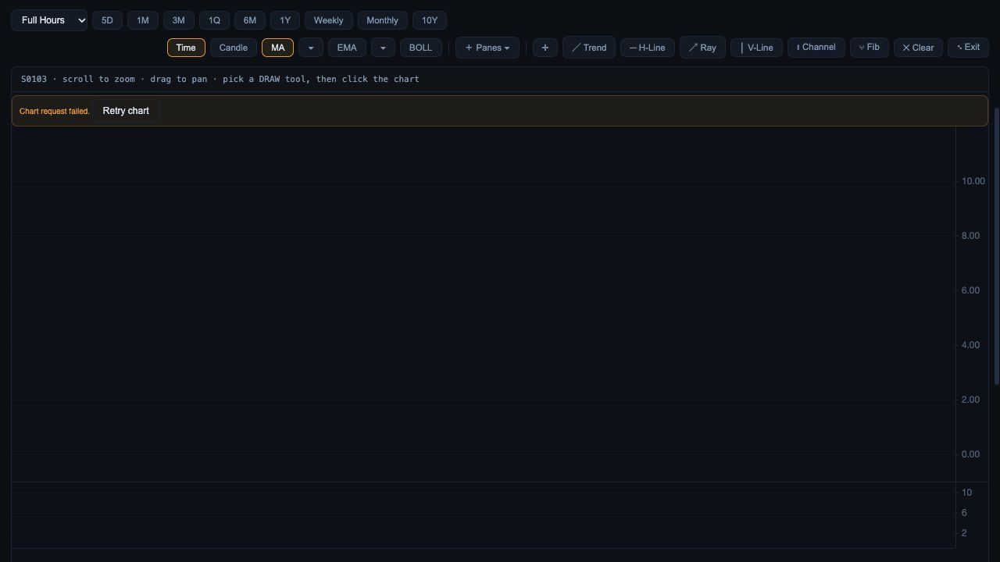
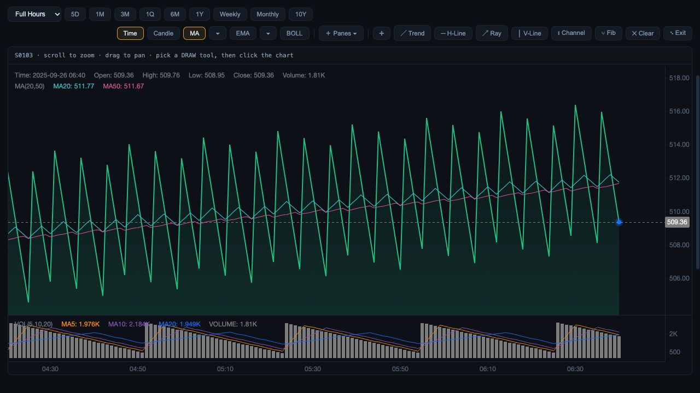

# Chart failure and recovery

3 October 2026, local candidate; 180 UI tests pass and diff whitespace checks pass.

Overview, Analysis and Compare previously reduced empty/failed chart responses to an unexplained blank plot. Added visible loading, source-unavailable, empty-session/timeframe and request-failed states plus Retry. During loading, previously plotted data is explicitly labelled as previous. Failed/empty results clear the plot; successful recovery hides the status without leaving an empty warning strip. Unavailable responses cannot render embedded bars/points as current data. Existing chart controls are retained.

The tests distinguish successful empty results, unavailable payloads, rejected requests and recovery; exception details are not displayed. Existing out-of-order tests remain passing.

Actual browser evidence: offline real API route preview port 8912, `RESEARCH_CHART_FAILURE_FIXTURE=failed`, in-app 1280 × 720. First source request returns HTTP 503; Retry gets recorded fixture data. Overview visibly failed then recovered. Analysis independently displayed failure. Compare showed three failed panels; retrying the first recovered that panel and left the other two failures visible. Browser testing caught and fixed CSS overriding the hidden status. The temporary server was stopped after verification.

This is transport/UI verification, not live-source or financial-identity acceptance. Recorded fixtures reuse unrelated security detail and have different clocks; they cannot qualify investment data.

