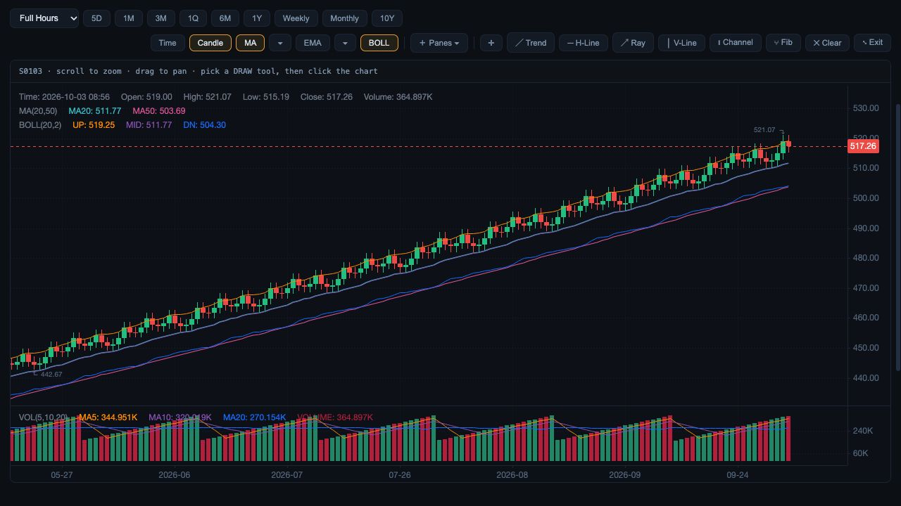

# Chart response integrity

3 October 2026, local MVP candidate. Source audit found Overview/Analysis loaders writing into shared chart stores before checking whether ticker, tab or source selection still matched. Compare loaders also applied delayed candles/events by panel index, potentially updating a replaced panel. Overlapping quote polls could replace a newer price.

Fixed:

- Overview and Analysis load into temporary buffers. Commit requires the latest request, same ticker/state, active tab, same chart element and matching source/range/session.
- Compare candles require the latest panel request, same panel object/host, ticker, timeframe and extended-hours setting. Obsolete requests cannot fill the shared cache or paint a chart.
- Earnings/dividend/estimate responses require the latest event request and unchanged panel/ticker.
- Quote polling requires the latest poll and unchanged Compare workspace/grid.

Regression evidence: tests deliberately finish B before A, then finish the obsolete A request; only B paints. Tests also replace the chart element, change tabs, remove a Compare panel, change event ticker, overlap same-ticker requests and rebuild a polling grid. Latest run: 178 UI tests pass, `git diff --check` passes.

Actual browser smoke: offline preview port 8910, in-app browser 1280 × 720. Rapid 1M → 1Y remains usable; Analysis fullscreen renders candles, MA/BOLL and volume; Compare restores S0103/S0104 and retained MACD controls. No warning/error entries captured. Browser smoke does not force network completion order; the deterministic response tests cover that race. No production deployment, live source parity, timestamp/identity or indicator-arithmetic qualification is claimed. Recorded research fixtures reuse unrelated security details and are unsuitable for investment-data acceptance.

