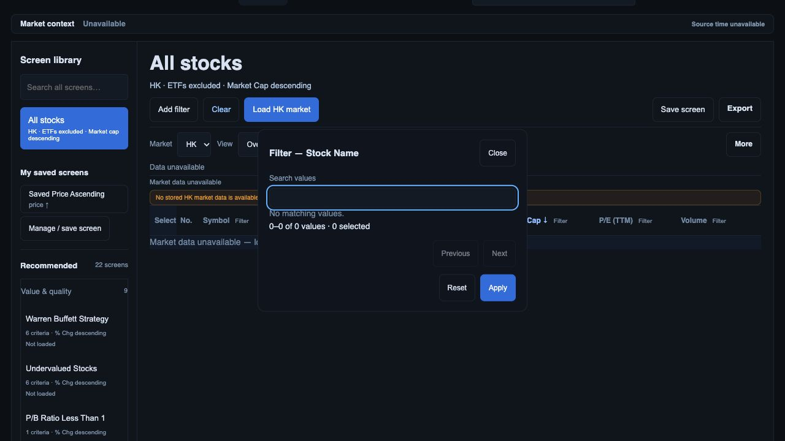

# Facet scope and research navigation checkpoint

3 October 2026. Local candidate only; production release and source qualification remain open.

The facet cache now follows market, source, stock/ETF mode, watchlist scope, active preset and current dataset/preset version. A late response can commit only to the cache and scope that issued it. A closed/reopened dialog cannot be replaced by an earlier dialog's response. Taxonomy dropdown requests also retain their original scope and verify the current target element. Local facets refuse a mismatched market dataset and count only watchlist members when scoped to a watchlist. A known empty cohort returns an empty facet list without an unnecessary server fallback.

Focused regressions exercise a delayed US response arriving after HK has opened, subsequent HK success, generation replacement, previous-market dataset refusal, known-empty cohorts and watchlist counting. 174 JavaScript tests pass. `git diff --check` passes.

Actual in-app browser at localhost:8910: US company-name filter shows 1,176 synthetic values; after closing and switching to missing HK, the filter has zero values and retains the surrounding unavailable/load-market state. It does not show US company names. Returning to US restores its cohort.

The same browser exercised seven research tabs (Overview, Options, Financials, Analysis, Company, News, Comments), six financial subtabs (Earnings, Revenue Breakdown, Financial Indicators, Income Statement, Balance Sheet, Cash Flow), and the 1M/BOLL/MACD controls. Back restored page 2 of 12, 1,176 matches, stock-only and market-cap descending. This proves the observed fixture navigation/control wiring, **not** indicator arithmetic, all drawing/session/fullscreen controls or ticker/provider financial identity. The fixtures deliberately reuse recorded detail responses for synthetic tickers.

Two chart captions no longer make an unconditional “live” claim; the data transport remains unchanged. Existing source/time limitations still need live qualification.

Evidence: `hk-scoped-filter.png`, `return-page-two.png`, `research-navigation-evidence.json`.

