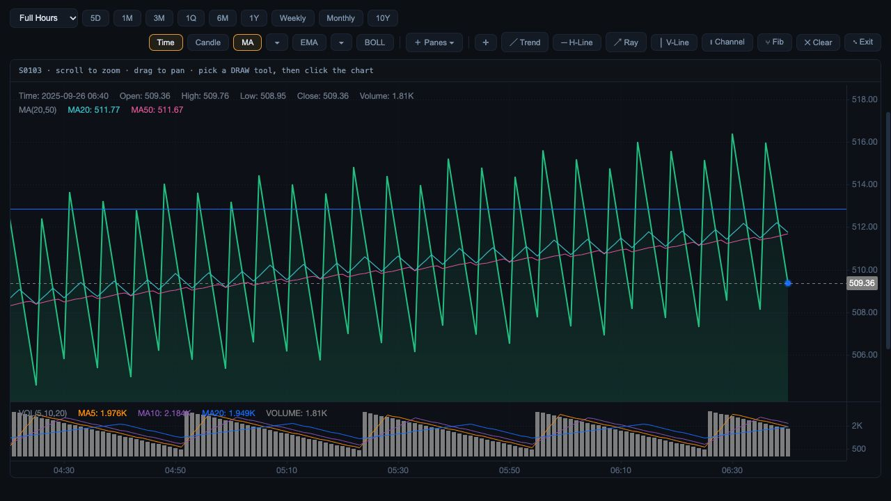
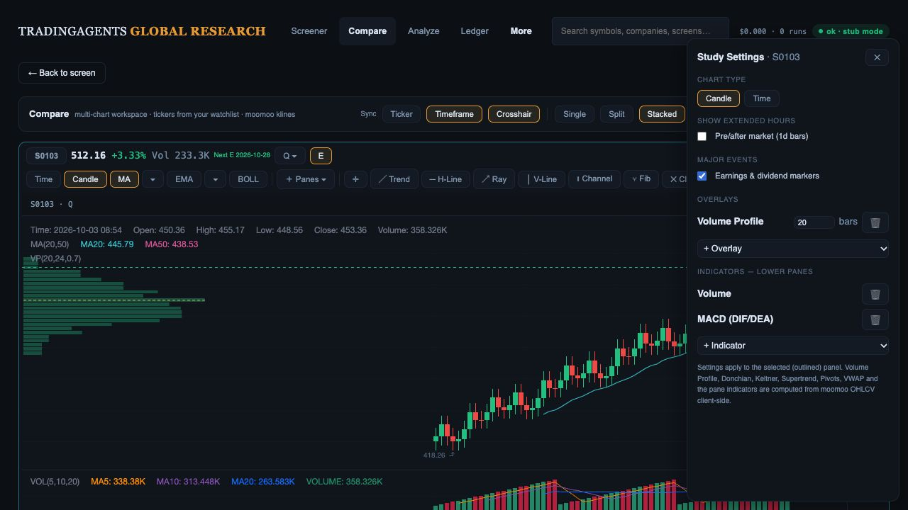

# KLine and Compare preservation checkpoint

3 October 2026, current local candidate, actual offline preview at port 8910, in-app browser 1280 × 720. Synthetic stock identities reuse recorded research responses; this verifies UI behavior, not financial identity or live accuracy.

Observed:

- S0103 opens from page 2. Overview chart retains sessions, ranges, candle/time modes, MA/EMA/BOLL, eight lower-pane studies, six drawing tools, clear and fullscreen controls.
- Fullscreen opens, Escape exits. A horizontal line drawn at approximately 512.86 remains after Financials → Overview. See the drawing-return screenshot.
- Pre-Market selection updates; Weekly and Candle controls respond; RSI(14) becomes checked and its pane label appears. This is not indicator arithmetic or session/bar-span qualification.
- Back restores page 2 of 12 and 1,176 stock-only matches. Selecting S0103/S0104 opens two Compare panels. Stacked layout responds; original sync/layout/study controls remain.
- Compare study drawer previously lacked an accessible name and descriptive add/remove labels; opening/closing did not transfer/restore keyboard focus. Fixed with a labelled nonmodal dialog, named controls, close focus and connected-opener return without scrolling. Escape behavior existed and is retained.
- Compare toolbar/header/drawer buttons rendered browser-default white controls because styling only targeted the stock toolbar. Extended the existing chart-control styles to those Compare containers; selected states are now visible in the existing dark palette.
- Browser verification of the fix: opening focuses Close study settings; adding MACD renders its removable entry; Escape hides the drawer and restores Studies focus. Reload retains both comparison tickers and MACD configuration. Back after reload restores page 2 and both selections.
- No warning/error entries were captured in this tab. 175 Desk/screener UI tests pass; `git diff --check` passes.

Still open: remaining drawing tools, zoom/pan/sync arithmetic, complete chart-state persistence, genuine ticker/quote/bar identity, dates/timezones/periods and live US/HK qualification. The fixtures visibly have different research/quote/bar identities and clocks; do not present these screenshots as investment data.

