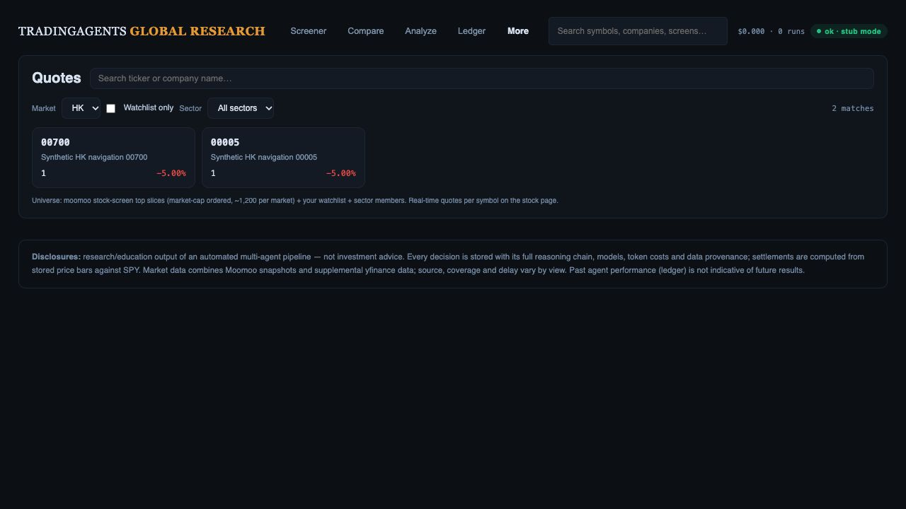

# HK navigation and ticker identity

3 October 2026. Research ticker dropdown, Enter selection, quote-directory cards and Compare ticker picker used display symbols instead of canonical codes. Numeric HK tickers could therefore open US requests. Research header search also used the previously cached market rather than the current instrument's market.

Changed those handoffs to retain explicit source codes; fallback construction uses the row/selected market and preserves US share classes. Header/dropdown lookup now uses the research instrument's US/HK market. Older market-universe requests cannot replace a newer cache, and obsolete dropdown queries cannot overwrite the current dropdown. A delayed quote-directory response also cannot replace a newer directory or a subsequently opened stock; each render captures its settings.

183 Desk/screener UI tests pass. Regression cases cover HK.00700 and US.BRK.B handoffs, Enter, current-market preload, out-of-order US/HK responses, out-of-order dropdown queries, newer directory renders and navigation away. Diff whitespace checks pass.

Actual browser verification used the temporary offline preview at port 8913 with two explicitly synthetic HK directory rows (`RESEARCH_HK_NAVIGATION_FIXTURE=1`), in-app 1280 × 720. Selecting HK showed two rows. Clicking 00700 opened `#/stock/HK.00700`; searching 000 in that research header offered the HK.00005 row, and Enter opened `#/stock/HK.00005`. All quotes returned to the HK directory. The temporary server was stopped after verification.

The source fixture deliberately cannot supply identity-valid HK quote detail; the real quote route rejects its unrelated recorded US quote. Other recorded research responses are likewise unsuitable for financial accuracy acceptance. This verifies routing and UI scope, not live HK coverage or source parity. Original presets, chart controls and exports were not changed.

