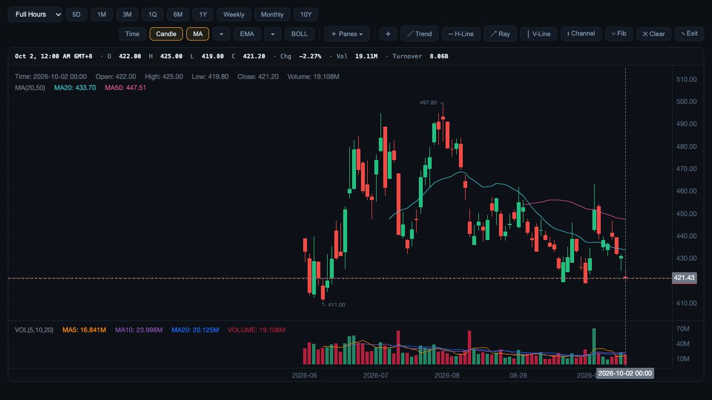

# Public source bars and trading-market dates

3 October 2026. Fresh public deployed quarterly candles for HK.00700 and US.AAPL each returned 73 bars. Both samples have zero duplicate timestamps, ordering inversions, invalid numeric/OHLCV rows or mismatches between provider `date` and market-local timestamp date. These are deployed API observations, not independent provider-app reconciliation or complete market acceptance.

The HK sample exposed a real date error: its last source bar has date 20261002 and timestamp 1790870400000, which is 2026-10-01 16:00 UTC and 2026-10-02 00:00 Hong Kong. Compare matched earnings/dividends using the UTC calendar date, which could assign events to the previous trading day. Chart/readout timezone previously also depended on engine/browser defaults.

Fixed stock Overview/Analysis and Compare charts to use the trading-market timezone (America/New_York or Asia/Hong_Kong). Crosshair labels explicitly include the timezone. Compare event markers/popovers use the market-local date; mapped data carries that date for market-day VWAP resets. Source timestamps, OHLC and volume are unchanged. Date formatters are cached, avoiding repeated formatter construction per bar. Invalid/nonpositive timestamps are rejected before they reach a chart/date formatter.

185 UI tests pass, including actual HK source timestamp → 2 October event matching, untouched OHLC/timestamp mapping, chart timezone configuration and malformed timestamp rejection. Diff whitespace checks pass. Other market support, indicator arithmetic and full source-span qualification remain outside this evidence.

Actual current-UI browser replay: only the captured public Tencent quote and 73 candles were served at localhost:8914; other API datasets returned unavailable. The 1Q candle chart's last bar and crosshair show 2 October 00:00 GMT+8 with O 422 / H 425 / L 419.8 / C 421.2 and 19.11M volume, matching the captured source (rounding only). No synthetic company details were substituted. Temporary replay was stopped after verification.

[Dated source checks and response hashes](../public-chart-source-check.json), [HK candles](../public-hk-candles.json), [US candles](../public-us-candles.json). The reusable offline harness is `web/api/tests/ui/chart-source-replay.py`.

Still open: live screener cohort/classification/preset qualification, direct Moomoo parity and production deployment. The zero-filled US pre/post-session labels exposed by this replay have since been corrected; see [source-backed quote-header verification](public-quote-header-check.md).

