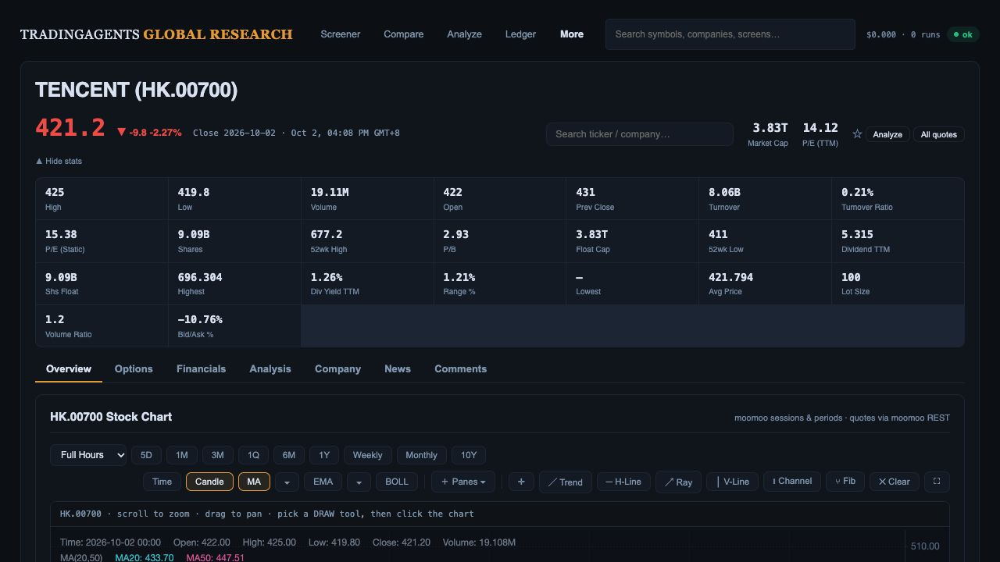

# Source-backed quote header verification

3 October 2026. The current local UI was replayed against the captured public Tencent HK.00700 quote and 73 quarterly candles, using `web/api/tests/ui/chart-source-replay.py`. Other datasets were explicitly unavailable. This verifies rendering of the captured deployed API response; it does not establish independent Moomoo app parity or complete market coverage.

Corrected four defects exposed by that response:

- HK no longer displays zero-filled US pre-market/after-hours quotes. US session quotes require a positive finite source price and use session labels rather than invented fixed observation times.
- The source update timestamp uses the instrument's trading-market timezone. Tencent displays 2 October, 04:08 PM GMT+8 for source timestamp 1790928485000.
- Invalid/nonpositive prices render as unavailable. Source `lowest_price` -23.001796322 displays a dash. Valid negative ratios remain visible, including source Bid/Ask -10.76%.
- Main price color follows the price movement, rather than the positive price itself. Tencent 421.2, down 9.8 / 2.27%, displays red. Missing direction remains neutral.

The actual browser reload showed all four corrected states. The 1Q Candle view retained the captured bars. All 186 JavaScript UI tests pass, including sentinel, timezone, session and color regression coverage; `git diff --check` passes. The preceding backend checkpoint remains 774 API/worker tests passed; this static-only correction does not change that backend evidence. Temporary source replay was stopped after verification.

Remaining release gates are live US/HK screener cohort and classification qualification, supported-preset results/sorts, minimal migration compatibility, and exact-candidate production deployment and smoke checks. This is a local candidate, not a production release.

