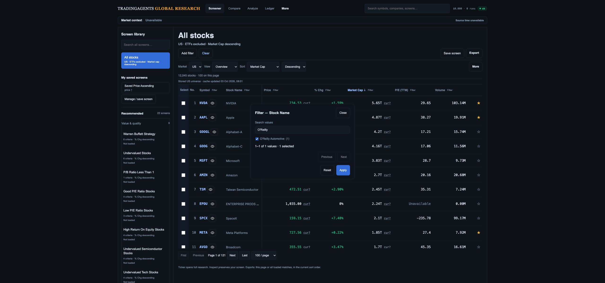

# Large-cohort interaction check and facet fix

3 October 2026. Current static Desk, Chrome 2560 px viewport, localhost replay of the complete recorded public US response: 12,045 stocks and 11,949 distinct company names. Replay makes no live provider requests or database writes. Other preview routes are fixtures; ticker detail/presets are outside this check.

Initial usable frame: 395.9 ms. Twelve warm market-cap direction changes, retaining 100 displayed rows: 80.1–156.2 ms, median 83.25 ms. These are local render-to-frame measures, not production network latency or a statistically qualified p95. The first warm observation exceeds the original proposed 100 ms budget; all are below the MVP's 300 ms warm usable-results budget.

Opening company-name filtering exposed a concrete scale defect: the old menu rendered all 11,949 checkbox values. Browser DOM inspection timed out after opening it. The page screenshot showed the dialog open; the observation timeout alone does not prove an equivalent user-perceived freeze duration.

The fix limits the rendered facet list to 100 values, with search and Previous/Next. Every value remains discoverable. Selections remain in the draft across pages and searches; the live selected count updates immediately. Checkbox handlers read the escaped input value, fixing apostrophes in company names rather than interpolating those names into JavaScript. The filter dialog is centered and constrained to the viewport.

Browser acceptance after the fix:

- Opening shows values 1–100 of 11,949; Next shows 101–200.
- Search NVIDIA → select → search Microsoft → Apply still returns NVDA only.
- Search/select O'Reilly Automotive → Apply returns ORLY only.
- Clear restores 12,045 matches, stock-only, market-cap descending.
- Escape cancels the draft, closes the dialog and returns focus to the originating company filter button.
- Document width equals the 2560 px viewport after cancellation.
- Captured warnings originate from an installed Chrome extension; no workstation error was captured.

172 JavaScript tests pass, including large-list/off-search selection and quoted-name regression coverage. `git diff --check` passes. Evidence: `real-cohort-evidence.json`, `real-cohort-filter.png`. Reproduce the offline source with `python3 web/api/tests/ui/cohort-replay.py docs/design-gap-audit/desk-mvp/live-us-cohort.json 8911`.

Source parity, HK availability, field qualification, production measurements and release/migration approval remain open. This fix does not activate any deferred workspace capability or the proposed data-aware column chooser.
