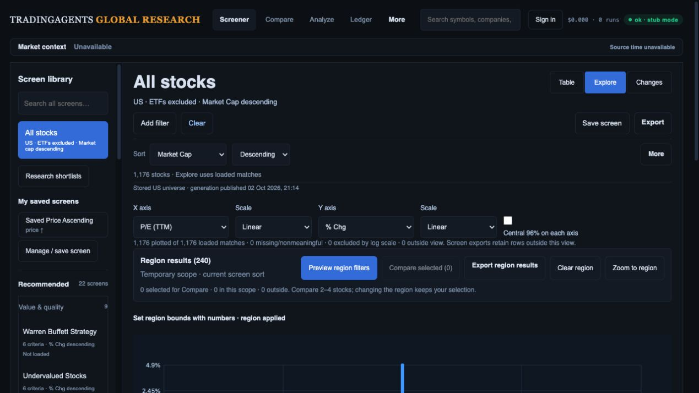
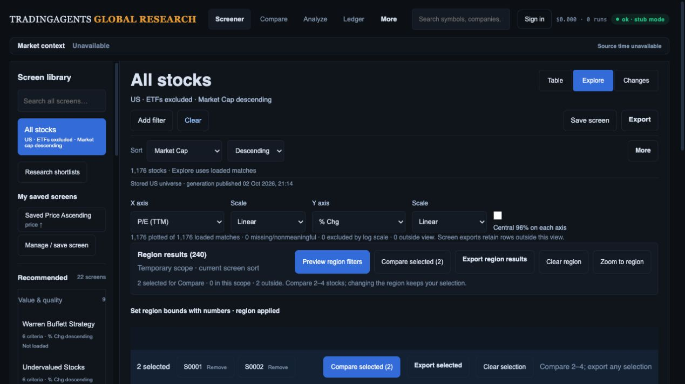
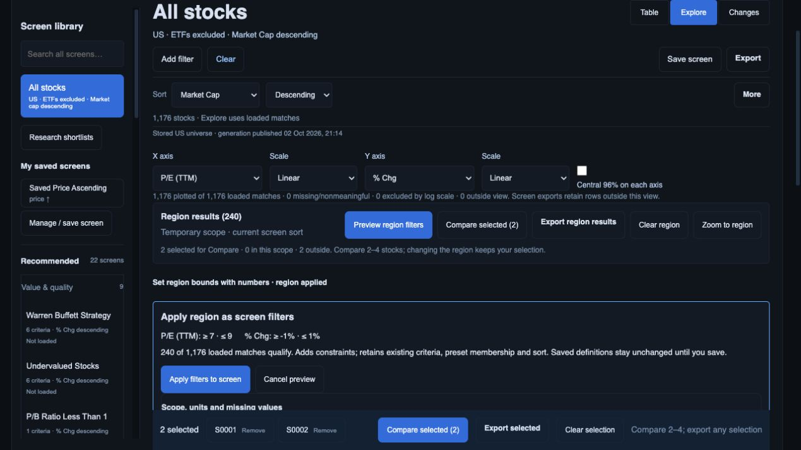
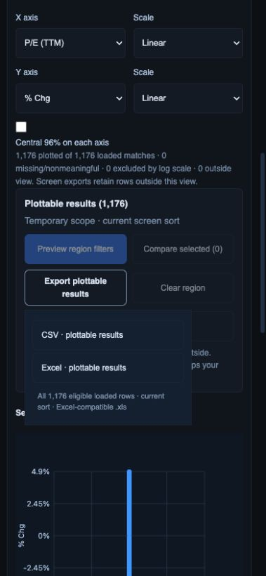

# Explorer actions near the plot

Local implementation on top of `36d14d2`, 2 October 2026. This addresses the laptop action-placement difference identified in the [original mockup review](../mockup-recheck-e0131ef/README.md), preserving the existing plot and region-to-screen workflow. R08/R09/R11/R13 remain open for their wider acceptance requirements.

## Implemented

- Region/plottable result count, Preview region filters, Compare selected, CSV/Excel export, Clear region and zoom now precede the 300 px plot. Numeric bounds are expandable immediately below the action strip.
- Compare selection remains independent from region membership. The status reports selected stocks inside/outside the region; changing bounds does not silently clear selection. Checkbox changes update the summary/button without rebuilding the canvas.
- Exports say “plottable results” without bounds and “region results” with bounds, and disclose the full eligible loaded count rather than just the first 100 linked rows. Existing export formats and scope implementation remain intact.
- Compact confirmation shows actual bounds, qualifying loaded count and saved-definition consequences. Detailed units, missing-value and changing-membership semantics remain keyboard-accessible in a disclosure.
- Opening numeric bounds closes the export disclosure so its menu cannot cover the form. Phone menu positioning was corrected after a fresh screenshot exposed clipping.

## Verification

`node --test web/api/tests/ui/screener.test.cjs`: **103 passed**. New tests cover independent selection/region counts, Compare limits without repainting, scope labels and ordering, and menu dismissal without altering bounds/selection. Existing reset, preset-definition, region apply/save/reload, collision and export preservation tests also pass. `git diff --check` passes. No backend source changed; the earlier 422-test backend result is historical, not a new run here.

Actual API-route preview at port 8897 uses 1,176 synthetic stocks and 24 ETFs. At 1280 × 720 with scrollY 0, all five strip action targets end at 513.328125 px and measure 44 px high. The canvas remains 300 px high. Selecting S0001/S0002 then applying P/E [7,9], % change [-1,1] retains both selections and reports 0 inside / 2 outside. Numeric region selects 240 rows; Preview → Apply returns a custom Table screen with 240 stocks, ETFs excluded, market-cap descending. Clear returns the stock-only default. Opening bounds with export expanded was checked after reload: bounds open, export closed.

Actual CSV and SpreadsheetML `.xls` files were read from Downloads (the browser download event timed out despite successful file creation). Both contain exactly the same 240 expected canonical identities, in market-cap order, US.S0040 through US.S1160, with P/E 8 and % change within [-1,1]. [Reconciliation](download-reconciliation.json) records filenames and scope. This qualifies this fixture handoff, not live market data.

At 390 × 844, the corrected export menu bounds are x=36 through 281, document scroll width 379; targets remain 44 px. Screenshot is intentionally scrolled to the controls; no claim that the entire phone workflow fits in one viewport. Confirmation screenshot is focus-scrolled and is not the scrollY-0 action-placement measurement. All four saved screenshots were visually inspected.

## Remaining

Full pointer/numeric/keyboard identity equivalence, Compare/full-research return/reload, all export scopes, zoom/device/accessibility/performance and analyst-task acceptance remain open. Qualified sector/cap/peer encodings depend on real source/currency/period coverage; no placeholder factor was enabled. The synthetic fixture's recorded quote/chart mismatch remains unsuitable for financial accuracy acceptance. No production migration, merge or deployment occurred in this packet.
