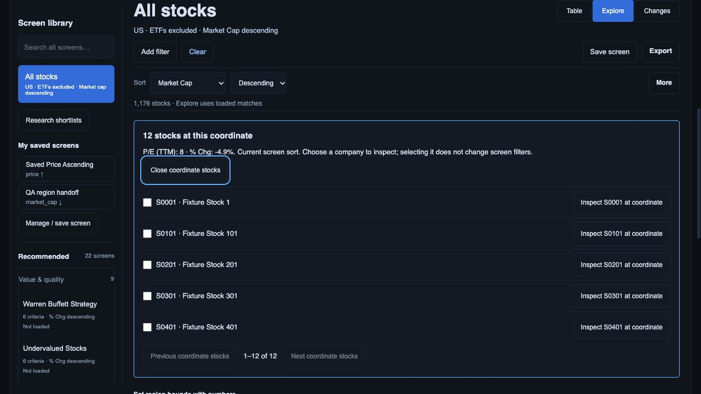
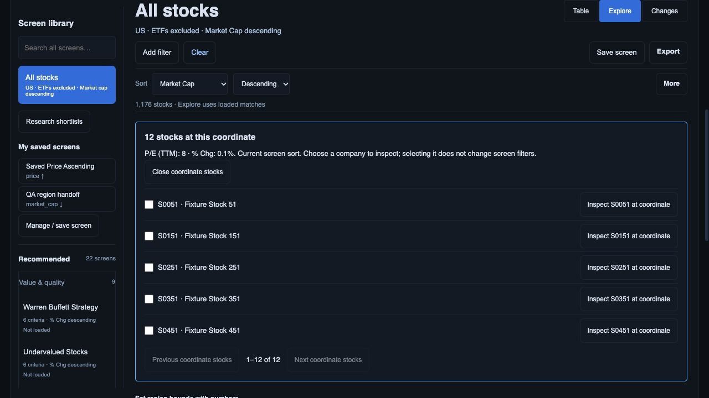
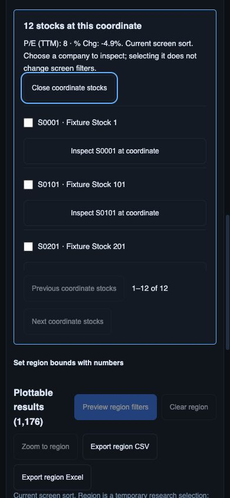

# Explorer coordinate selection and keyboard checkpoint

2 October 2026. Partial D05/R08 progress; release register remains open.

Exact finite plotted coordinates now group all matching canonical companies in current screen sort. Click or keyboard Enter opens a paged company picker for a collision; a single company opens its inspector. No jitter changes analytical values and nearby coordinates remain distinct. Arrow keys browse coordinate groups; Home/End reach first/last; Enter uses the same group path as pointer selection. A white focus ring and text status identify the active coordinate. Escape/Close returns focus to the plot. Numeric range selection remains available for keyboard region bounds.

The picker has per-company select/inspect controls, 50-row pages, existing selection/export integration, and a scrollable list. It revalidates current plotted identities and exact values, so a changed quote cannot remain labelled at its old coordinate. Axis/region changes discard stale picker state. Resize redraws the plot without rebuilding picker controls and losing keyboard focus. Counts now say Explore uses loaded matches instead of claiming that the table's 500-row page is the plot population.

## Actual browser evidence

In-app browser, controlled actual API preview at port 8894; 1,176 synthetic stocks. Screens saved and opened. Earlier cropped desktop captures were replaced after adapting scroll margin to the sticky query header.

1. Home → Enter opened all 12 companies at P/E TTM 8, change −4.9% in market-cap sort. Selected and inspected non-first S0101; closing inspector restored its Inspect button focus and checked selection. Escape on picker Close returned focus to `research-scatter` and emptied the picker.

   

2. Clicking the plot's centre opened 12 companies at P/E TTM 8, change 0.1%, using the same picker. This checks pointer collision activation; it does not qualify drag-region precision or every device input.

   

3. At 390 × 844, document width measured 390 and every picker button measured 44 px high. Picker title, bounds, labels and actions wrap. Focus remained on Close across desktop→phone resize. Viewport restored to default afterward. Final browser warning/error log empty.

   

## Regression and remaining acceptance

87 JavaScript tests pass. Added cases verify canonical share classes, exact-versus-nearby coordinates, current sort, missing/log exclusions, bounded arrow/Home/End/Enter behaviour, 121-company paging, quote/identity revalidation and unchanged screen rules. Backend unchanged; earlier 379 API/worker checkpoint was not rerun for this UI packet.

R08 is not fully closed: pointer/numeric region equivalence, complete keyboard/screen-reader/zoom/reduced-motion tasks, all region/selected exports and live financial factor qualification remain. R09 sector/currency-cap/peer analytics, Changes review queue, full continuity, live Moomoo/PostgREST/Auth and production release gates remain open. Fixture success is not investment-grade data acceptance.
