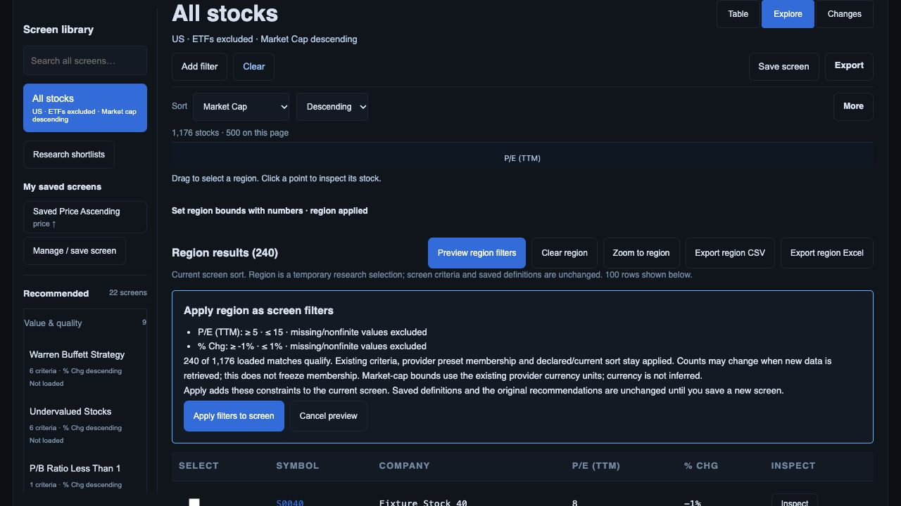
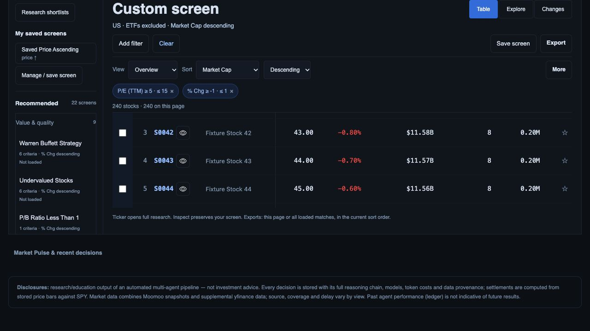
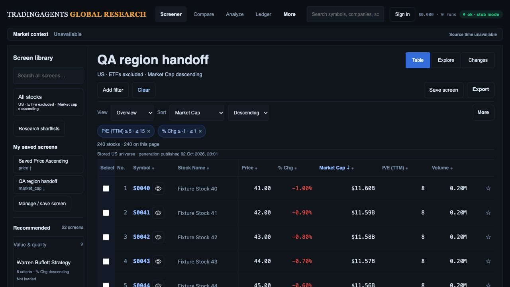

# Explorer region → screen → saved definition checkpoint

2 October 2026. Local implementation; partial D05/R08 and saved-title D04 progress. Original presets/rules/sorts and current screen sort are retained. No release closure or live financial claim.

1. Numeric P/E TTM 5–15 and daily change −1–1% selected 240 of 1,176 loaded stocks. Preview displayed inclusive rules and explicitly left current criteria unchanged until confirmation. Repeated axes intersect; positive ratios exclude zero; blank/nonfinite numbers do not qualify.

   

2. Apply appended canonical filters, returned to Table with 240 stocks and retained market-cap descending sort. Existing provider preset membership stays separate from display snapshot filters. Original saved definitions are untouched. Screenshot is scrolled to the applied criteria; it is not first-fold acceptance.

   

3. Saved “QA region handoff”, cleared, reopened and reloaded. Two filters, stock-only scope, Overview, title and market-cap sort returned. Saving now refreshes the library; asynchronous saved metadata now restores the heading via textContent, avoiding a stale generic “Saved screen” name and false Modified default-view state.

   

The actual downloaded CSV has 240 rows, exact canonical identities in current sort order, all values in the numeric region and one controlled generation ID. [Reconciliation](export-check.json) records the file fingerprint. Download-event observation timed out, but the actual saved file was found and parsed; no successful event observation is claimed.

85 JavaScript tests pass, including numeric/canonical membership, repeated-axis intersection, inclusive zero, provider-rule preservation, Modified/saved serialization and metadata-title recovery. API backend unchanged; earlier 379 API/worker tests were not rerun here. Controlled provider transport, synthetic instruments and fake research storage do not qualify production Auth, financial currency/periods, Moomoo membership or investment readiness. Collision picker, complete keyboard paths, phone/zoom, pointer equivalence and all export scopes remain open.
