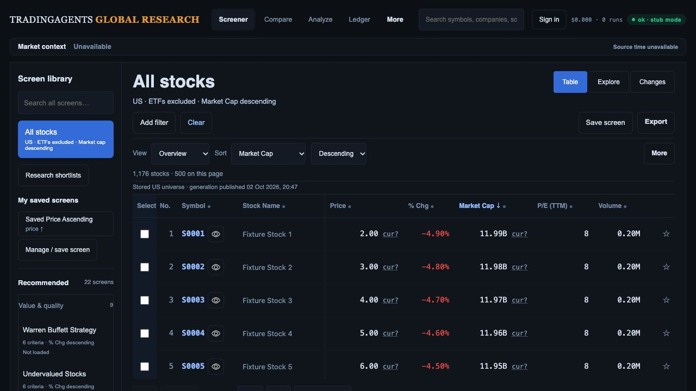
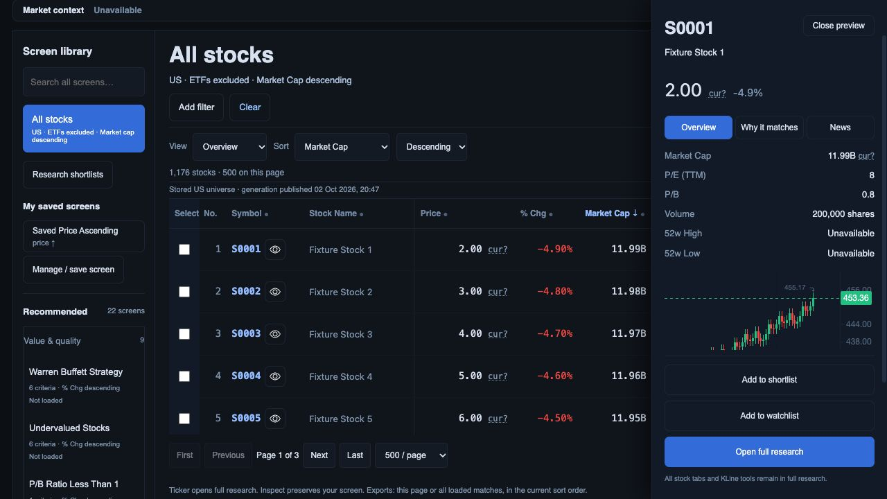
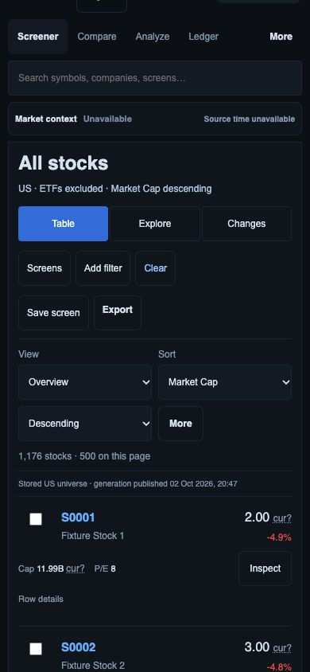

# Field currency display/export checkpoint

Monetary fields in the screener table, mobile cards and inspector no longer imply dollars. Currency labels require a matching canonical identity, field, finite numeric value and currency unit in that field's observation. A supplied three-letter code is shown; otherwise `cur?` has an explicit accessible label and tooltip, with Price currency also disclosed in Data context. Company trading currency is not borrowed for market cap, EPS or another value. Numeric booleans/arrays/nonfinite values render Unavailable. This validates attribution, not fiscal/session/peer comparability.

Groups and server exports share the worker-side `field_currency` contract. CSV and SpreadsheetML append per-monetary-field currency columns, mark absent attribution Unavailable and preserve typed provenance as JSON. Server exports include fields from every returned row rather than only the first, preserving later-row observations. Server CSV now protects formula-leading text, retaining negative numeric values. Client export scopes, canonical identity, ordering and generation columns are preserved. Current browser qualified-currency fixtures are absent; supplied/mismatched USD/HKD/EUR fields, zero values and export JSON are verified in automated tests.

Verification: **394 API/worker tests and 91 JavaScript tests pass**; `git diff --check` passes. New checks cover identity/value/unit/currency mismatch, trading-currency non-inference, zero, huge/nonfinite/boolean input and CSV/SpreadsheetML provenance. CSS asset version was advanced to load the compact 12 px note styling; actual inspector notes measured 12 px after reload.

Fresh in-app browser evidence used existing controlled preview port 8895, reloading static assets without restarting its backend. The Python export changes were exercised in the API tests; the actual browser download exercised the current client exporter. Desktop table and inspector show unknown currency consistently. Phone width/document width both measured 390 px; notes have the explicit accessible label. Temporary viewport overrides were reset. Browser warning/error log was empty. An early library-loading Desk image was rejected and replaced after the 22 recommendation heading was visibly present.

1. **Desk:** stock-only default, market-cap descending; no inferred dollar prefix.

   

2. **Inspector:** compact notes beside price and cap; research actions retained.

   

3. **Phone:** monetary notes retained without document overflow.

   

The download observation timed out, but the newly saved browser CSV was independently parsed from Downloads. [Reconciliation](download-reconciliation.json): 1,176 rows and unique canonical codes, market-cap descending, one immutable generation, all 1,176 price and cap currencies Unavailable as expected for this fixture. The download itself, not the timed-out event, proves file creation and contents.

R02/R09/R11 remain open for actual provider currency/period/session coverage, compatibility-qualified filters/sorts/plots/peers and complete live export acceptance. Currency-less cap filtering/sorting remains visibly in provider units; this packet does not supply exchange rates or qualify cross-currency ranking. Other research/Compare/Changes/private-list monetary surfaces and criterion-side observations still require contract-wide acceptance. The synthetic quote/chart mismatch remains unqualified. All 22 definitions and original research/chart/export capabilities remain preservation gates. No merge, deployment, current Moomoo comparison or investment-team readiness is claimed.
