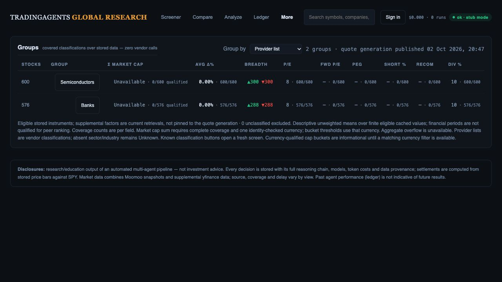
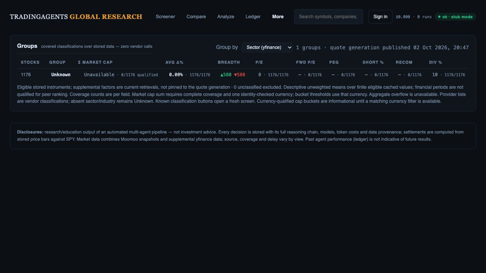
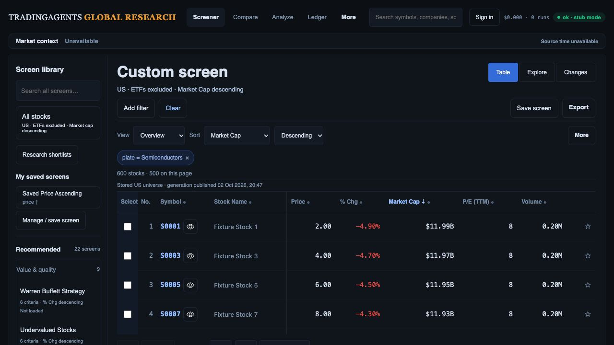
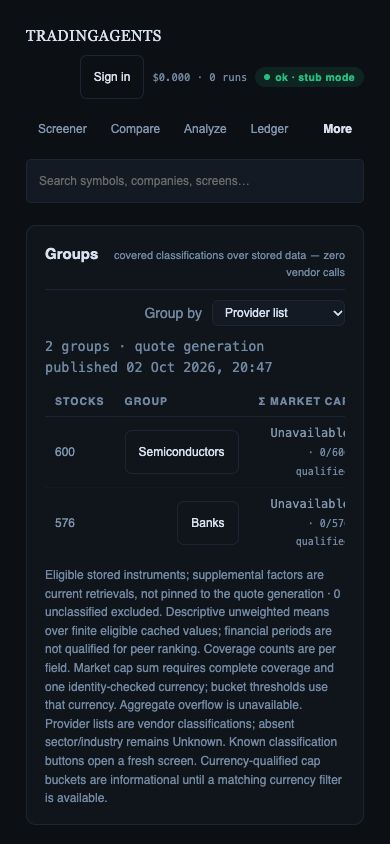

# Groups integrity and drill-through checkpoint

## Implemented

Groups now reads the selected stored quote generation and its metadata, excludes unknown instrument types and uses the same supplemental category clocks/field registry as the screener. Fundamentals expire independently from computed technicals. Successful supplemental changes are visible on the next read; no aggregate TTL cache can renew stale classifications. Malformed maps, boolean/nonfinite numeric values and blank classifications fail closed. Missing sector/industry stays Unknown rather than borrowing a provider list.

Every displayed mean has eligible n/N; positive valuation multiples, nonnegative dividend/short percentages and the 1–5 analyst scale have explicit eligibility. Zero daily change and zero volume remain valid. These are descriptive cached means, **not period-qualified peer ranks**. Retrieval/computation timestamps are not reporting periods. Supplemental data is current at read time and is not frozen by the stored quote generation ID.

Capitalization totals require full group coverage and one currency supplied by an identity/value/unit-checked field observation. Currency is never inferred from market. Mixed or incomplete coverage yields an unavailable full total; per-currency covered subtotals are retained. Cap ordering across unlike currencies returns 400 unless an explicit `cap_currency` selects the comparable ordering cohort; other currencies stay last. Finite-input aggregate overflow yields unavailable rather than Infinity; representable means survive intermediate sum overflow. Cap buckets include currency and remain informational until an equivalent currency-aware screener filter is built. This checkpoint does not qualify actual source/reporting/session semantics for institutional peer analysis.

Known classification buttons open a fresh screen, clear hidden preset/saved/private-watchlist scope, exclude ETFs, reset page/selection/temporary Explorer state and sort market cap descending. Sector/industry use supplemental factors; provider list/exchange use the stored quote source. Unknown and cap bucket entries have no misleading drill action. Provider filter strings are preserved exactly. The API validates market, classification, ordering, instrument type and optional currency inputs.

UI fixes remove undefined `cap()`/`num()` formatter calls, escape drill values, label the grouping select, identify quote publication separately from supplemental freshness, show cap/mean coverage and contain the wide table on phones. Classification buttons have 44 px minimum height.

## Verification

- Full suite: **393 API/worker tests pass**, including stale-vs-fresh classifications, immediate refresh, no provider-list fallback, independent clocks, missing-last ordering, invalid inputs, mixed/incomplete currency totals, explicit currency ordering, overflow and malformed map/identity/value rejection.
- **89 JavaScript tests pass**, including actual Groups rendering/formatter coverage and drill replacement of hidden preset/private/filter state.
- `git diff --check` passes. Existing preset definitions were not edited.
- Actual current routes were exercised in the in-app browser using the controlled port 8895 fixture: 1,200 synthetic instruments, 1,176 stocks, immutable quote-generation storage and offline provider transport. No production writes or vendor calls were made by Groups. The final cap-identity validation tightening is covered by the later full test run; currency-qualified totals were tested in Python, not claimed from these currency-missing browser fixtures.
- Browser warning/error log was empty. Phone width 390 px: document width 390 px, table width 846.421875 px inside a 300 px `overflow-x:auto` container; both known-group buttons measured 44 px. Temporary viewport override was reset.

Four screenshots below were freshly saved and opened before acceptance:

1. **Provider groups:** 600 semiconductor stocks plus 576 bank stocks; field coverage shown, currency-missing cap totals unavailable.

   

2. **Sector groups:** all 1,176 remain Unknown because the fixture has no qualified supplemental sector; no invented sector or drill button.

   

3. **Drilled screen:** Semiconductors opens exactly 600 stocks, ETFs excluded, market-cap descending and the provider-list criterion retained. This is fixture membership reconciliation, not live Moomoo acceptance.

   

4. **Phone:** table stays inside its scroll container and classification actions remain usable.

   

## Remaining gates

R02/R09 remain open: actual currency/period/session/adjustment qualification, per-field/cohort provenance, real taxonomy coverage, compatible percentile/peer cohorts, advanced Explorer factors/bubbles and matching cap-currency drill filters. All broader R01–R15 ownership, continuity, monitoring, export, accessibility/performance, fresh Moomoo and production release requirements remain open. This packet is local implementation progress, not investment-team readiness or deployment.
