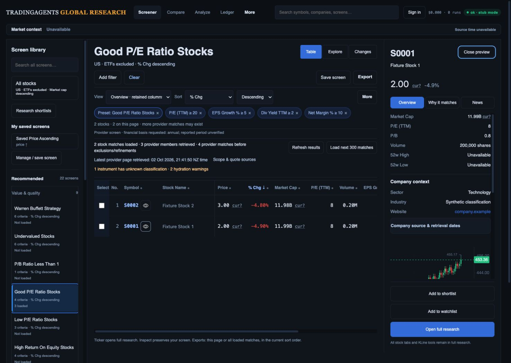
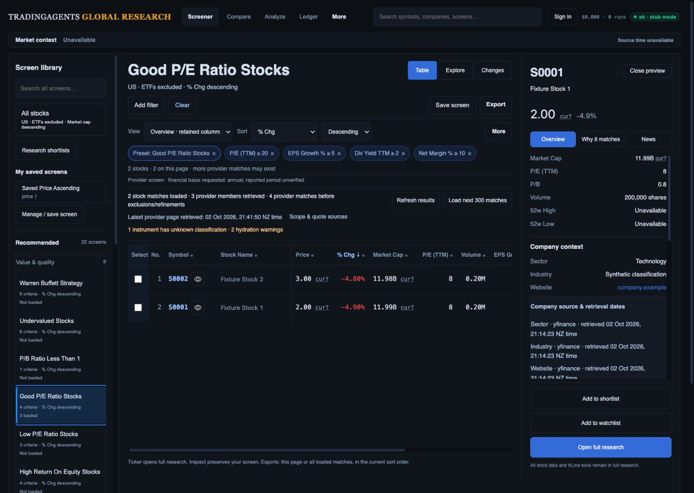
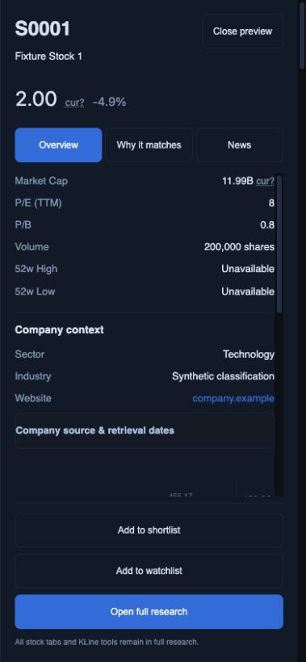

# Inspector focus continuity and company retrieval dates

2 October 2026, based on `c1245fb`. This advances packet 2 of the [current mockup review](../mockup-recheck-e0131ef/README.md). R03/R04/R13 remain open for the full workflow and device/data qualification.

## Implemented

Programmatic focus now uses `preventScroll` for stock inspector opening, tab/range replacement, connected/reconstructed originating-row return, Changes evidence opening and responsive transition into a modal drawer. Focus still moves to Close on opening and returns to the initiating action on close; chart lifecycle and request generation guards remain intact.

Company context now has an expandable **Company source & retrieval dates** disclosure. Each displayed field uses its own supplied source/cache clock, with machine-readable `<time datetime>` and the existing timezone display. Missing, stale, future, wrong-source/wrong-code or timezone-unqualified fields cannot borrow another field's date. A rejected website has no qualified website date. The disclosure explicitly distinguishes retrieval time from fiscal periods and current company metadata from the quote generation.

Repeated company-source prose is moved into the native disclosure, with a 44 px summary target. No custom disclosure toggle or forced page restoration was retained. The stylesheet version changes so the new styling loads.

## Fresh browser checks

The existing port 8897 actual-route fixture was reused and reloaded for the changed static assets. No server restart or live provider request was required. Data/classifications are synthetic, and the recorded chart does not match the synthetic quote; these screenshots establish UI behavior only. Browser warning/error log was empty. The temporary viewport override was reset.

1. **Filtered desktop open — verified:** at 1487 × 1058, Good P/E keeps its four criteria and % change descending. A direct pointer click on the visible S0001 Inspect action preserved document scrollY **0 → 0** and focused Close preview. Masthead, active criteria and primary research actions remain visible.

   

2. **Source dates — verified:** direct pointer activation expanded the native disclosure while scrollY remained **0**. The three `<time>` elements contain the fixture's supplied `2026-10-02T08:14:23.015146+00:00`, displayed as 02 Oct 2026, 21:14:23 NZ time. The internal drawer scroll permits reading content beyond the fold; dates are not financial reporting periods.

   

3. **Keyboard disclosure and return — verified:** Enter on the focused summary collapsed it without page movement. Escape closed the inspector and restored `aria-label="Inspect S0001"`, still at scrollY **0**.

4. **Phone open — verified:** at 390 × 844, Clear settled on All stocks excluding ETFs, market-cap descending and Overview. Opening the visible S0001 action preserved scrollY **0**, focused Close and exposed a named modal dialog. Document scroll width was **379 px**; action-footer bottom **802 px**, within the viewport.

   

5. **Phone focus boundary — verified:** Shift+Tab from Close wrapped to Open full research; Tab wrapped back to Close. Escape returned focus to the visible Inspect S0001 control, with scrollY **0** throughout. This is a bounded keyboard check, not full screen-reader/keyboard accessibility acceptance.

### Verification distinction

The locator-based automation automatically scrolled the document when targeting a disclosure/filtered row, even when the target appeared visible. Direct pointer input using fresh observed geometry and native keyboard input isolated product behavior: those paths retained page position. The temporary compensating disclosure handler was removed. Earlier 42/131 px automation-induced scroll observations are not evidence that this direct interaction still jumps, nor do these checks establish every navigation/reload/viewport path.

## Regression checks

**100 JavaScript tests pass**, including new cases for independent per-field dates and page-position/focus preservation through opening, tab/range focus, connected/disconnected origin return and Changes evidence. Existing breakpoint, obsolete-response, chart lifecycle, preset/reset and export checks remain green. `git diff --check` passes. The preceding backend checkpoint has 422 passing API/worker tests; backend code was unchanged here and that suite was not rerun solely for this static UI change.

## Still required

- [ ] Cross-state/tablet/zoom/screen-reader/contrast/reduced-motion acceptance and measured latency.
- [ ] Full research/Compare/private-route Back, reload, deep-link, selection, page, scroll and focus continuity.
- [ ] Table-level criterion-versus-display clarity, coherent chart fixtures and broader per-field source/period/currency coverage.
- [ ] Remaining Explorer, team/pair-review, monitoring, export/Moomoo/platform and production release gates in R01–R15.

No merge, deployment or production acceptance is claimed.
