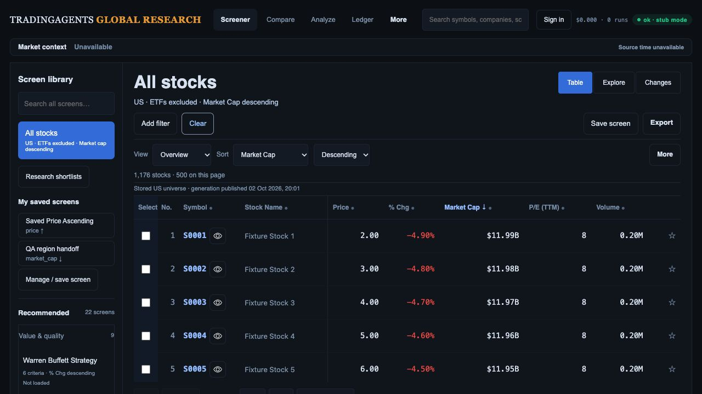
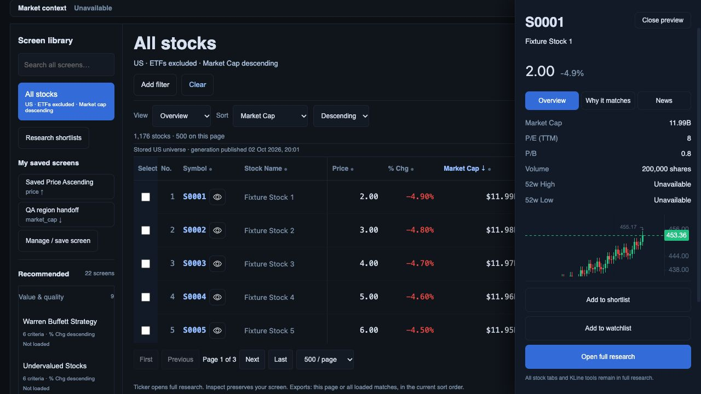
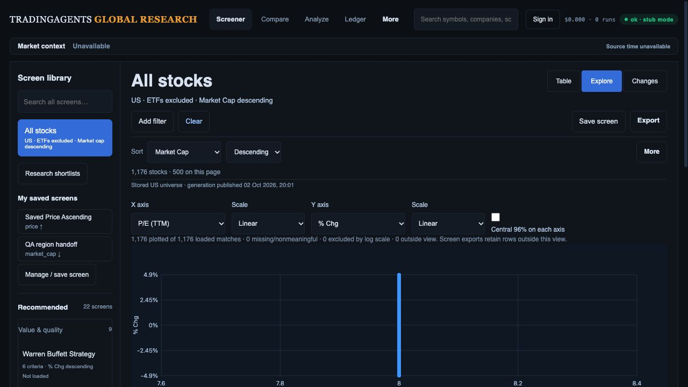
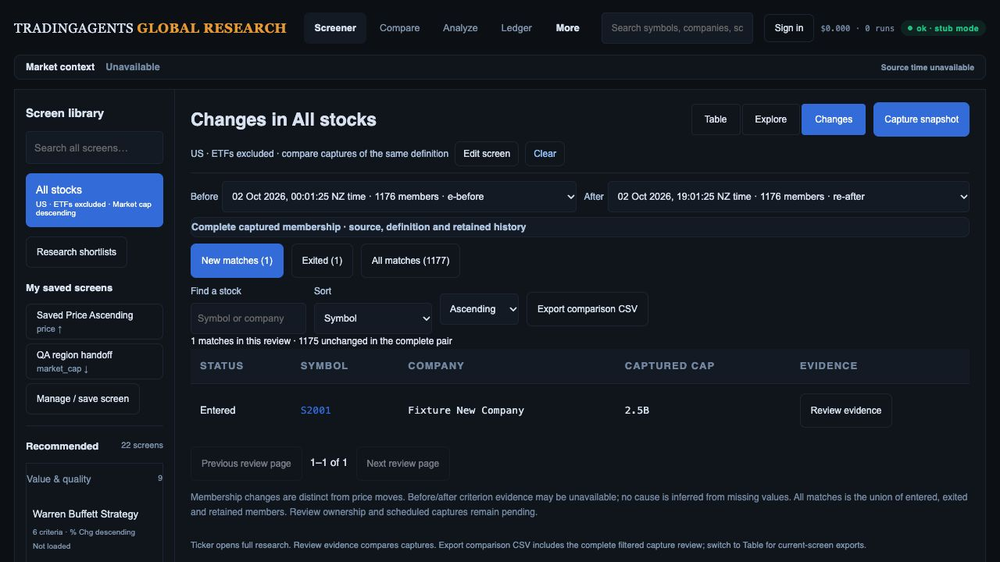

# Current build versus approved design — 2 October 2026

## Decision

Retain the combined Desk → Explore → Changes architecture and existing design tokens. The build has the core shell, but the original mockups show a more complete investment workflow. Implement the missing handoffs and evidence before declaring presentation readiness. This review supersedes the older statement that region-to-save is absent; it does not close R01–R15.

Original references: [Desk](../references/02-research-desk.png), [Explorer](../references/03-factor-explorer.png), [Changes](../references/04-change-monitor.png). These are illustrative concepts: their sample companies, values, counts, vendor labels and shortened screen library are not specifications. Preserve all 22 current preset keys/rules/sorts, saved definitions, original research tabs, financial subtabs, KLine/Compare tools and CSV/Excel-compatible exports.

## Fresh flow audit

The current local build was reopened in the in-app browser, port 8894, viewport 1280 × 720. Four screenshots were captured, saved and opened in this review. The initial loading Changes screenshot was rejected and replaced with the settled view. Existing original references were separately opened for comparison. Different viewport, default rather than illustrated financial screen, and controlled fixture data mean this is a workflow/hierarchy audit, not pixel-match or real financial acceptance. Browser warning/error log was empty.

1. **Reset Desk — functional; company/evidence presentation incomplete.** Clear returned from the saved region screen to 1,176 stocks excluding ETFs, market-cap descending, Overview and page one. All 22 recommendations remain in the library. Compact scope and permanent Clear work. Compared with the mockup, the table lacks qualified company taxonomy and row trends; the library's secondary text remains small and the unavailable market strip consumes space. Criterion-first filtered columns and evidence still need matched-state tests.

   

2. **Inspector — improved hierarchy; context still incomplete.** Six metrics precede the chart and the three research actions stay reachable. The laptop drawer covers part of the table, whereas the original larger mockup uses an adjacent panel. Keep this adaptive treatment, then qualify it at the reference width and on phones. Sector/industry/website and criterion source/period need field-qualified rendering. Source/history detail requires inner scrolling. Fixture quote 2.00 and recorded chart around 453 are incompatible: this capture cannot qualify instrument accuracy.

   

3. **Explorer — supported factors work; analytical and selection design incomplete.** Table-only column-view control is now hidden. The plot discloses missing/log/outside-view counts and advanced axes remain disabled pending coverage. Region preview → apply → save/reload is implemented locally; see the [handoff evidence](../explorer-region-handoff/README.md). Exact-coordinate collisions still choose one company and need an explicit picker with keyboard access. Region controls and linked rows sit below the laptop fold. The status still says “500 on this page” while the plot includes 1,176 loaded stocks; make counts presentation-specific. Sector colours, currency-consistent cap sizes, peer comparison and criterion detail shown in the mockup are not yet available.

   

4. **Changes — membership review works; review queue incomplete.** The settled pair shows one entered, one exited, 1,175 unchanged and a 1,177-member union. Dates, search, sort and comparison export work. The original design's row selection, criterion-led financial columns, pair review status/notes, bulk actions and Next unreviewed are missing or not fully qualified. Company names use a dense monospaced treatment; use the Desk company typography. Add causes only after compatible before/after observations prove them. All-stocks synthetic membership does not prove financial threshold causes.

   

Visible accessibility risks: small source/library labels, icon-only row actions, plot overlap and controls below the fold. Semantic buttons and labelled inputs exist, but complete keyboard/focus, screen-reader, contrast, zoom, touch and reduced-motion acceptance remains open. No production or current Moomoo count claim is made.

## Ordered implementation checklist

| Order / register | Build elements from the original design | Required acceptance |
| --- | --- | --- |
| 1 / D01, R01–R02 | Finish field registry: canonical identity, units, actual currency, fiscal/TTM/forward period, source/session/adjustment clocks and eligible coverage. Complete native capture/PostgREST/publication and failure qualification. | Coherent pages/capture/download during publication; no unknown type silently admitted; no mixed period/currency causal or peer claim. Record live field coverage. |
| 2 / D02–D04, R03–R04/R12 | Criterion-first table/inspector context, qualified sector/industry/website, readable secondary labels. Match desktop adjacent inspector where space permits; keep bounded drawer on narrow screens. Add presentation-specific counts, simplify unavailable market context, and verify filtered hierarchy. Optional lazy/batched trends follow source qualification. Complete research/Compare/reload origin restoration and Settings/private-list recovery. | Reference-state captures at 1487 × 1058; default table ≤360 px; Clear/evidence/actions accessible at 390/768/1280 and 200% zoom. Preserve seven research tabs, six financial subtabs and entire chart/Compare inventory. No per-row eager chart fetch. |
| 3 / D05, R08 | Finish Explorer collision picker and keyboard-equivalent inspection/selection. Put concise region summary and primary apply action near the plot; disclosure for detailed bounds/provenance. Preserve preview/apply/save semantics already built. | Pointer/numeric/keyboard canonical IDs agree; inclusive bounds and repeated-axis intersections; save/reload/export match. Axis/source changes invalidate stale preview; original presets untouched. |
| 4 / D06, R02/R09 | Actual sector legend, currency-consistent cap bubbles, cohort-labelled percentile panel; forward P/E/growth and ROIC/debt only when qualified. | Per-factor/cohort coverage, tie/small-cohort policy, unknown taxonomy and unavailable state. Higher valuation rank must not imply quality. |
| 5 / D07, R05–R07 | Pair-specific status/notes, selected/bulk shortlist/export and cross-page Next unreviewed. Add team roles after real Auth/legacy ownership mapping. Improve Changes company typography; render all enabled criterion evidence. | Review key includes owner/team, screen version, both capture IDs and canonical code. Account isolation, revision conflicts/draft preservation, scope changes and exact selected downloads. |
| 6 / D08, R07/R10 | Compatible before/after evidence and explicit opt-in saved-screen schedules with last-success/running/failure/retry UI. | No false exits from partial captures; distinguish observed crossing from supported cause; idempotent duplicate/restart jobs and retained previous success. |
| 7 / D09, R11/R13–R15 | All export scopes, current like-for-like Moomoo reconciliation, devices/accessibility, measured p95 and 5–8 analyst tasks; migration/cutover/rollback then merge/deploy and production smoke. | All 22 presets and both RSI definitions retained; actual downloaded ID/count/order/value/provenance reconciliation. Exact production commit/deployment/migration evidence. |

Every packet records implementation, regression checks, fresh browser/data evidence and unresolved acceptance. Instrument latency immediately: feedback ≤100 ms and cached transitions ≤300 ms p95 are targets, not measured production claims. Keep data qualification and safe UI work moving together. Existing merge/deploy authorization applies once release gates pass.

## Plan corrections

- Region-to-save is now partially implemented and tested; collision/keyboard/live factor acceptance remains open.
- Provider scope compaction and inspector metric-before-chart ordering are already implemented locally. Do not rebuild them as absent features.
- Existing criterion matrix, private shortlist and generation-reader foundations remain; qualify/extend them rather than replace the screener or chart engine.
- Saved-screen reload naming and immediate library refresh defects were fixed in the current pending implementation.
- Latest UI regression: 85 JavaScript tests pass. The earlier 379 API/worker checkpoint is historical and was not rerun for this review. The richer build remains local; investment-team release is unfinished.
