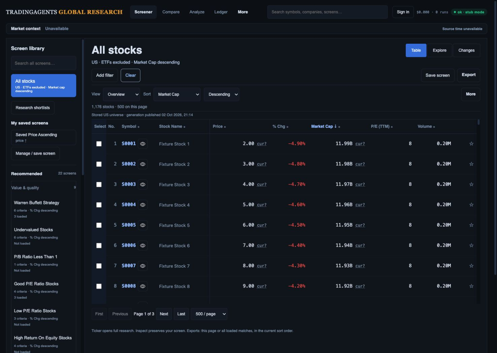
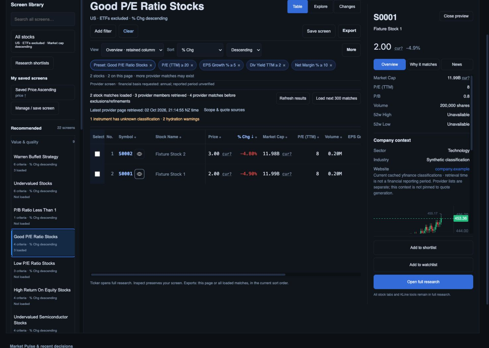
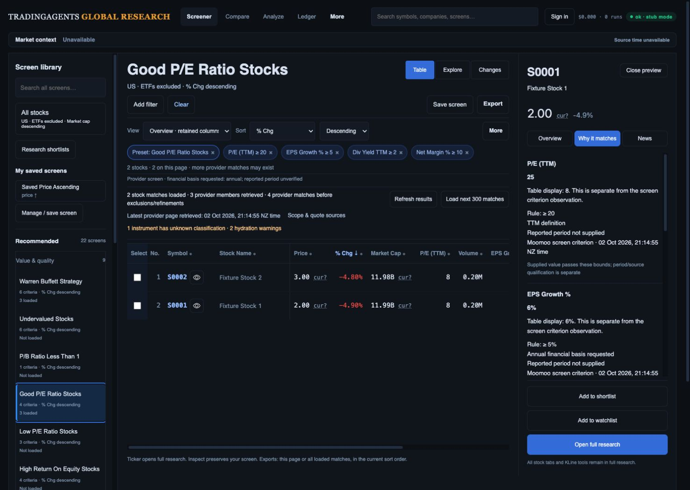
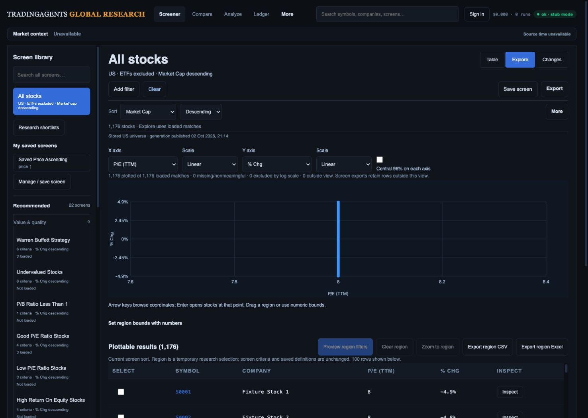
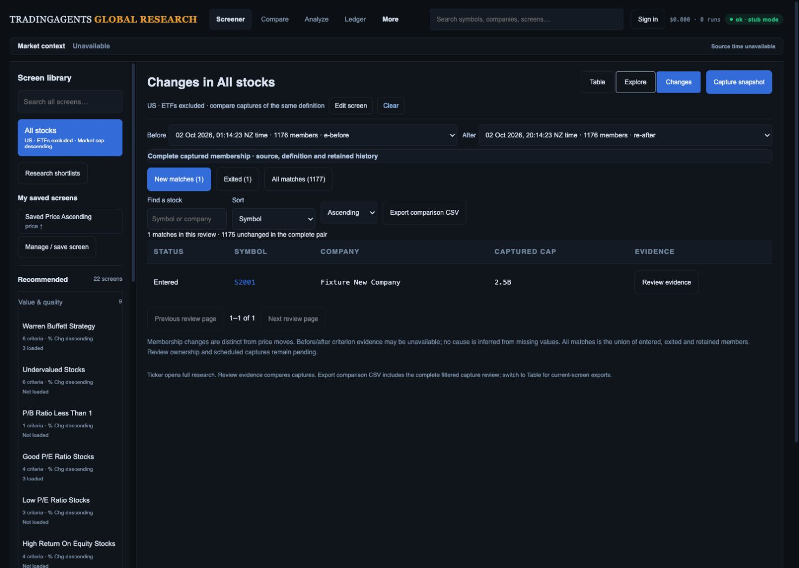
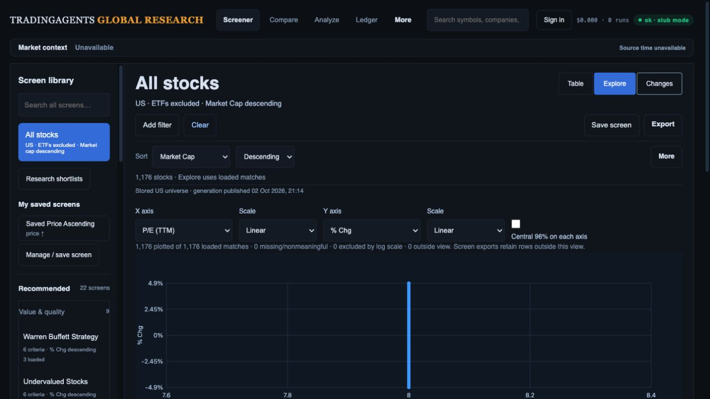

# Build review against the three approved mockups

Reviewed 2 October 2026 against committed UI baseline `e0131ef`. This is the current design comparison and implementation sequence; it supersedes earlier descriptions of missing features. The complete release closure register remains [R01–R15](../../investment-workspace-current-gap-plan.md#gap-register).

**Verdict:** retain the combined Desk → Inspect → full research/Compare → shortlist/export → Changes workflow. Its main structure is built. Explorer's analytical context and Changes' analyst review workflow are incomplete, and data/production acceptance is still open. The build is not yet investment-team presentation ready.

## Evidence and limits

Six fresh captures were saved through the in-app browser and opened for visual inspection alongside the original [Desk](../references/02-research-desk.png), [Explorer](../references/03-factor-explorer.png) and [Changes](../references/04-change-monitor.png). Desktop viewport was 1487 × 1058, matching the concept dimensions; the laptop check was 1280 × 720. Matching dimensions does not mean matching market data or screen state, or pixel-perfect acceptance. The viewport override was reset afterward.

The running actual-route preview on port 8897 uses controlled generation/provider/company/criterion fixtures. The 1,176 stocks, company classifications and capture pair are synthetic. The recorded chart near 453 is incompatible with the synthetic S0001 quote of 2; it cannot establish instrument accuracy or qualify row trends. The provider fixture deliberately separates membership P/E 25 from displayed quote P/E 8 and leaves reporting period/currency unqualified. No new live Moomoo reconciliation, Auth/PostgREST qualification, production deployment, p95 measurement or accessibility certification was performed. Browser warning/error log was empty during the reviewed flow.

Three pending worker source/test edits were already present at review start; they do not change these rendered UI screens and are not claimed as verified by this design review. The preceding committed checkpoint records 408 Python and 98 JavaScript tests; those counts are historical regression evidence, not tests newly run for this document.

## Reviewed steps

1. **Default Desk — core behavior healthy; scanning needs polish.** Clear restored All stocks, US, ETFs excluded, market-cap descending and Overview. The 22-screen library remains visible. Table top measured **357.625 CSS px** at scrollY 0, meeting the ≤360 px target in this fixture. The original concept has more readable secondary text, a less verbose library, more prominent selection/Compare and row trends. Keep all 22 definitions rather than copying the concept's shorter sample library. Add optional coherent trends only after the source and request budget qualify.

   

2. **Filtered inspector — company context is built; opening disrupts orientation.** Good P/E retains its four original criteria and % change descending sort. Sector/industry/website now render before the chart, with cached-source disclosure and separate quote context. Opening S0001 moved the document to **scrollY 131**, hiding the masthead in the capture. Fix initial focus without page scrolling, retain internal drawer scrolling and restore the originating row's focus/scroll on close. Company retrieval dates exist in the payload but are not shown; expose the actual per-field dates on demand. The long evidence text needs a summary/detail hierarchy.

   

3. **Criterion evidence — improved source honesty; table interpretation remains a gap.** Why it matches shows P/E **25** against ≥20 and separately identifies table display **8**. Each rule has its own source/retrieval clock; unavailable reported periods are explicit. Dynamic percentage columns now show percentages. These are implemented features, superseding the previous review's missing-source/formatting notes. However, a table reader still sees 8 under a ≥20 screen without opening the inspector. Add explicit criterion-versus-display column/value treatment, including accessible labels and the same definitions in sorting, Explore and exports. Do not overwrite a display observation with a criterion value and leave its old attribution attached. Collapse repeated explanatory prose while retaining source/period detail.

   

4. **Explorer — supported exploration built; the concept's context panel is missing.** The compact axes toolbar, four supported axes, coverage counts, region preview/apply/save and exact-coordinate collision selection are existing local foundations. The constant P/E fixture creates a vertical line; do not jitter points to make it resemble the concept. The concept's sector legend, same-currency cap bubbles, forward valuation/growth axes and cohort-labelled peer percentiles remain absent/gated. Add a selection context panel containing bounds, eligible count, Apply, Compare and exports before analytical embellishment. Define rank direction, ties, small cohorts, negative values and exclusions with the data contract.

   

5. **Changes — membership comparison healthy in the fixture; review queue incomplete.** The pair shows one entered, one exited, 1,175 retained and a 1,177-member union. Date pair, cohort/search/sort, evidence and comparison CSV are built. In the settled scoped measurement, table top was **446.78125 px** and first body row **491.421875 px**, meeting the ≤500 px closed-inspector target for this state. That does not qualify filtered/open-inspector/device states. The original concept's pair-specific status/notes, Next unreviewed, selected/bulk shortlist/export and supported crossing/cause explanations are incomplete. Captured cap still displays 2.5B without the Desk's currency qualification. Manual capture is built; opt-in durable screen monitoring is pending.

   

6. **Laptop Explorer — primary handoff visibility fails.** At 1280 × 720 and scrollY 0, numeric-bounds disclosure begins at **798 px**; Preview region filters and Export region CSV begin at **856 px**. The first viewport shows the plot but none of these handoffs. Move the compact count/bounds/apply/Compare/export summary alongside or immediately above the plot; keep the detailed bounds form and source disclosures expandable below it. Preserve a usable plot rather than merely shrinking it until every control fits.

   

Visible accessibility risks: small secondary labels, icon-only row/filter actions, loss of orientation from focus scrolling, dense/repeated evidence prose and below-fold primary handoffs. Screenshots and DOM checks do not establish contrast, screen-reader announcements, keyboard task completion, zoom or reduced-motion acceptance.

## Corrected build checklist

The approved concepts are illustrations, not authority for securities, counts, connected vendors or metric definitions. No illustrated ROIC/net-debt factor becomes enabled solely to match the image.

| Order / existing register | Build work | Completion evidence |
| --- | --- | --- |
| 1 / R01, R02, R11 | Complete per-field identity/unit/currency/period/session and membership/display contracts. Finish the pending Yahoo identity/ratio audit, including share-class cash-per-share basis and old-cache invalidation after unit corrections. Extend shared currency qualification to Changes, Compare, private lists, plots and every export. Qualify actual generation/capture/PostgREST behavior. | Raw dated provider samples, exact code/value/unit and compatible-period tests, eligible n/N coverage, publication-between-pages/capture tests. Unknown stays explicit; no retrieval clock becomes a fiscal date. |
| 2 / R03, R12, R13 | Fix inspector focus/scroll preservation; show field retrieval dates; make screening-versus-display values clear in the table. Tighten library metadata, secondary text and evidence summaries using existing tokens. Repair the inconsistent chart fixture before data-sensitive UI acceptance. Optional lazy/batched row trends follow, with interval/span/session and source disclosure. | Default/filtered/inspector desktop, laptop, tablet, phone and 200% zoom captures; accurate identity through chart/quote/evidence; reset/sort unchanged; keyboard focus restored; no eager per-row vendor calls. |
| 3 / R04, R11, R13 | Qualify screen → ticker → research → Compare → return across Back/reload/deep links, including private routes. Keep the original research/chart engine and add a compact selected-company action summary where necessary. | Seven research tabs, six financial subtabs and all existing KLine drawing/study/session/layout/sync controls exercised; filters/sort/columns/page/selection/scroll/focus recover; actual selected/page/loaded downloads reconcile. |
| 4 / R08, R09 | Move Explorer's selection summary and actions into the working viewport. Validate existing region/collision paths rather than rebuilding them. Add sourced sector legend, qualified cap sizing and labelled peer panel; then enable supported forward P/E/growth or derived factors only when eligible coverage qualifies. | Pointer/numeric/keyboard membership, apply/save/reload and export IDs agree; covered subset labelled; compatible currency/period/cohort; ties/negative/missing/small-cohort behavior tested; no jitter. |
| 5 / R05, R06, R11 | Finish owner/team/legacy mapping, then build pair-scoped status/notes, cross-page Next unreviewed, selection and revision-safe bulk shortlist/export. General company shortlist status remains separate from review of a specific pair. | Real two-owner/two-role Auth isolation and revocation; key includes owner/team, definition version, both capture IDs and code; conflicts preserve drafts; pair changes clear/revalidate selection; exact filtered/selected downloads. |
| 6 / R07, R10, R12 | Qualify compatible before/after criterion evidence before crossing/cause labels. Then add explicitly enabled saved-screen monitoring with durable bounded idempotent jobs, timezone/session handling, last success/running/failure/retry. Keep universe refresh separate. | Missing/incompatible/partial captures create no false causes/exits; every supported criterion and repeated bound exercised; duplicate dispatch/restart creates one capture; failures preserve prior success; monitoring off/on works. |
| 7 / R11, R13, R14, R15 | Complete end-to-end data/download/accessibility/device/performance acceptance, fresh like-for-like Moomoo reconciliation and analyst tasks. Qualify additive migrations, production Auth/PostgREST, cutover/rollback; then perform the already-authorized merge/deploy and production smoke. | All 22 definitions and original saved screens retain keys/rules/sorts/hashes; documented RSI limitations; exact export IDs/order/value/source across every scope; recorded p95 conditions and 5–8 analyst tasks; production commit/deployment/assets and rollback evidence. |

### Checklist applied to each packet

- [ ] Initial view, Clear and second active-preset click return to selected-market stocks excluding ETFs, market-cap descending and default columns.
- [ ] All 22 preset keys, boundaries, periods and declared sorts plus existing saved definitions are retained.
- [ ] Full analysis, all original KLine/Compare features, and CSV/SpreadsheetML `.xls` remain reachable.
- [ ] Source, criteria, query/version, generation, canonical identity and revision stay consistent through navigation and exports.
- [ ] Loading/refresh/error/empty/offline states preserve understandable context; obsolete requests cannot replace a newer screen or account.
- [ ] Measured warm feedback <100 ms p95, cached inspector <150 ms and warm usable results <1 s under recorded device/network/cache/dataset conditions. These are acceptance targets, not measured claims.
- [ ] Close the applicable R-register entries only with implementation plus evidence. Fixture layout progress does not close data, Auth or production gates.

## Changes to the previous plan

Retired obsolete missing-feature statements for company context, per-rule provider/custom source routing, dynamic percentage formatting, region apply/save/reload and collision/keyboard selection. These are built locally and still require broader acceptance. Default Desk placement passes in this fresh fixture; settled Changes closed-inspector placement also passes. Their full cross-state acceptance remains open.

Added explicit table-versus-membership semantics, share-class ratio basis and legacy cache correction, cross-surface currency consistency, company retrieval dates, coherent chart fixtures, focus-induced scroll and measured laptop action placement. These take precedence over optional sparklines. No framework rewrite, replacement preset library or loss of existing chart/export functionality is proposed.
