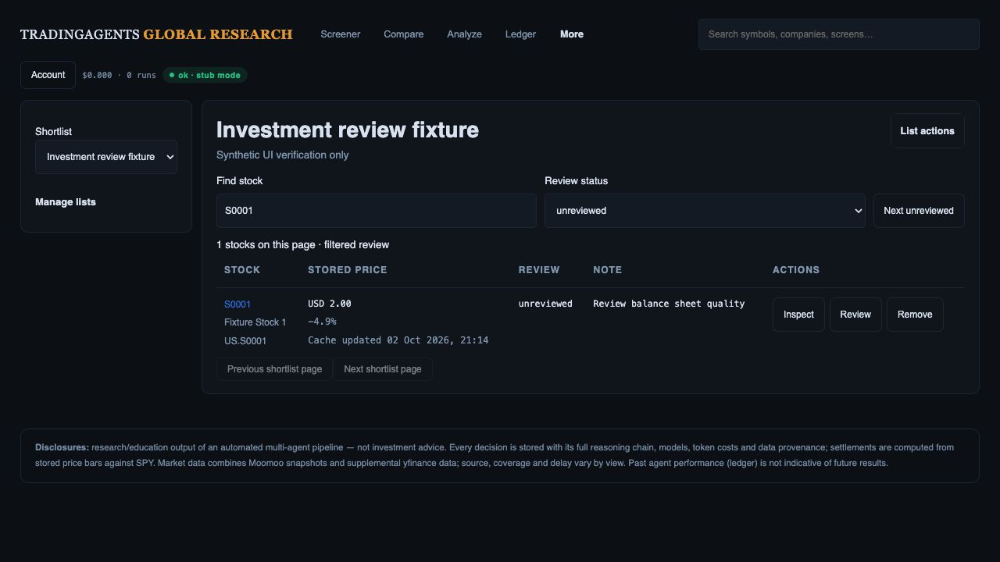
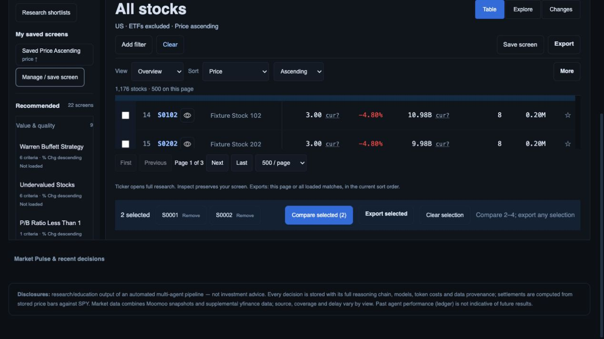
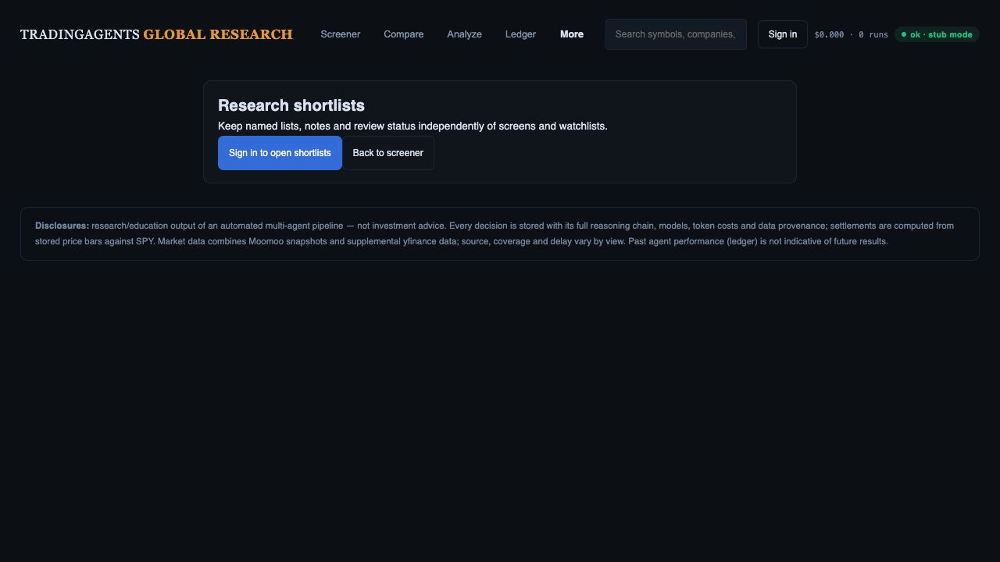

# Reload and research navigation continuity

Local implementation checkpoint, 2 October 2026. This advances R04/R05/R12; those full release gates remain open.

## Behavior

Settings, Compare and private shortlists now have explicit hash routes. A requested shortlist ID survives an anonymous deep link and sign-in. Validated owner-bound session storage preserves shortlist search, status, archive mode and page offset without putting private filters in the URL. Research origin persists through stock/Compare reload and returns screen state, selection and stored scroll coordinates. Sign-out/account changes clear private navigation and origin; public screen origin is separate. Invalid origins, duplicate canonical identities/selections and malformed stock encodings fail closed. Versioned helper URLs prevent new HTML from using incompatible cached navigation code.

## Verification

`node --test web/api/tests/ui/screener.test.cjs`: **115 passed**. New coverage includes routes/history normalization, owner isolation, sign-out clearing, malformed persistence and helper asset versions. No backend logic changed; the earlier 422 backend tests were not rerun for this static-only checkpoint.

Actual-route offline browser checks at 1280 × 720:

- Settings route persists after reload and Back restores the screen route.
- Anonymous shortlist deep link survives reload with a sign-in gate.
- Fixture sign-in opens the requested list. Search `S0001` and Unreviewed status survive reload.
- Shortlist → full research → reload → Back restores the filtered shortlist.
- Screen with Price ascending and selected S0001/S0002 → Compare → reload → Back restores that sort and both selections. Read-only DOM confirmed the sort, ascending direction, canonical screen hash and checked selections.
- Screen → full research → reload → Back also retains that screen state.
- Sign-out → shortlist deep link → reload exposes no private list contents.

Screenshots below were saved and visually inspected. The Compare return capture is scrolled; it supports visible selection/action placement, not a measurement of initial viewport or exact scroll restoration.

## Limits

The preview uses in-memory storage, synthetic stocks and recorded research/chart responses. S0001 has mismatched fixture quote/research/chart prices; these checks qualify navigation only. Real Auth, two-owner server isolation, 501+ item browser paging, financial accuracy, every research/KLine/Compare feature, all devices and production remain unqualified. Page offset 100 is covered by the unit harness; the one-item browser shortlist does not prove large-list paging. No merge/deployment occurred in this checkpoint.
