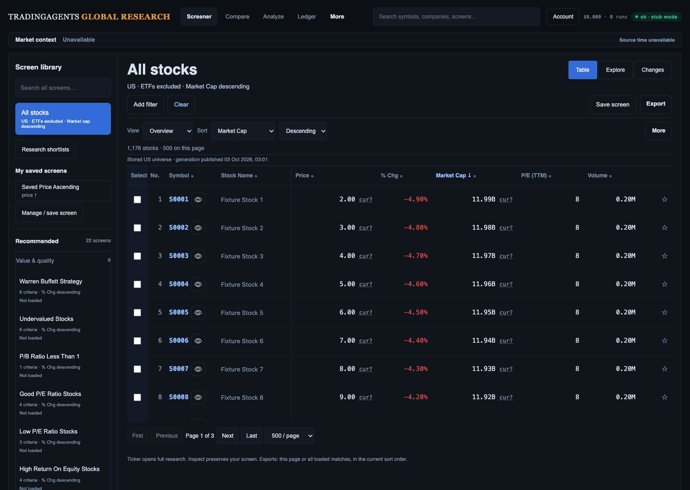
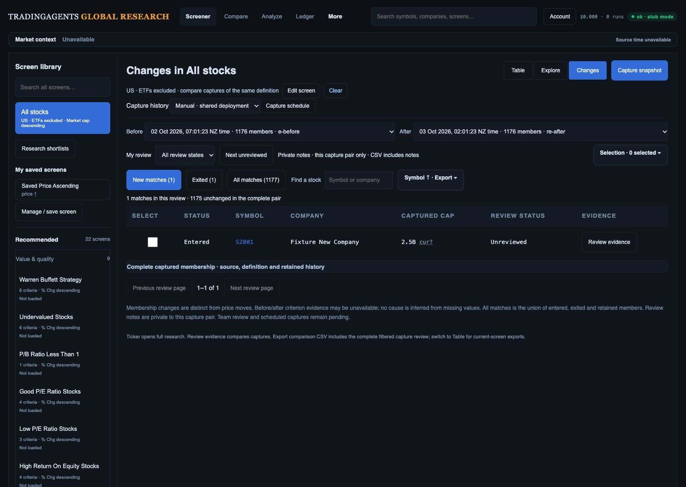
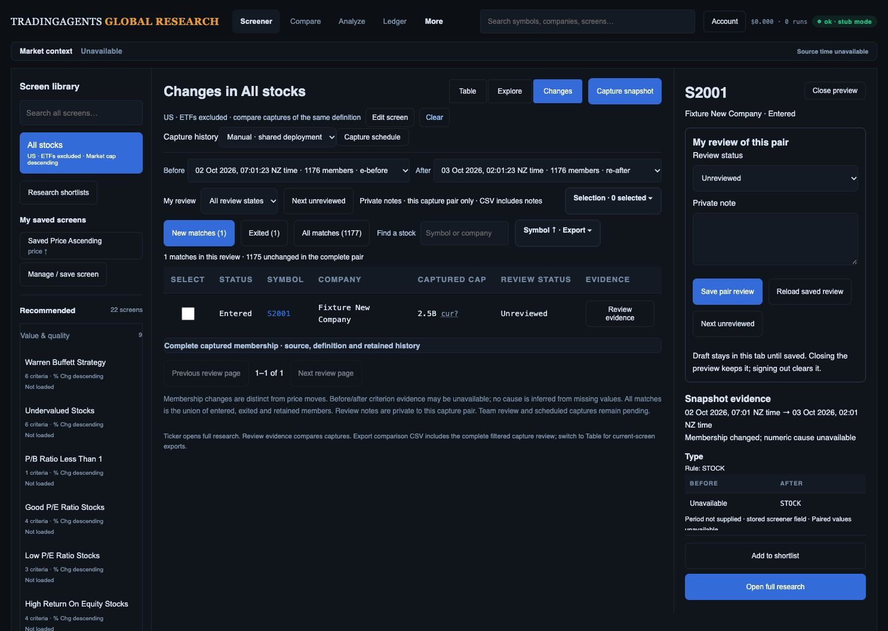
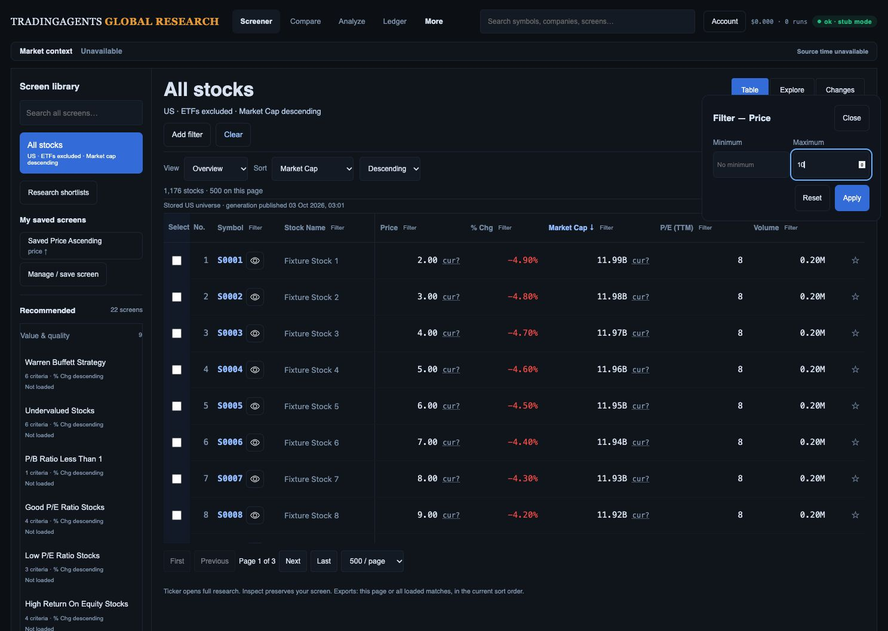
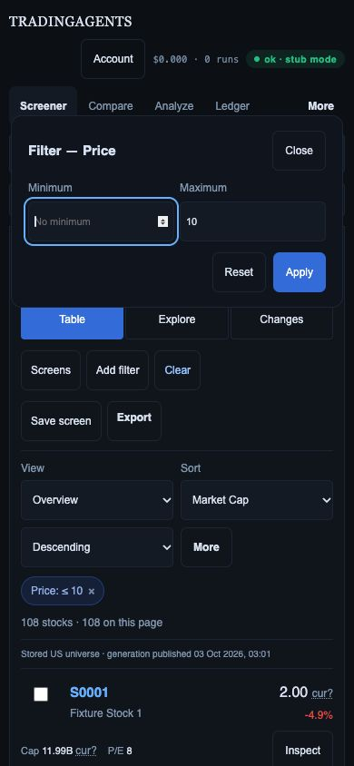

# Desk, Changes and filter-editor presentation review

3 October 2026. Current local implementation compared with the user's original Research Desk and Change Monitor mockups. All runtime evidence below comes from fresh synthetic localhost browser captures in this review. Original mockup numbers and unsupported factors remain illustrative; they are not provider evidence.

## Flow and findings

1. **Default Desk — placement target met in this state.** At 1487 × 1058 the table begins at 357.625 CSS px (target ≤360). Default displays stocks excluding ETFs, Market Cap descending, visible Clear, all 22 original recommended screens, view/sort/export and source context. Current typography and grouping differ from the mockup, but the entry controls and disclosure hierarchy are retained. Unknown currency remains explicit rather than displaying an invented USD symbol.

   

2. **Changes — row-access target met in this state, with and without inspector.** First data row at 491.828 CSS px (target ≤500), both closed and open at 1487 × 1058. Before/after, review controls, cohort counts, search, export and provenance remain available. The inspector reduces table width to 834 px without pushing this first row down. This default screen has no numeric criteria: it cannot qualify the fuller criterion-heavy mockup or classify a crossing from legacy evidence.

   
   

3. **Column-filter editor — accessibility defect fixed.** Before: repeated glyph-only filter links; unnamed min/max fields; generic overlay without dialog semantics, initial focus, keyboard containment or Escape return. After: named Filter buttons, visible Minimum/Maximum labels, field-specific input names, modal semantics/background isolation, initial input focus, Tab/Shift+Tab containment, Escape close/origin return and readable Close. Removed the redundant second active-filter link; the remaining button retains active colour, border and accessible active state.

   
   
   

## Verification and limits

- Browser: Shift+Tab from Minimum → Close; Shift+Tab from Close → Apply; Tab from Apply → Close. Escape removes the editor, restores Filter Price focus and leaves zero inert elements. Price ≤10 applies to 108 synthetic stock rows; active filter is named and Clear restores the default.
- At 390 × 844, dialog spans x=12..378 (366 px); document scroll width is 390 px. Close/Minimum/Maximum/Reset/Apply all measure 44 px high. Saved screenshots were visually inspected.
- **162 JS tests pass**, including actual modal-helper background isolation/focus loop/restore and prior filter draft/application checks. `git diff --check` passes. Backend code unchanged from the preceding 750-test checkpoint.
- Asset fingerprint: `20261003-filter-access1`. No eager provider calls, chart changes, preset definition/sort changes, production flag activation, merge or deployment.
- Open: complete 768/1280/zoom/motion/contrast/screen-reader audit; populated private-history/source/account transitions; criterion-heavy and real-data matched states; p95 responsiveness; all original KLine/Compare paths; live-data/Moomoo/platform/cutover/release. These fresh placement measurements do not close R03/R07/R13 overall.
- Mockup elements still gated or absent: qualified ROIC/debt and peer factors, normalized sector taxonomy, optional lazy row trends and team review. Enable only with source/currency/period/coverage evidence; do not replace these with illustrative values.
