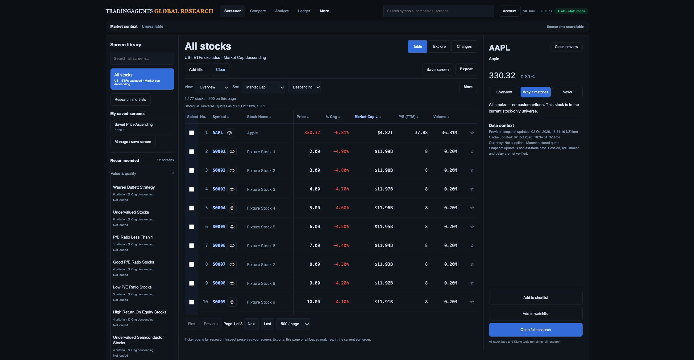
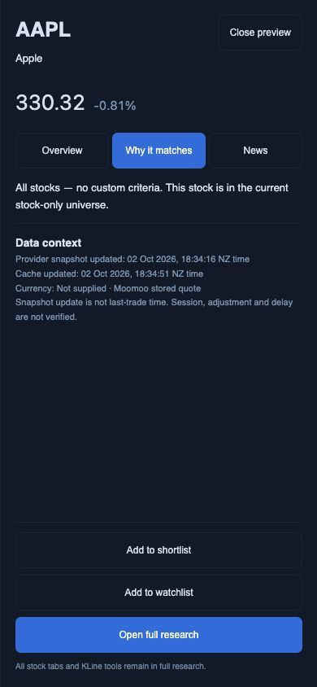

# Quote provenance follow-through — 2 October 2026

The mockup's information depth requires truthful source context before richer company/factor presentation. The actual cloud snapshot normalizer now produces per-field identity/value/unit/source records. `update_time` is parsed as Unix milliseconds and identified as **provider snapshot update**, never last-trade time. Cache write time is taken after each returned batch and kept separate. Malformed numbers become missing values; valid zeros remain zeros.

Capture binds these produced records to exact current criteria only when there is no period/window/context dependency. Repeated bounds get independent slots. Daily volume does not supply a 30-day average. Currency and fiscal/session periods are absent unless qualified; the current producer leaves them absent. Numeric explanations requiring those contracts remain unavailable.

## Source and limits

A fresh read-only AAPL public quote response was normalized and used in the inspector. [Bounded evidence](verification.json) records its raw-response hash, exact source/cache timestamps and absent currency. This is one quote, not a provider-wide coverage or count reconciliation. The preview's stock classification, remaining 1,176 stocks/24 ETFs and other stock detail/chart responses are synthetic. The inspector was checked in Why it matches to avoid presenting the recorded fixture chart as reconciled.

Primary references: [Moomoo cloud tool schema](https://open.moomoo.com/mcp-docs/available-tools) and [cloud getting started](https://open.moomoo.com/api/overview/getting-started) describe millisecond time fields. [OpenD SDK snapshot documentation](https://openapi.moomoo.com/moomoo-api-doc/en/quote/get-market-snapshot.html) describes market-local string times, a different interface. Search extracts were available; direct cloud documentation fetches timed out. The successful actual public cloud response supplies the observed field shape, not a guarantee about all instruments.

## Verification

- Full API/worker suite: **298 passed**. JavaScript suite: **68 passed**.
- Automated coverage includes ambiguous/invalid/future clocks, nonfinite/malformed numbers, legitimate zeros, field/code/value conflicts, repeated rules and contextual-volume refusal.
- Desktop and 390 × 844 phone screenshots were saved and opened. Source/cache timestamps and Currency: Not supplied render separately. Phone Open full research is 44 px tall, y=758–802 within 844 px; Escape restores Inspect AAPL focus. Final browser warning/error log is empty; viewport reset.
- No production migration, research write, merge or deployment occurred. No additional native PostgreSQL run was required for these JSON producer changes; previous native evidence remains dated.

## Remaining build checks

- [ ] Qualify listing currency/reference identity across US/HK, including exceptions; remove unqualified currency assumptions from other table/list/research surfaces.
- [ ] Qualify bar/session/adjustment and financial report/period clocks before producing derived evidence.
- [ ] Produce and validate complete provider-universe observations, bounded paging, duplicate/unrequested identities, partial-refresh failure and freshness.
- [ ] Reconcile actual eligible membership and like-for-like preset counts with dated Moomoo criteria.
- [ ] Complete company context, Explorer sector/cap/peer/region workflow, pair review/team ownership/schedules, full research preservation and release gates in the mockup review.
