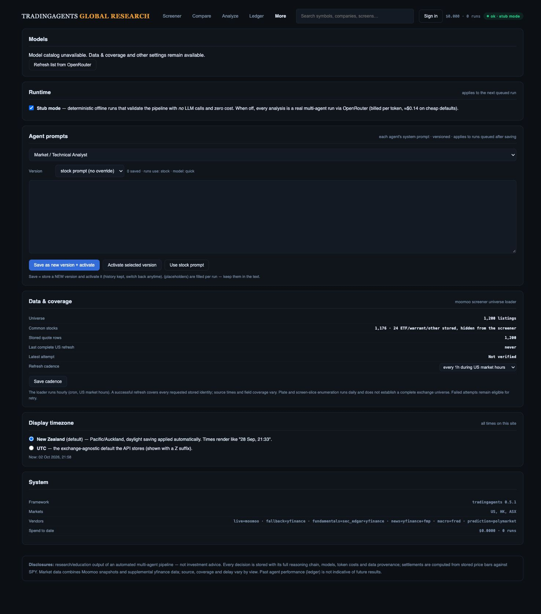
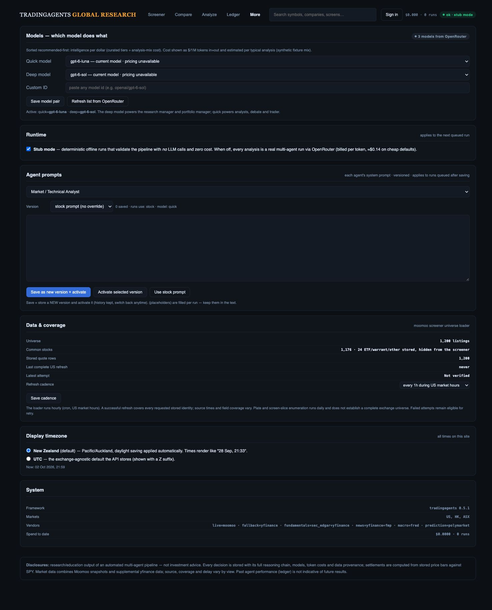
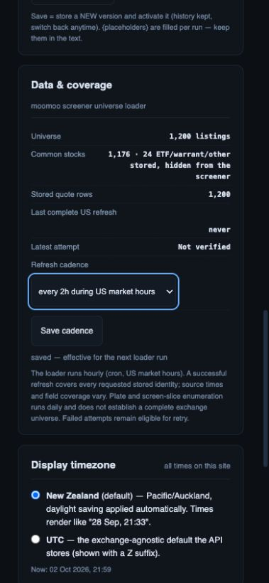

# Independent Settings recovery

Local implementation after `5fa8c01`, 2 October 2026. Addresses the concrete Settings defects in R12; the broader recovery/release gate remains open.

## Changes

Settings renders its shell immediately. Models, runtime, prompts, Data & coverage and system metadata load independently: a rejected or pending model catalog cannot prevent coverage/cadence loading. Failed catalog/runtime/coverage requests show scoped recovery messages; failed metadata does not leave an unhandled rejection. Generation and element-identity guards prevent old responses from repainting a later Settings render or changing runtime state after navigation. Catalog refresh cannot navigate back to Settings after the user has left it.

Model options reject negative, absent, nonfinite and nonnumeric pricing as Unknown. Only explicit numeric zero input/output prices get the FREE label. Valid finite positive prices retain the existing formatting. Refreshed catalogs retain active quick/deep IDs absent from the response as selected “current model · pricing unavailable” options, preventing an accidental switch to the first model on Save. Quick/deep/custom/cadence controls now have accessible names.

This is a UI price-display correction. It does not qualify vendor catalog completeness, estimated-run economics or accounting fallback calculations. The [official Auto Router documentation](https://openrouter.ai/docs/guides/routing/routers/auto-router) describes routing to an underlying model; the negative-price fixture is synthetic and is not a current vendor-price observation.

## Verification

`node --test web/api/tests/ui/screener.test.cjs`: **108 passed**. New tests prove shell rendering makes no catalog/runtime request, invalid pricing cannot become negative/free display, catalog failure leaves independent panels intact, stale responses cannot update a later render/runtime state, and missing active IDs remain selected. Existing 22-preset/reset/export/Explorer preservation tests still pass. `git diff --check` passes.

The explicit offline preview (`RESEARCH_SETTINGS_FIXTURE=failure`, port 8898) uses actual `/api/models`, `/api/settings` and `/api/screener/schedule` routes, with an in-memory database and catalog transport replacement; no vendor call or production write occurs. Initial catalog returns a synthetic outage. Browser Settings still displays runtime, prompts, coverage (1,200 stored listings, 1,176 stocks, 24 others), cadence and timezone. Refresh recovers a three-model synthetic catalog; option text shows Unknown for -1 prices, FREE for explicit zeros and $2/$10/$5 for a paid fixture. After reload, quick/deep selectors retain `gpt-6-luna` / `gpt-6-sol`, absent from that catalog.

The browser changed the offline cadence from 1h to 2h and Save reported “saved — effective for the next loader run.” At 390 × 844, document width is 379 and Save cadence is 44 px high. The phone screenshot is scrolled to coverage. All saved images were opened and visually inspected. The outage image predates accessible-name/retained-ID changes, which do not affect its failure-state layout; recovered/phone images use final source.

## Open scope

R12 still requires loading/empty/failure/offline/obsolete-response checks across Desk, Explorer, Changes and company research. Full original-feature continuity, model accounting validation, real Auth/provider data, production migration/deployment and investment-team acceptance remain open. Settings hash/deep-link restoration is still an R04 requirement; this packet does not claim it is fixed. No merge or deployment occurred.
