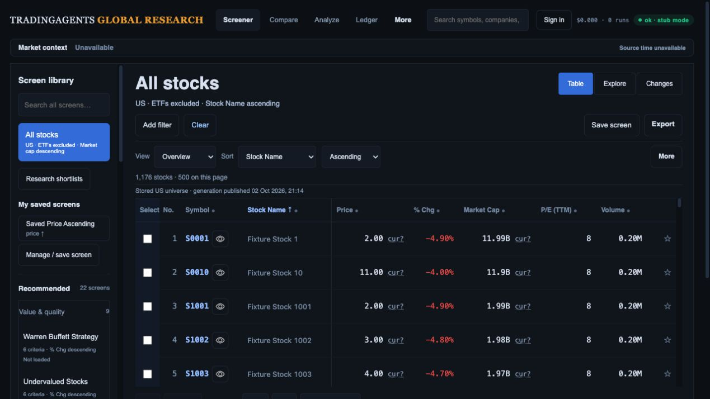
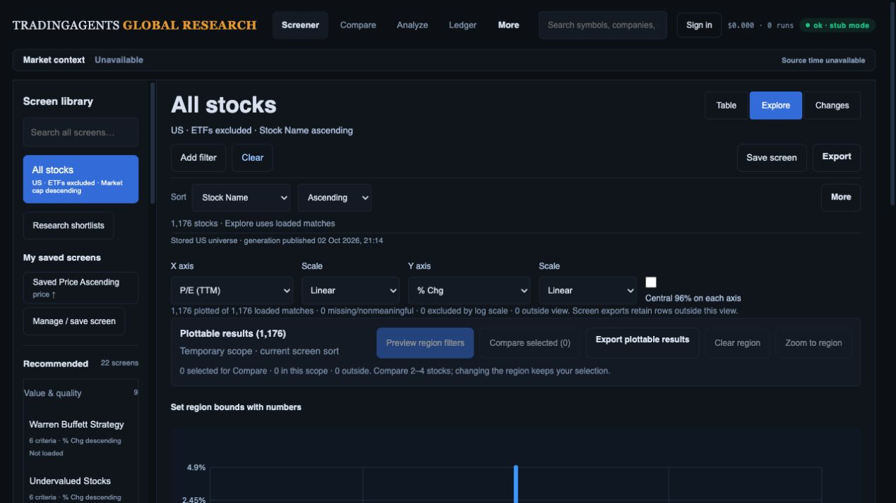

# Typed factor eligibility, sorting and display

Local implementation checkpoint, 2 October 2026. Advances R02/R08/R11/R12; all broader release gates remain open.

## Corrections

Numeric filters and Explorer eligibility previously used conversion: booleans, numeric-looking strings and singleton arrays could become numbers. Both client and API filters now require finite typed numeric observations and finite typed bounds. Missing or invalid inputs fail closed; zero and negative numeric values remain eligible where the rule permits them. Known New High/New Low flags retain explicit Boolean/0/1 semantics. Numeric-looking provider strings must be normalized at the source boundary, rather than guessed during screening.

Client and API numeric sorts keep invalid observations last in either direction. Text/date/classification sorting is deterministic and no longer calls float on company names or tickers in the API. Known flags have a separate sort contract. Valid ties preserve input order. Numeric comparisons avoid subtracting large operands. Text ordering uses lower-case lexical order on both sides; this is alphabetical rather than natural-number company-name ordering.

Actual table rendering now shows Unavailable for invalid numeric values instead of displaying coerced 1/0/8. Flags show explicit Yes/No/Unavailable. The shared API validity predicate handles integers too large for a finite float without raising OverflowError. Per-criterion provider evidence remains separate from display data; preset definitions/sorts are unchanged.

## Verification

**445 API/worker tests and 120 JavaScript tests pass.** `git diff --check` passes.

New tests exercise booleans, strings, arrays/objects, infinities/NaN and huge integer overflow; invalid bounds; zero; legitimate Boolean flags; both sort directions; text sorting; actual preset table HTML and region → filter membership agreement. An actual API-function → CSV/SpreadsheetML regression confirms filtered downloaded response bodies contain only canonical US.ZERO with numeric zero and no coerced US.BAD rows. This tests actual export response contents, not an additional browser download.

The existing coordinate-collision fixture was corrected to use two typed 8 observations. Numeric-string 8 is now deliberately rejected by the new invalid-input test rather than being treated as a valid overlapping point. Nearby numeric 8.000001 remains distinct and canonical share-class identities remain separate.

Commands:

```sh
PYTHONPATH=web/api:web/worker /private/tmp/tradingagent-ui-venv/bin/python3 -m pytest web/api/tests web/worker/tests -q
node --test web/api/tests/ui/screener.test.cjs
git diff --check
```

## Actual-route browser checks

Using the existing offline preview, current static assets were reloaded:

1. Company name ascending returns Fixture Stock 1, Fixture Stock 10, Fixture Stock 1001, Fixture Stock 1002. Sort controls and ordered DOM cells agree.
2. Explore retains that order and reports 1,176 plotted of 1,176 loaded valid synthetic observations, with zero missing/log/view exclusions. Linked rows retain company-name ordering.
3. Clear returns All stocks, stock-only count 1,176, Market Cap descending, Overview Table.

Both saved screenshots were opened and visually inspected. The Explorer screenshot shows controls, count disclosure and the upper plot; it is not a complete plot capture or accessibility qualification. No viewport override was set in this checkpoint.




## Limits and next gates

The running preview backend predates this Python change; browser checks qualify the current static client with ordinary typed fixture data. Invalid-data API/export checks run against current Python code in tests. No production or additional browser-download qualification is claimed. The fixture remains synthetic with mismatched recorded research/chart prices.

Currency/period/session comparability, cap-cohort qualification, advanced factors/peers, full device/accessibility/performance, live Moomoo reconciliation and production gates remain open. Typed finite values alone do not establish comparability or completeness. Unfiltered exports may still retain raw invalid source values; full R11 sanitation/provenance and unavailable-value acceptance remains pending. No merge/deployment occurred.
