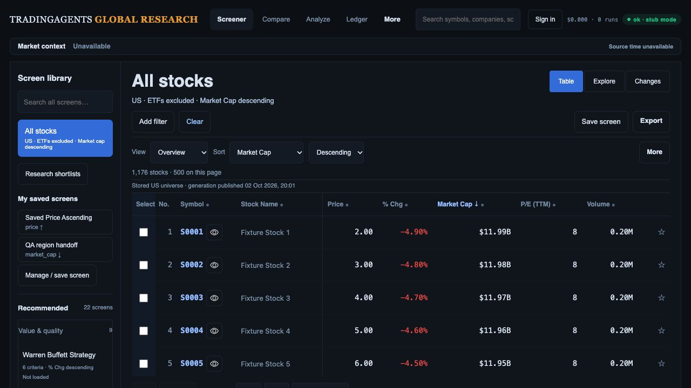
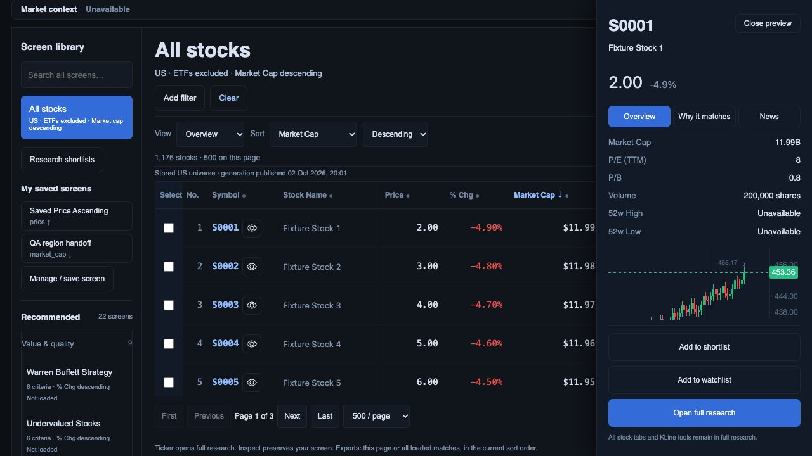
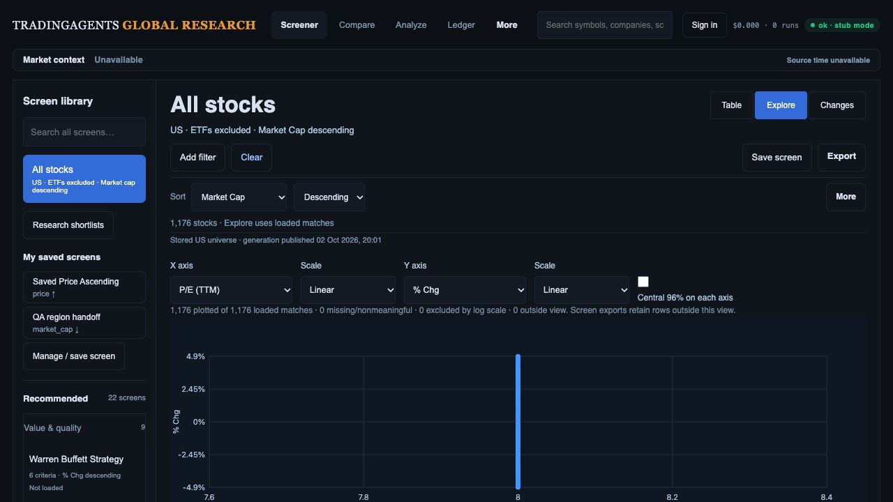
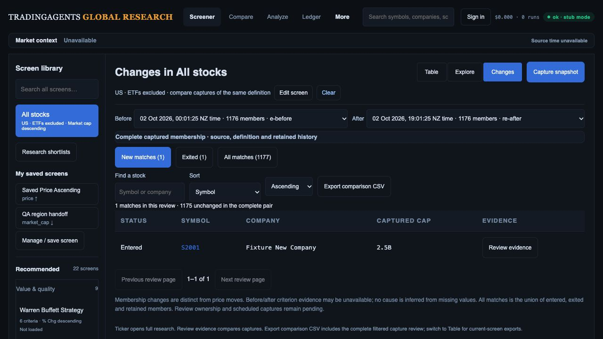

# Updated build-to-design review — 2 October 2026

## Decision and scope

Keep the approved Research Desk → Inspector → full research/Compare → Explorer → Changes workflow. The current build has the architecture and several useful handoffs, but it is not yet the complete investment-team experience in the original concepts. Complete the elements below using the existing engine and tokens. The R01–R15 register remains the release checklist; this review does not close it or imply deployment.

Baseline: `8b8a126`, with pending Groups API/UI reliability work in the checkout. This review made documentation changes only. The existing port 8894 browser preview was observed without reload/restart; therefore the pending Groups backend changes were **not** exercised by this audit. The four accepted screenshots were freshly captured, saved, opened and compared with the original [Desk](../references/02-research-desk.png), [Explorer](../references/03-factor-explorer.png) and [Changes](../references/04-change-monitor.png) references. Viewport: 1280 × 720. This is a hierarchy/workflow review; the originals are 1487 × 1058 and illustrate different filters, so this is not pixel fidelity acceptance.

The preview uses controlled synthetic instruments and recorded chart responses. Its 1,176-stock count is a fixture count, not Moomoo reconciliation. The S0001 quote of 2.00 and chart around 453 are incompatible; these images cannot qualify company/price accuracy. Browser warning/error log was empty. No current production data, Auth, performance percentile or accessibility compliance claim is made.

## Fresh flow observations

1. **Desk/reset — functional foundation; evidence/context incomplete.** Clear visibly restored All stocks, US, ETFs excluded, market-cap descending, Overview and Table. The library retained 22 recommendations. Compared with the original, taxonomy and row trends are absent, secondary text is small, and the unavailable market strip still occupies a full row. Library entries are tall enough that only the first recommendation is visible at this laptop height. Keep readable labels and screen purpose while reducing repeated metadata. Table values show a dollar prefix while the inspector says currency is not supplied: currency presentation must follow the same qualified field contract everywhere.

   

2. **Inspector — improved metrics/actions; missing company and criterion context.** Metrics precede the preview and shortlist/watchlist/full-research actions remain visible. The drawer is appropriate at this width, but sector, industry and website shown in the original are absent. Screen/source context lies below the initial inner-scroll view. Opening inspection scrolled the document so the main navigation left the capture; qualify focus/scroll restoration and header reachability. An Overview default is sensible for All stocks; a filtered screen should prioritize why the company qualifies and make value, threshold, source, actual period and currency easy to reach. Preserve the complete KLine tools in full research.

   

3. **Explorer — supported plot works; original analytical context incomplete.** Loaded-match counts now describe the plot correctly. Region-to-filter/save and exact-coordinate collision/keyboard inspection have been implemented locally in earlier packets; stop listing them as wholly absent. Remaining gaps are sector legend, currency-consistent bubble size, supported forward valuation/growth axes, cohort-labelled percentiles and a concise selection/apply/Compare summary near the plot. Bounds, apply and linked rows fall below this viewport. Constant synthetic P/E produces a vertical line; retain true values and collision handling rather than introducing misleading jitter. Advanced axes remain honestly disabled pending qualification.

   

4. **Changes — usable membership comparison; analyst review queue incomplete.** The settled pair displays one entered, one exited, 1,175 unchanged and a 1,177-member union. Date pair, search, sort and CSV action are present. The original selection/bulk actions, pair-specific status and notes, Next unreviewed and supported cause explanation are missing. Company typography is denser than the Desk. Criterion columns/matrix already exist in code for filtered captures; validate them with a meaningful filtered pair instead of concluding they are absent from this All-stocks screenshot. Capture schedules are still pending.

   

Visible accessibility risks: small secondary labels, dense toolbar rows, icon-led row actions, below-fold plot handoffs and document movement when opening inspection. Full keyboard/focus, screen-reader, contrast, 200% zoom, phone/tablet and reduced-motion testing is still required.

## Build checklist and dependencies

Status is local implementation, not production acceptance. Each row requires code, preservation regression checks and fresh browser/data evidence before it closes.

| Order / register | Element to build or qualify | Acceptance and implementation direction |
| --- | --- | --- |
| 1 / R01–R02, R09 | One trustworthy field contract across table, inspector, Groups, plot and export | Canonical identity, finite value, unit, actual currency, fiscal/TTM/forward period and source/session clocks. Remove unsupported dollar prefixes. Unknown classifications stay Unknown; provider lists remain distinct from industries. Groups work is pending, not an accepted peer-ranking engine. Do not rank or size bubbles across incompatible currencies/periods; disclose eligible n/N. Qualify publication/paging/capture/PostgREST and recovery. |
| 2 / R03, R04, R12 | Finish Desk and company evidence hierarchy | Use existing `research-workspace.js`/CSS and column machinery. Criterion-led columns and inspector evidence; qualified sector/industry/website; larger readable secondary text; compact unavailable context/library metadata. Adjacent inspector when width permits, bounded drawer otherwise. Validate filtered/default at 1487 × 1058, 1280, 768, 390 and 200% zoom; default table top ≤360 px at the specified reference state. Optional trends only through lazy/batched retrieval with interval/span/source labels. |
| 3 / R04, R11–R13 | Complete research, Compare and selection continuity | Preserve seven research tabs, six financial subtabs, drawing/study/session/layout/sync tools, CSV and SpreadsheetML. Reconcile selected/page/loaded exports. Origin filters, columns, sort, page, scroll, selection and focus survive research/Compare return, reload, deep links and private-list routes. Measure interaction and request budgets now; avoid per-row chart requests. |
| 4 / R08–R09 | Complete Explorer handoff and analytical panel | Move concise bounds/count/apply/Compare summary into the plot's working area; expand detailed provenance on demand. Validate existing region/save/collision features rather than rebuild. Then enable qualified sector colours, currency-consistent bubbles, forward P/E/growth and cohort percentiles. Define ties, small cohorts, negative/missing values and rank direction. Pointer/numeric/keyboard cohorts and actual downloaded IDs agree. |
| 5 / R05–R07, R11 | Build Changes review queue | Real Auth/owner and team-role qualification before shared review. Key status/notes by owner/team, screen version, both capture IDs and canonical code; keep company shortlist status separate. Add selection, bulk shortlist/export, cross-page Next unreviewed and Desk typography. Validate every enabled criterion/repeated bound using compatible before/after observations; no cause from missing/incompatible values. Preserve drafts on conflicts. |
| 6 / R07, R10, R12 | Supported causes and opt-in monitoring | Only describe crossing/update/price/correction causes when evidence supports them. Saved-screen schedules need explicit consent, time zone/session, last success/running/failure/retry and durable idempotent jobs. Partial/failing runs never create false exits or replace previous success. Universe refresh cadence is a separate setting. |
| 7 / R11, R13–R15 | Investment-team acceptance and release | Fresh like-for-like Moomoo default/all-22 membership and counts, both RSI definitions retained; actual export row/value/order/source reconciliation; device/accessibility and measured p95 checks; 5–8 analyst tasks. Qualify additive migrations, real Auth/PostgREST, cutover and rollback, then authorized merge/deploy and exact production smoke evidence. |

## Corrections to the earlier plan

- **Built locally, acceptance remains:** compact provider disclosure, metrics-before-chart inspector, region preview/apply/save/reload, presentation-specific Explorer counts and exact-coordinate keyboard/pointer picker. Do not duplicate implementation tickets for these.
- **Partially built:** criterion matrix, generation readers, source observations, private shortlist and origin return. Extend and qualify the existing paths.
- **Still missing or gated:** qualified company taxonomy/site/trends, advanced Explorer/peer encodings, pair review/bulk/Next unreviewed, team roles, capture schedules and supported causal review.
- **New explicit checks:** table/inspector currency consistency; cap ranking across currencies; inspector document scroll/focus; recommendation-library discoverability at laptop height; filtered evidence view and coherent quote/chart fixtures.
- All 22 preset keys/rules/sorts, user definitions and original chart/research/export capabilities remain preservation requirements. Mockup sample names, vendor integrations, metrics and counts are illustrative and must not be copied as data claims.

The original proposal's performance targets remain unmeasured acceptance targets: warm feedback <100 ms p95, cached inspector <150 ms, warm usable results <1 s, with device/network/cache conditions recorded. No test suite was rerun for this documentation-only review; previously recorded regression totals are historical evidence with their own scope.
