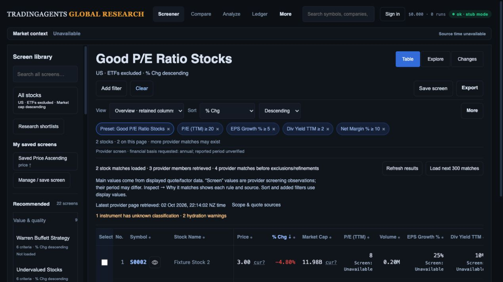
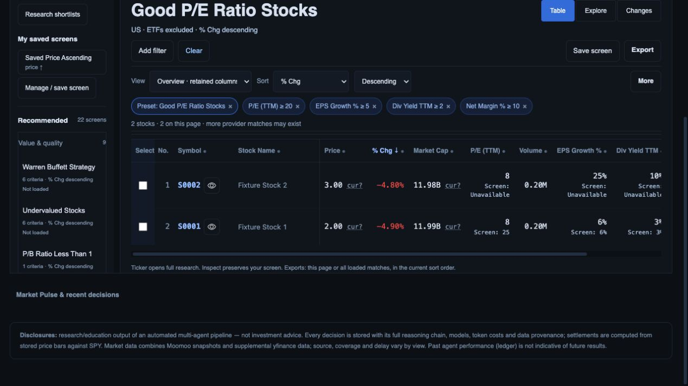
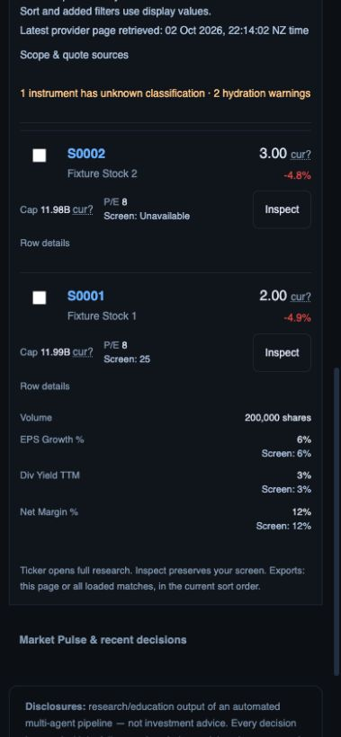

# Visible screening observations

Local implementation and browser verification, 2 October 2026. Advances R03; R02/R03/R11 and all broader release gates remain open.

## Problem and change

The Good P/E preset requires P/E (TTM) ≥20, but a display quote can show 8 while the provider criterion observation is 25. Previously only the inspector explained that distinction. Original provider criteria now show a secondary **Screen** value inside their table cells and phone cards/details. Scope text explains display versus screening observations, period uncertainty, and display-value sorting/additional filtering. Existing values, row membership, sorts, filters and structured criterion export fields are unchanged.

Only exact original active provider criteria receive these labels. Custom/column rules retain their display-source semantics. Per-rule evidence is matched by canonical code and complete criterion, including days and repeated bounds. Missing, wrong-code or ambiguous evidence renders Unavailable, without substituting the display quote. Legacy field evidence follows the existing inspector contract; no new financial/source/period qualification is inferred. Monetary evidence retains unknown-currency disclosure. Labels use local data with no new network requests.

## Evidence

**117 JavaScript tests pass** (`node --test web/api/tests/ui/screener.test.cjs`). New tests cover independent display/criterion values, added custom rules, wrong identities, repeated windows, zero, ambiguous observations and reset. Prior backend test count is 422; backend tests were not rerun for this static-only change.

Actual-route offline preview:

1. Good P/E preset retains two loaded stock rows, original four criteria and % change descending. S0001 shows display P/E 8 and Screen 25. S0002 shows display 8 and Screen Unavailable; missing evidence is not treated as a pass.
2. Desktop labels are present inside table cells. Second screenshot is scrolled to show both rows; it is not an initial-viewport measurement.
3. At 390 × 844, P/E labels remain on mobile cards and opening S0001 Row details exposes percentage display/criterion values. Document width 379 CSS px, within viewport 390. All saved screenshots were opened and visually inspected.
4. Clear returns All stocks, stock-only fixture count 1,176, Market Cap descending (direction 2), no Screen labels and canonical default screen hash.

## Remaining qualification

Synthetic membership, in-memory storage and recorded chart/research data do not qualify live investment data. The fixture quote/chart mismatch remains explicit. Real provider units, periods, currency, compatible sorting/cohorts, complete market/preset/Moomoo reconciliation, usability/performance, export and production gates remain open. Existing structured exports are preserved by tests; no new actual download was claimed for this packet. No merge or deployment occurred.
