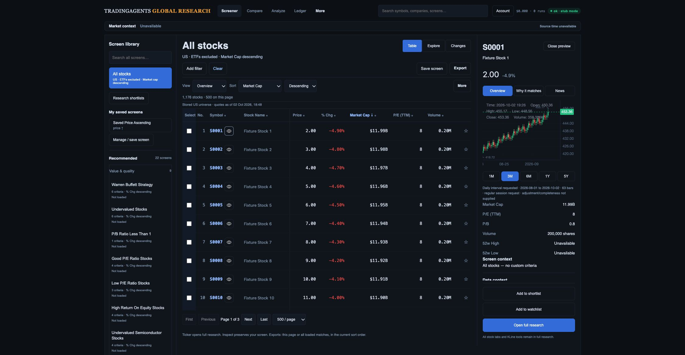
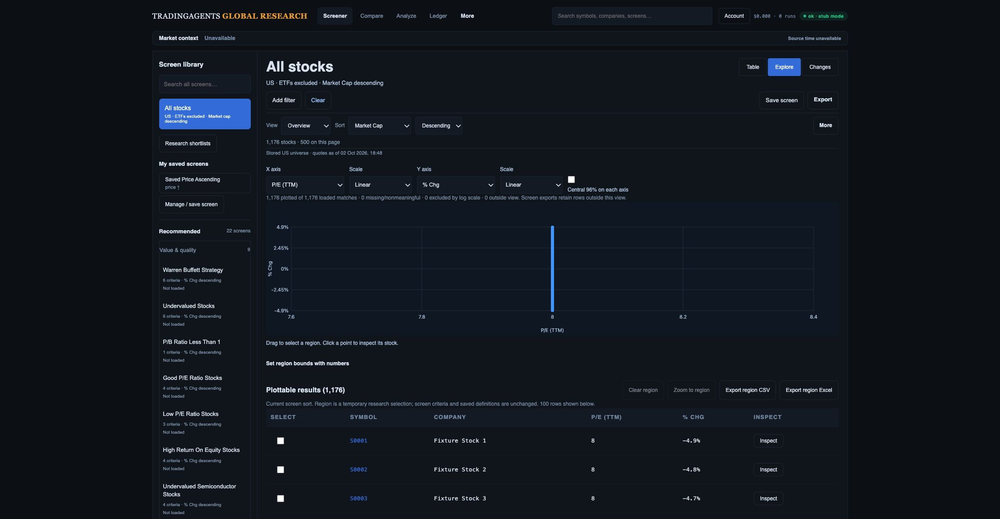

# Current build versus original design — refreshed implementation plan

2 October 2026. Three fresh screenshots were saved and opened from the existing local preview, then compared with the original Research Desk, Factor Explorer and Change Monitor references. This is a bounded three-view audit, not full original-feature or accessibility acceptance. Backend-only worker changes do not change the rendered UI.

The desktop viewport was 2249 × 1168 CSS px, scrollY 0; document width was 2249. The preview uses 1,176 synthetic stocks/24 ETFs and recorded chart responses, fake research storage and stub mode. S0001 is quoted at 2.00 while its chart is around 453, so this preview cannot support identity/price accuracy. No real market reconciliation, private production write or fresh phone/keyboard test occurred. The final captured warning/error log was empty. Original references have different widths and selected-screen states; this comparison assesses hierarchy and missing workflow, not pixel fidelity.

## 1. Research Desk → Inspect — functional foundation, presentation incomplete

Reference: [Research Desk](../references/02-research-desk.png). Permanent Clear, explicit stock-only/default sort, 22-screen library, table and inspector are present. The inspector keeps three primary actions visible. Compared with the reference, secondary text is small and dense; company context lacks sector/industry/website; provenance is below the visible content area; row trends are absent. The currently open no-filter screen cannot demonstrate criterion-led columns or match explanations for a filtered screen.

Build R03/R04/R12: reuse existing tokens, raise readable secondary text, shorten the header/control stack and put identity/coverage next to the stock. Add qualified company fields and an expandable source/period block accessible without hiding the actions. Keep criterion-led columns and explicit declared sort. Add optional batched/lazy trends only after span, interval, source and cache behavior are qualified. Group the full-research chart/study/drawing controls and repair origin-route restoration. Keep Settings coverage controls usable when the model catalog fails.

Acceptance: matched 1487 × 1058 filtered/default/selected states; first results at ≤360 CSS px in the specified default state; 390/768/1280/1487 widths, 200% zoom and keyboard focus. Recheck every original research/KLine/Compare feature and Back/reload/deep-link context. Screenshots alone do not measure contrast, keyboard reachability or latency.

## 2. Explorer — linked view built, analytical workflow incomplete

Reference: [Factor Explorer](../references/03-factor-explorer.png). Axes/scales, exclusion counts, numeric-region input and region CSV/Excel exist. Constant synthetic P/E stacks all points; individual inspection needs a collision picker. The reference's sector legend, cap bubbles, peer-cohort ranks and region-to-save workflow are absent. Current provider qualification does not justify enabling illustrative forward P/E/growth/ROIC/debt axes.

Build R08 first: add a selected-region summary, exact collision picker and keyboard-equivalent inspection. “Apply region as filters” previews inclusive bounds, marks Modified and hands off to explicit save; temporary brushing must never silently mutate a saved definition. Preserve existing numeric/pointer and export scopes. Build R09 after R02 field qualification: actual sector legend, currency-consistent market-cap encoding and cohort-labelled percentile panel with missing-value, tie and small-cohort policies. Higher valuation rank must not imply higher quality.

Acceptance: pointer, numeric and keyboard paths produce identical canonical members; apply/save/reload reproduces the cohort; axis changes reconcile incompatible bounds; exact-point collisions retain every identity; plot exclusions and export scope agree. Record coverage, fiscal/TTM/forward period, actual currency and source clocks before enabling each advanced factor.

## 3. Changes — compact evidence review built, review queue incomplete

Reference: [Change Monitor](../references/04-change-monitor.png). Contextual title, date pair, New/Exited/All, search/sort, retained-history disclosure and comparison CSV exist. This default-screen fixture has no numeric criterion columns; that is not proof those implemented columns are absent. It does show no row selection, bulk shortlist/export, pair-scoped status/notes, Next unreviewed or capture schedule controls. General shortlist company status cannot supply historical pair review.

Build R05/R06/R07: qualify Auth and legacy ownership, then store review by owner/team, screen version, before/after capture IDs and canonical security. Add selection and revision-safe bulk actions, independent review notes/status and Next unreviewed across filtered pages. Keep the criterion matrix and capture-side sorting; qualify threshold evidence and distinguish observation from cause only when compatible source/period/currency facts support it. Build R10: explicit opt-in capture schedules, durable bounded jobs, prior success and honest retry/failure status.

Acceptance: the same company in two pairs has independent notes/status; changing pair clears/revalidates selection; concurrent edits retain the draft; Next unreviewed respects the current pair/search. Actual downloads reconcile exact selected/filtered membership. First review row ≤500 CSS px in specified closed/open-inspector states; no exits inferred from incomplete captures; duplicate/restarted jobs append one qualified capture.

## Build order and preservation

The [authoritative R01–R15 register](../../investment-workspace-current-gap-plan.md) defines code touchpoints and exit gates:

1. Finish generation-pinned API reads/paging/capture/export and actual provider field qualification. The worker/native storage checkpoint passes locally; API/PostgREST/retention/cutover remain open.
2. Desk presentation, company evidence, research toolbar/route continuity and Settings recovery. Begin performance instrumentation alongside this work.
3. Auth/legacy ownership, team permissions and pair review/bulk/Next; qualify causal observations.
4. Explorer region/save/collision workflow, then supported sector/cap/peer/factor context.
5. Opt-in capture monitoring with duplicate/restart/failure checks.
6. Download reconciliation, fresh like-for-like Moomoo membership, devices/accessibility/p95 and analyst tasks; migration/rollback qualification, merge/deploy and production smoke.

Every packet must retain all 22 original preset keys/rules/sorts, existing saved definitions, Clear/second-click all-stocks excluding ETFs/market-cap reset, ticker full research, all KLine/financial/Compare controls and existing export formats. The mockups' sample numbers and provider labels are never acceptance data. These screenshots are audit evidence, not proof the remaining elements are built or the investment-team release is ready.
