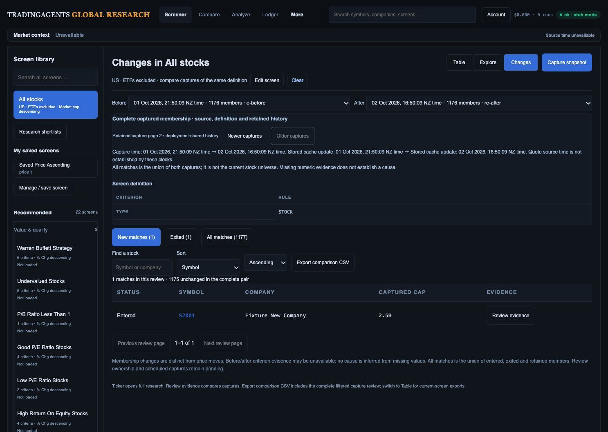
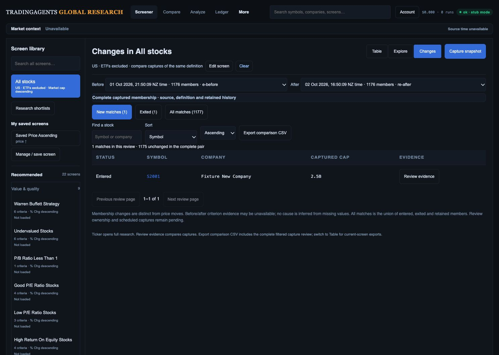

# Retained screen history: local implementation checkpoint

2 October 2026. This advances G10/G11/D2 in the approved Change Monitor. It is local implementation and test evidence, not production qualification or completion of D2.

## Storage and retry contract

`20261002043636_immutable_screen_captures.sql` adds an append-only table and an atomic append RPC. The old `app_settings` history is left untouched. On the first new capture, existing records are imported with their original IDs or stable legacy fingerprints in the same transaction as the new record. There is no last-two overwrite or automatic deletion. Existing evidence versions are preserved rather than upgraded by inference.

The primary key scopes each capture to its existing deployment/definition history key. An exact retry inserts nothing; reusing an identity for different evidence rejects the transaction. Update, delete and truncate triggers enforce immutability. RLS is enabled, direct anonymous/authenticated grants and RPC execution are revoked, and the server service role receives only the required table/RPC permissions. This is still **deployment-shared history**. It does not authenticate the legacy public capture route or assign history to individual accounts or teams.

The browser sends a UUID Idempotency-Key and retains the pending request identity and public screen definition in tab session storage until success. A lost response can be confirmed by the scoped immutable record; retry does not recapture market data after a successful write. No rows, notes or passwords are stored with this retry identity. Storage failure reports a recoverable error and does not replace the legacy blob.

The API fetches only two latest payloads for the default comparison, metadata pages of at most 100 captures for the date controls, and explicitly selected payloads by scoped identity. Older selected pairs remain usable after subsequent captures. History paging retains the comparison, cohort and row page. The source disclosure remains open and keyboard focus moves to the available paging control when reaching a boundary. Offset is currently bounded at 40,000; keyset paging and large-history performance qualification remain necessary before claiming unlimited navigable history.

Capture time and provider retrieval/cache-update time are separately labeled, with seconds and a short capture ID to distinguish nearby captures. Neither clock establishes a market quote timestamp. The definition disclosure lists rules; before/after observations belong to the selected stock evidence panel. Comparison CSV adds the clock types and deployment scope while retaining its existing columns.

## Evidence and limits

- 239 API/worker tests and 62 JavaScript tests pass. Tests cover legacy preservation, scoped IDs, metadata-only pages, old-pair selection, retries/lost responses, invalid evidence and capture storage failures.
- Isolated PostgreSQL 16.14 contracts pass for grants/RLS, immutable operations, exact retries, payload mismatch and atomic batch rollback. An observed two-connection lock race retains the legacy record plus both new captures; a repeated append inserts zero. The disposable local database was stopped afterward. This is not Supabase PostgreSQL 17/PostgREST qualification.
- A synthetic 105-capture browser fixture exercises both history directions, retained pair/counts, disclosure state and focus. An earlier four-capture fixture restores the original pair after two newer captures. Four screenshots were saved, opened and inspected.
- With provenance collapsed, the first review row remains at 491.4 CSS px, scrollY 0, viewport 1487 × 1058. Expanded provenance deliberately adds height. No browser warning/error was captured in the final check. This does not establish phone/tablet/zoom, assistive technology or latency acceptance.

All displayed companies, dates and counts here are offline fixtures. Captures remain version-2 membership observations: nonmembers often lack a value on one side. Numeric causes, period/currency comparability, pair-scoped review notes/status, team permissions and scheduled runs remain unfinished. No production migration, capture write, account creation, merge or deployment occurred in this checkpoint.

## Rollout and rollback gates

1. Qualify the migration, RPC grants and payload contract on the deployed PostgreSQL/PostgREST versions. Record legacy history keys, IDs and saved-definition hashes without changing ownership.
2. Implement and qualify verified capture ownership/team roles and explicit legacy mapping before the investment-team release. Do not infer a personal owner from a deployment default or client ID.
3. Quiesce capture writes during the application cutover. Apply the additive schema before new application traffic. Old binaries must not continue replacing legacy blobs while new readers prefer imported records. Verify every imported legacy ID and new append before enabling capture traffic.
4. Smoke-test a complete capture, replay of its request ID, selected older pair, incomplete-run rejection and exports. Preserve both stores and migration evidence.
5. For rollback, quiesce capture writes again and retain the immutable table. An old binary reads only the legacy blob and cannot expose all newly retained records. Use a qualified compatibility reader or explicitly suspend historical review while restoring application service; do not claim transparent history rollback, rewrite the old blob as a substitute for retained history, or drop the new table. Qualify this recovery path before deployment.

The native test scripts are local-only fixtures: `web/api/tests/capture-db-contract.sql` and `web/api/tests/capture-db-concurrency.py`. Their cleanup must never be run against production history.
