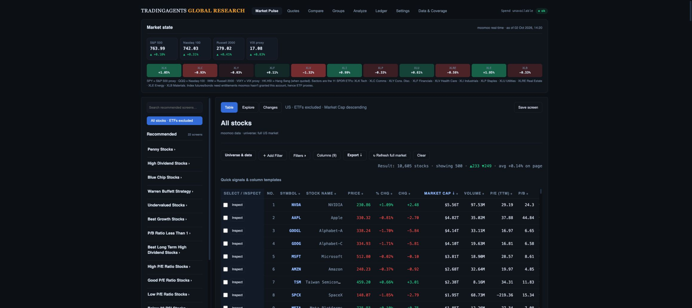

# TradingAgents investment research workspace

## Review objective

This is the supported initial release for team review, not completion of the full approved mockups. The [design-gap audit](investment-workspace-design-gap-audit.md) records remaining shell, inspector, Explorer, change-review, mobile and measured-quality work with acceptance gates.

Move from a qualifying stock cohort to comparative evidence and full company research without losing the screen, sort order, chart tools or export context. The combined design provides Table for precise screening, Explore for relationships among supported factors, and Changes for complete cohort comparisons.

## Five-minute demonstration

1. Start in **All stocks**: ETFs excluded, market cap descending. Show the searchable library and the existing saved Penny screen.
2. Select **Penny Stocks**: 55 provider-qualified stocks, sorted by day change. Inspect the average-volume period and strict profit-growth boundary. Click the same card again to restore the default; Clear does the same.
3. Select **P/B Ratio Less Than 1**, then load the next page. Explain provider totals versus classified stock counts and that exports use available loaded matches. Inspect a candidate without leaving the cohort.
4. Open full research. Show Overview and Analysis KLine charts, studies/drawings/fullscreen, financial FY/quarter labels, balance sheet, cash flow, and delayed options. **Back to screen** restores the research context; previous/next reviews the same cohort.
5. Select two stocks for Compare, return, switch to Explore, and show coverage counts. Use Changes to capture a complete baseline and later comparable snapshot. Export CSV or Excel-compatible `.xls` with explicit page/available scope.

## Preserved capabilities

All 22 original recommended definitions and their criteria remain in a golden preservation fixture. The saved-screen migration is additive; its existing definition count/hash did not change. Full research keeps seven tabs, six financial sub-tabs, analyst research, company/news/comments, options controls, the existing KLine engine, comparison layouts and agent-report handoffs. Saved screens also retain provider, columns, ETF choice and presentation state.

## Data we can support today

Moomoo supplies quotes, classification, price history, supported financial screen factors, company statements, analyst research and options for tested US stocks. The backend preserves provider pagination and units; verified preset financial criteria use annual periods. Snapshot volume remains separate from period-averaged screening volume. Supplemental yfinance data varies by instrument and freshness.

Public Moomoo count checks reconcile for the supported small screens and the total High P/E, Low P/E and Junk cohorts. P/B was 3,158 on the public site earlier and 3,157 on the later provider request; this one-row difference is documented, not presented as exact parity. Provider counts include ETFs: Good P/E has 116 instruments, with 87 stocks and 29 ETFs; the default stock-only table correctly displays 87. The full stored stock universe is 10,605 versus the public site's earlier 9,454; differing membership requires instrument-level reconciliation.

Initial Explore exposes P/E, P/B, market cap and day change. The deployed default P/E/day-change view plotted 4,302 of 10,605 stocks and reported 6,303 missing or nonmeaningful values. It does not invent points for unavailable or economically inappropriate ratios.

## Limits to explain during the review

- **Below 30 RSI** and **Small Cap Growth** retain their exact definitions but are unavailable: the configured provider rejects its documented RSI query. Junk Stocks works and has no RSI criterion.
- Advanced sector, forward-P/E/growth, ROIC and net-debt/EBITDA views remain gated. Bulk enrichment covered approximately 2.07% at the audit, insufficient for a whole-universe institutional-factor claim.
- Changes requires complete, fresh, comparable snapshots; incomplete provider pages cannot create false exits. Membership changes alone do not establish economic causation.
- Results are snapshots, not streaming quotes. Exports include the selected available scope. Excel export is SpreadsheetML `.xls`, not native `.xlsx`.
- Cached controls and responsive layouts were exercised. Device-specific p95 and throttled-network budgets still need an agreed reference device and benchmark; no latency guarantee is claimed.

## Verification and release record

199 Python API/worker tests and 17 JavaScript state tests pass. Browser verification covers all 22 preset selections/deselections in both the deterministic fixture and the live site, all four parsed export downloads, mobile filter layout, actual drawing retention/clear/fullscreen, and production research/financial/options/navigation. Live API evidence covers all 22 preset responses and distinct cursor pages. Production bugs found during testing were fixed in follow-up PRs.

[Build plan](investment-workspace-build-plan.md) · [Release checklist and evidence](investment-workspace-release-checklist.md) · [Live workstation](https://tradingagents-portal.onrender.com/#/screener)
