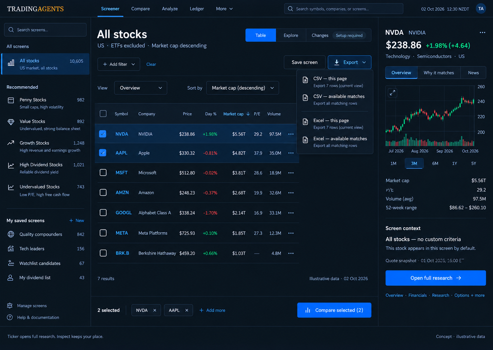
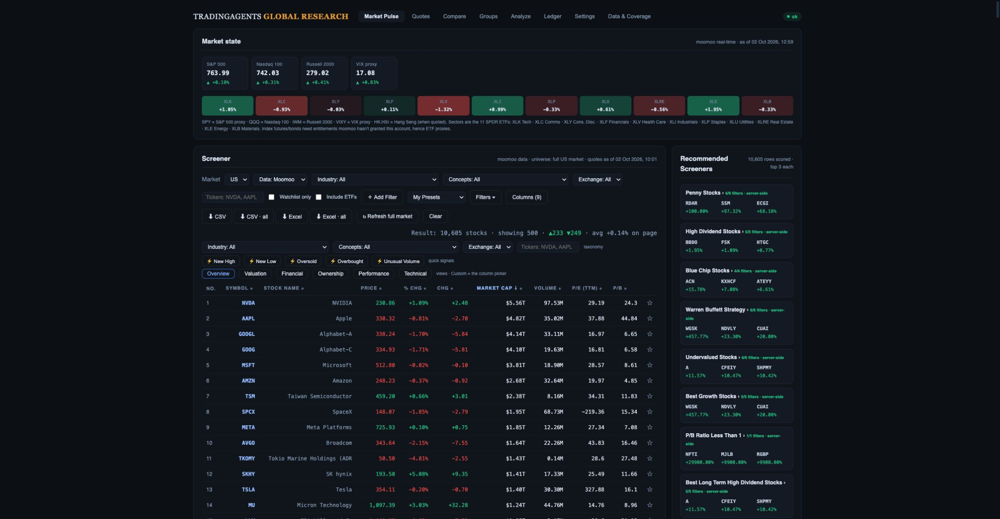
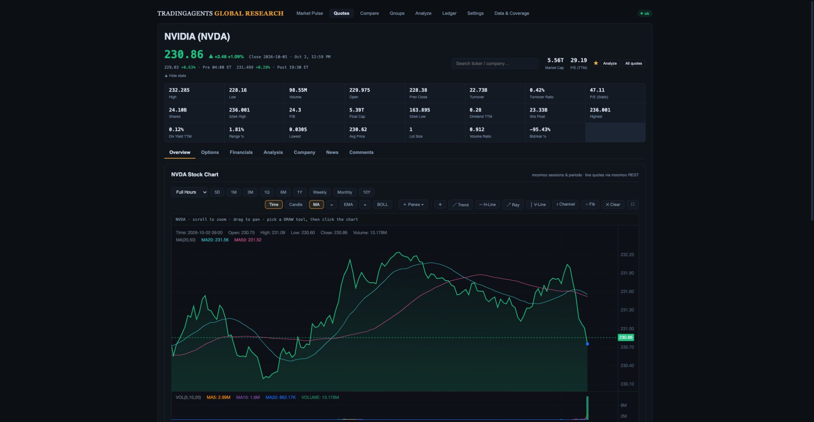
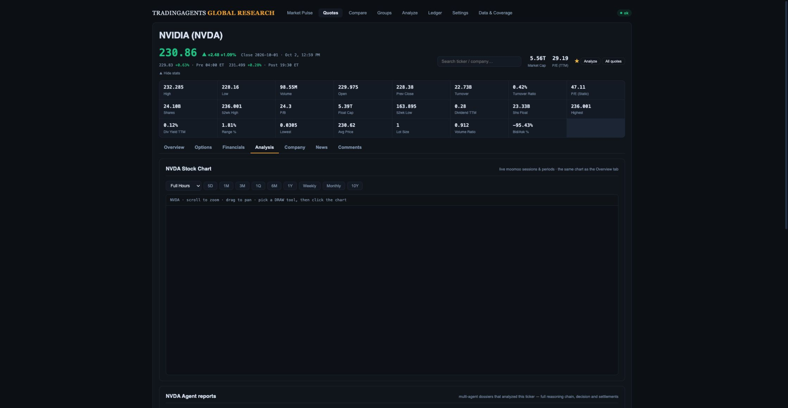
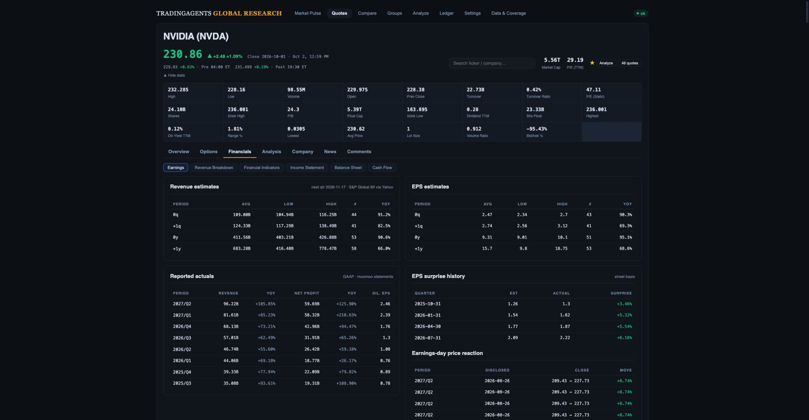
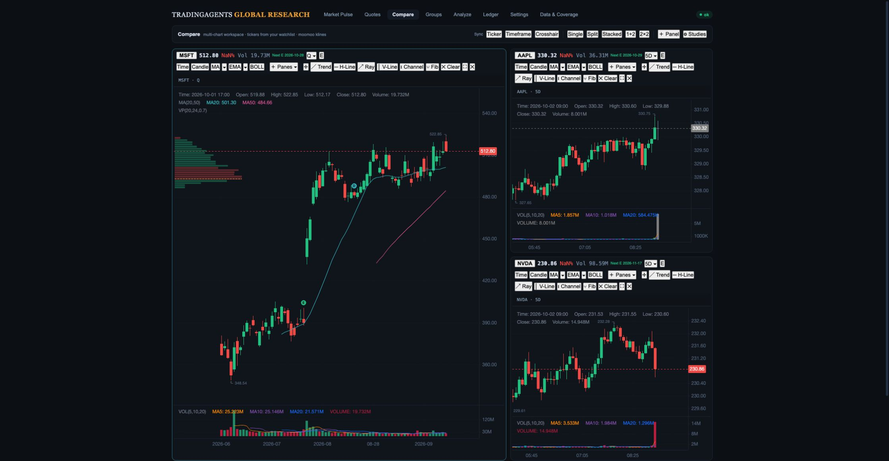

# TradingAgents: combined screener and research workflow

**Latest refresh checkpoint:** [universe refresh integrity](universe-refresh-integrity.md) adds strict batch/paging/classification validation, market-specific success/failure clocks, cohort fingerprints and a working cadence save. 331 API/worker and 68 JavaScript tests pass; synthetic desktop/phone evidence verifies status/save and 390 px document fit. Atomic publication/concurrency, complete market coverage and live reconciliation remain open.

**Latest producer checkpoint:** [real quote provenance and remaining acceptance checks](design-gap-audit/quote-provenance-checkpoint/README.md). Cloud normalization now produces field observations and distinct source/cache clocks; the inspector no longer infers currency from market prefix. 298 API/worker and 68 JavaScript tests pass, with a fresh single AAPL quote and desktop/phone verification. Currency, fiscal/session contracts and full-universe coverage remain unqualified; all broader mockup/release gates remain open. Earlier counts/status paragraphs are dated evidence.

**Latest execution plan:** [fresh comparison against all three original mockups](investment-workspace-mockup-review.md#plan-recheck-against-the-three-original-mockups), reviewed on 2 October. Its revised build order supersedes earlier local status paragraphs below: preservation/presentation → observation reliability → team/pair review → qualified Explorer → capture automation → investment-team release. Research account/list UI, company search, compact criterion review and immutable retained history are committed locally. Version-3 eligible observations and repeated-criterion safeguards are committed at `3d2c8d5` with synthetic browser/storage evidence. The latest quote producer checkpoint supplies partial real provenance; provider-wide currency/period coverage and production qualification remain open. These changes are unmerged, undeployed and unqualified against real Auth/production storage. All original preservation and data gates remain required.

Current build order and completion checklist:

Latest D2 progress: [paired observation contract and evidence](paired-screen-observations.md). Stored-universe v3 capture and read validation, independent criterion slots, conservative assessments and full-union CSV are locally verified (272 API/worker, 67 JavaScript, native PostgreSQL round-trip, desktop/phone and downloaded 108-row synthetic export). Actual provenance producers and provider-wide observations remain missing; D2 remains open.

- [ ] Finish shortlist workflow acceptance: dialogs, bounded inspector, phone cards/chooser, ticker/status/Next unreviewed and conflict recovery are implemented locally. Company search and measured phone/tablet layout now pass locally; complete 200% zoom/full keyboard coverage, real Auth and large-cohort browser export qualification. A downloaded one-item synthetic shortlist CSV was parsed and reconciled.
- [ ] Qualify authentication/private storage; implement team roles and explicit legacy ownership migration without losing saved definitions.
- [ ] Complete Changes acceptance: contextual/compact layout and criterion matrix/capture-side sorting are implemented locally. Add selected review actions and pair-scoped review status; qualify real observations and expanded device/zoom cases.
- [ ] Qualify immutable retained history in production: append-only storage, retries and paged date selection are implemented locally. Complete verified capture ownership, paired observations, opt-in schedules, large-history performance and recovery qualification. See [retained-history contract](durable-screen-history.md).
- [ ] Qualify provider coverage; add sector/cap/peer context and supported advanced axes with explicit eligibility.
- [ ] Finish desk typography/icons and research toolbar grouping; verify every original preset, chart/tab/Compare feature and export scope.
- [ ] Complete original visual elements: qualified company sector/industry/website and criterion evidence, optional batched row trends, Explorer sector legend/cap bubbles/peer ranks, explicit region-to-filter/save workflow and overlap disambiguation. Verify each field's identity/period/source/currency before presentation; do not copy the mockups' sample values or vendor labels.
- [ ] Restore private shortlist route/context through reload/deep links and full research return; do not let an old public Changes hash reopen instead.
- [ ] Complete dated Moomoo reconciliation, real-device performance/accessibility and analyst tasks; merge/deploy and verify production with rollback.

Fresh regression checks: 240 API/worker tests and 65 JavaScript tests pass; isolated PostgreSQL revision/locking and immutable capture/concurrent append contracts pass. Browser evidence is synthetic; passing tests do not close the checklist above.

Prepared 2 October 2026. This records the approved design, implementation sequence and release checks. Implementation and verification status is recorded in [the release checklist](investment-workspace-release-checklist.md). Based on the current repository, live browser inspection, read-only API probes and read-only database aggregates. The approved Research Desk, Factor Explorer and Change Monitor become views of one workflow, rather than separate products.

## Product decision

**Discover → inspect → research → compare → save/export → revisit changes.** The table stays the default and the main working surface. Explore visualizes the same results; Changes compares membership of the same saved screen over time. One shared screen state determines criteria, universe and sort in all three views.

1. Start at **All stocks**, ETFs excluded, market cap descending. Keep Clear visible at all times; disable it when already at the default. Preserve the selected market when resetting, matching the existing reset behavior. Current reset also restores Moomoo source, Overview columns, page 1, no watchlist restriction, and no custom criteria.
2. Pick a recommended or saved screen. Show its exact criteria, applicable periods, result scope and sort. Clicking its selected library entry again returns to the default. Recommended screens and user-saved screens have separate identities even when names match.
3. Work in **Table / Explore / Changes**. These are presentation views; Overview / Valuation / Financial / Ownership / Performance / Technical remain column templates. Switching either must not silently change criteria or sort.
4. Click **Inspect** to open a lightweight right panel: quote, small KLine preview, watchlist action and screen context. Ticker/name links continue opening the full stock page. No information is removed from that page to make the inspector fit.
5. Full research offers **Back to screen** and previous/next within the originating result set. Returning restores criteria, selected screen, sort, columns, page, selection and scroll. Direct links remain usable without a parent screen.
6. Select stocks for the existing **Compare** workspace. Keep its layouts, synchronized chart controls and indicators. Return to the originating screen without losing selections.
7. **Export** presents format and scope explicitly: this page, available matches or selected rows. Selected exports are implemented and remain a preservation requirement in new views. **Save screen** preserves the complete reproducible screen definition. Changes becomes usable only after comparable, complete snapshots exist.

Do not put every current action on the new top bar. Retain infrequent controls in labeled menus, keep full functionality discoverable, and use the existing page routes as compatibility aliases. Use “Run agent analysis” for the job action to distinguish it from the stock Analysis tab and the global Analyze workspace.

## Updated layout and responsiveness

The mockup illustrates hierarchy and interaction, not live quotes or an implementation contract. Its illustrative screen counts, saved names, sector labels and shortened recommended names must not replace production data or the exact 22-screen inventory below. The seven displayed rows are a composition sample, not the actual All stocks result count. Keep the current full column set; the open export menu obscures some columns in this frame. An explicit Inspect icon must be distinguishable from the illustrated ellipsis menu. Apply the documented availability and export-limit labels during implementation.

Desktop: collapsible searchable screen library on the left, results in the center, optional inspector on the right. Filter criteria are readable chips with period/unit context; a pinned toolbar contains Clear, Save and Export. A single selection bar provides Compare. The default table has the current Overview columns; users retain all current column choices.

Explore initially offers supported axes such as P/E TTM, P/B, market cap and day change. Scatter selection links to table rows and selection; show a count of plotted versus unplottable results. Negative/nonmeaningful P/E, missing values and log-scale eligibility need explicit treatment. Do not silently discard these stocks from the underlying screen. Sector coloring and forward-P/E-versus-growth axes are gated until their coverage is verified.

Changes shows newly qualifying, exited and unchanged results with before/after evidence. A first snapshot produces “Baseline captured”, not fabricated additions. An incomplete fetch, stale factor or changed criterion produces an unknown/comparison-unavailable state, not an exit alert. Watchlist and saved-screen memberships remain distinct.

Tablet: collapse the library and allow the inspector to overlay. Mobile: compact result rows with key values; horizontal table scrolling remains available for analytical columns. Library, filters and inspector become sheets. Keep ticker navigation and Clear easy to reach. Full research keeps a large chart with a horizontally scrollable tab strip and collapsible tool menus. Do not squeeze every chart tool into an unreadable toolbar.

## Existing features that must survive

| Area | Preservation requirement |
| --- | --- |
| Universe and filters | US default, strict ETF exclusion, market/provider selection, watchlist-only, numeric/text column filters, filter modal categories, quick signals, facets, column chooser, pagination and sorting |
| Screens | All 22 recommended screens, exact boundaries and periods, provider factor mappings, saved-screen create/read/update/delete, shareable URLs and persisted preferences |
| Column templates | Overview, Valuation, Financial, Ownership, Performance, Technical and Custom; user column order |
| Exports | CSV page/all and Excel page/all, displayed filter/sort/column order, global row numbering, escaped values and UTF-8 BOM CSV |
| Full stock page | Overview, Options, Financials, Analysis, Company, News, Comments; quote statistics, sessions, search, watchlist, research reports and agent-analysis handoff |
| Financials | Earnings, Revenue Breakdown, Financial Indicators, Income Statement, Balance Sheet, Cash Flow; quarterly/annual, period count, YoY, hide blank, currency and reporting dates |
| Options | Expiry, calls/puts, bid/ask, open interest, IV/delta and existing sorting/moneyness controls |
| Main KLine engine | Candle/area modes, MA/EMA 5/20/50/100/200, Bollinger bands, volume, MACD, RSI, KDJ, CCI, Williams %R, ROC, BIAS, OHLCV crosshair, zoom/pan, sessions/ranges, fullscreen and responsive resizing |
| Drawing tools | Trend, horizontal line, ray, vertical line, parallel channel, Fibonacci and explicit Clear drawings; serialize drawings by instrument/timeframe/adjustment |
| Compare workspace | Single, split, stacked, 1+2 and 2×2 layouts; add/remove panels, synchronized ticker/timeframe/crosshair, extended sessions and existing studies/panes |
| Compare studies | Volume Profile, Donchian, Keltner, Supertrend, Pivot, VWAP, SAR; ATR, Aroon/Aroon oscillator, MFI, Force, relative volume, performance %, Stochastic, OBV, DMI/ADX, earnings/dividend markers |
| Other workspaces | Existing Analyze, Ledger, Groups, quotes and report/dossier chart entry points remain reachable |

Volume Profile is estimated from OHLCV today: retain the feature and explain that limitation rather than relabeling it as exchange volume-at-price. Chart range and bar interval must be separate concepts: the current quarter-range request uses daily bars, not native quarterly candles.

### Recommended screen inventory

Penny Stocks; High Dividend Stocks; Blue Chip Stocks; Warren Buffett Strategy; Undervalued Stocks; Best Growth Stocks; P/B Ratio Less Than 1; Best Long Term High Dividend Stocks; High P/E Ratio Stocks; Good P/E Ratio Stocks; Low P/E Ratio Stocks; Below 30 RSI Stocks; Junk Stocks; Small Cap Stocks with Huge Growth Potential; Blue Chip Dividend Stocks; Speculative Stocks; High Return On Equity Stocks; Low P/E High Dividend Stocks; Undervalued Semiconductor Stocks; Undervalued Tech Stocks; Undervalued Bank Stocks; High EPS Stocks.

Keep definitions versioned, including exclusive boundaries, financial reporting period, 30-day average volume, RSI and industry plate IDs. Current recommended execution defaults to day-change descending; the saved “Penny Stocks” screen in the database uses market-cap descending. Preserve each recorded behavior, and make each recommended screen's sort explicit in its definition instead of inferring it from its name.

Current “Excel” export is SpreadsheetML `.xls`, not native `.xlsx`. Preserve compatibility initially. A native XLSX option is a separate enhancement. Recommended execution currently caps results at 300: “available matches” must disclose that scope until complete provider pagination is validated. The fallback export must use the same provider and state as the visible screen.

## Data coverage: capability versus actual availability

Database observation: **2 October 2026, 13:01 NZDT** (00:01 UTC). Counts below refer to the stored US STOCK universe, not ETFs or indices. This is a point-in-time audit, not a freshness guarantee for every instrument.

| Data | Actual coverage | UX consequence |
| --- | --- | --- |
| Stock universe | 10,606 instruments; 10,605 quoted (99.99%) | Table/quote-based Explore are feasible now |
| Price, market cap, day change | 10,605 numeric values each in the follow-up quote aggregate | Suitable initial axes and sort fields; timestamps still need validation |
| P/E TTM / P/B | 8,019 / 8,445 numeric values | Show missing/nonmeaningful values and plotted coverage |
| Dividend yield | 2,941 numeric values | Absence must not automatically mean zero yield |
| Any enrichment row | 220 stocks (2.07%) | Presence of a row does not prove fundamental data exists |
| Forward P/E, ROE, revenue growth, normalized sector | **0 stocks each** in stored enrichment | Current bulk store cannot support the earlier fundamental scatter or sector peer percentiles |
| RSI 14 / one-year performance | 214 / 172 stocks | Current computed technical coverage is too sparse for a broad-universe claim |
| Stored KLine state | 5,373 stocks (50.66%) | There is an existing historical-data base to expand from |
| At least 200 stored bars | 4,419 stocks (41.66%) | Potential SMA/technical cohort; last fetch is not proof of the latest trading bar |
| ROIC / net debt to EBITDA | 0 stored values; neither registered as a screener field | New definitions and a validated financial-statement pipeline are required |

The latest enrichment row stamps were 30 September 01:06 UTC. Stock quote database writes ranged from 29 September 21:18 UTC to 1 October 21:01 UTC. A write timestamp is not the source's actual quote timestamp; expose source time, retrieval time, session, currency and quote delay separately.

On-demand NVDA estimates returned revenue/EPS forecasts, trends and earnings surprises successfully. That request took approximately seven seconds in one cold probe; this is evidence of availability, not a latency benchmark or universe-wide coverage guarantee. Full stock-page financials and chart data also exist independently of screener enrichment. The redesign must not hide them just because the bulk factor table is sparse.

The live Penny preset returned 39 members, while numeric evidence for its average-volume, revenue-growth, profit-growth and debt-ratio factors was absent across those rows. Thus provider-qualified membership and locally displayed numeric factor evidence must have different statuses. Never show every criterion as numerically verified when its value is missing; never replace 30-day average volume with today's volume or mix incompatible growth periods.

**Conclusion:** the current providers are sufficient for the core workflow and an initial quote-based Explore view. Integration/storage problems block the richer fundamental view. Change Monitor also requires an application-owned snapshot pipeline. A new provider is not the first step; repair and measure the existing pipeline, then assess residual gaps and entitlements.

Moomoo documents screen pagination with total/has-more/next-key. The application's 300-row limit should not be assumed to be a provider limitation; confirm the account's REST response and entitlements, then implement pagination. Its historical KLine endpoint documents a maximum 370 bars per response plus `next_time`, so long-history completeness needs paging. [Moomoo screening tools](https://open.moomoo.com/mcp-docs/available-tools), [historical KLine API](https://open.moomoo.com/zh-hk/api/quote/basic-data/history-kline).

Yfinance exposes per-ticker statements, history and estimates, but those APIs do not establish complete bulk factor coverage. Registered metadata, successful per-stock fetching and a reliable stored universe are three separate tests. [Yfinance Ticker reference](https://ranaroussi.github.io/yfinance/reference/api/yfinance.Ticker.html).

## Foundation issues discovered

- **Reproduced:** opening stock Analysis throws a chart initialization error because analysis state is read before initialization. The chart area stays blank. Fix before migrating the host.
- **Observed:** Compare displays `NaN%` in chart headers and several native unstyled controls. Add explicit missing-value display and consistent tool styling while preserving functionality.
- **Code risks requiring regression tests:** chart rebuild can discard user drawings; Cursor follows the clear-overlay path; resize listeners lack corresponding cleanup. Store chart state separately from DOM rendering and implement lifecycle cleanup.
- **Navigation/state:** stock navigation uses history replacement and canonical symbol conversion needs care for share classes and non-US instruments. Add real back/forward navigation and guard every asynchronous stock request against stale symbol responses.
- **Filtering integrity:** absent fields can currently cause criteria to be skipped. A custom screen must explicitly report unsupported/incomplete criteria instead of appearing fully applied. Provider-backed preset membership can remain valid with an evidence-unavailable label.
- **Enrichment integrity:** the nightly upsert can replace a previously enriched JSON object with only this run's technical fields; row timestamps also conflate technical updates with fundamental freshness. Merge existing data safely, preserve last successful field/source timestamps, and distinguish stale values from authoritative deletions.
- **Worker scheduling:** missing rows are ranked after existing rows despite the stated missing-first intent; mixed ETFs/indices consume stock enrichment budget. Prioritize the eligible STOCK universe and recover missing fundamentals with bounded batches and observable failures.
- **API health:** `/api/meta` returned HTTP 500 in one probe. Reproduce and repair before relying on it for capabilities.
- **Verified database exposure:** RLS is disabled on enrichment/KLine tables and both `anon` and `authenticated` hold broad write grants. Add an access-control migration and test that public writes fail while service-role API/worker operations continue. Check the broader exposed-table list; do not assume simply enabling RLS addresses every grant. [Supabase RLS guidance](https://supabase.com/docs/guides/database/postgres/row-level-security).

Evidence: [database coverage](research-workspace-evidence/database-coverage.json), [live API probes](research-workspace-evidence/live-api-probes.json). These audits did not mutate production data or saved screens.

## Build plan and release gates

### Current status after the design review

The initial functional release is deployed; the complete approved design is unfinished. The [fresh design-gap audit and build packages](investment-workspace-design-gap-audit.md) are the current execution backlog and preserve the contracts below.

| Original phase | Delivery status | Remaining work |
| --- | --- | --- |
| 0 — foundation | Initial repairs delivered; richer data contracts partial | Typed evidence, taxonomy and fresh coverage validation |
| 1 — shell | Shared state/library/export delivered; hierarchy partial | Screener navigation, compact context, collapsible library, pinned toolbar, mobile rows/sheets |
| 2 — continuity | Inspector/research/Compare return delivered; inspector design partial | Tabs/ranges/watchlist, selected chips/export, focus lifecycle and toolbar polish |
| 3 — Explore | Quote plot delivered; analytical interaction incomplete | Scales/outliers, brush/form selection, linked subset, saved axes; advanced factors gated |
| 4 — Changes | Manual two-snapshot membership comparison delivered | Review queue, dated history, paired evidence, schedules and review state |
| 5 — quality | Functional checks and production smoke tests delivered | Measured p95, accessibility, matched visual QA and intended-user tasks |

Packages A–F in the audit define the next implementation sequence. Functional regression tests do not close design-completion gates.

### Phase 0 — feature baseline, data contracts and repairs

Inventory routes/buttons/chart controls and record expected behavior. Fix the reproduced chart error, missing-value rendering, source-consistent exports, request races, filtering integrity and API metadata health. Repair enrichment merging, scheduling and field-level freshness. Harden database access with separately validated migrations. Define a field registry containing unit, currency, source, financial period, dependencies, eligibility and coverage. Normalize canonical instrument IDs across routes, provider adapters and exports.

**Gate:** default/reset/preset toggles pass; all 22 definitions retain their boundaries/sort; unsupported fields are explicit; service-role operations work and unauthorized database writes fail. Existing charts load without console errors. Test on staging rather than editing production saved-screen definitions for QA.

### Phase 1 — shared screen state and research-desk shell

Extract current screener behavior into modular state, query, export and rendering layers incrementally; no framework rewrite is necessary. Version the screen schema and migrate old saved screens with compatibility defaults. Store universe, criteria, source, sort, columns, column-template and presentation view; keep navigation context (page/scroll/selection) separately. Add the library, persistent Clear, unified Export menu and responsive table. Put the shell behind a rollout flag.

**Gate:** existing saved screens and shared links reopen identically; same-name recommended/saved screens remain distinct; old routes still work. Export matches visible semantics. No regression in default table speed.

### Phase 2 — inspector and full research continuity

Add Inspect independently of ticker navigation. Preserve all seven tabs and six financial sub-tabs. Add Back to screen, previous/next and selected-stock Compare handoff. Reuse the existing KLine adapter; initialize state before controls and persist drawings/studies/viewport separately from page rendering. Lazy-load heavy tabs, cancel stale requests and clean up chart listeners.

**Gate:** a user can screen → inspect → full research → financials → options → Compare → return with state intact. Every chart feature in the preservation table has a functional acceptance check. Verify cursor does not clear drawings and instrument/timeframe changes do not leak prior-stock data.

### Phase 3 — coverage recovery and Explore

Backfill normalized fundamentals, sector/industry and computed technicals using the corrected worker. Validate field meanings against provider units/periods and collect coverage by eligible universe. Recompute technicals only for instruments with sufficient bars; check latest completed market session and adjustment consistency. Ship P/E/day-change or other supported axes first. Add sector peers and forward-P/E/growth after coverage qualifies.

**Gate:** each selected axis displays eligible, missing and stale counts. Proposed broad-cohort gate: at least 95% of eligible instruments have valid, sufficiently fresh values; otherwise offer an explicitly named covered subset. This is a product target, not a measured current capability. ROIC and net-debt/EBITDA require separate validated derivations (NOPAT/average invested capital; interest-bearing debt less cash over TTM EBITDA) with consistent currency/period and sector applicability.

### Phase 4 — complete snapshots and Change Monitor

Validate provider result pagination before collecting membership snapshots. Store screen-definition version/hash, canonical instrument IDs, source/period timestamps, completeness and comparison evidence. Collect at least two comparable successful snapshots. Separate changed membership from missing coverage, delistings, stale data and definition edits. Add new/exited queues and review handoff into the same inspector/full research flow.

**Gate:** incomplete or mismatched snapshots cannot generate exits; reasons cite comparable before/after values or clearly indicate provider membership only. First-run, no-change and failed-refresh states are designed and tested. No notification service is needed for the initial in-app view.

### Phase 5 — performance, accessibility and staged release

Profile against the existing production baseline before changing the query architecture. Keep thin cached result data for fast local interactions where appropriate; do not substitute slow requests for every sort/filter. Virtualize visible table rows, batch DOM work, debounce expensive input and compute scatter subsets off the main thread when profiling justifies it. Load only visible chart instances and requested tabs. Replace blanket warming of all preset requests with bounded, prioritized prefetching. Server-side queries must be authoritative for complete large result sets and exports.

Proposed budgets: visible feedback within 100 ms; cached state changes within 300 ms at p95 on an agreed reference device. Cold provider requests are asynchronous with a visible loading/stale state and no fabricated instant-response claim. Measure desktop, mid-range mobile and throttled-network behavior; monitor render long tasks, memory and provider request counts.

**Gate:** keyboard/focus behavior, screen-reader labels, contrast, touch targets and reduced motion pass; chart resizing works across layouts; no console errors or wrong-stock responses. Merge only passing changes, deploy progressively to Render, verify production routes/data/export/chart flows and retain rollback capability. Keep data migrations and UI rollout independently reversible where possible.

## Release checklist

The executable checklist, measured results, live Moomoo reconciliation and remaining coverage/performance gates are maintained in [investment-workspace-release-checklist.md](investment-workspace-release-checklist.md). The phases above retain acceptance requirements for the supported initial release and the gated institutional-factor expansion.

## Inspection screenshots

Current full research and financial views establish the preservation baseline. The Analysis screenshot records the reproduced blank chart; the Compare screenshot records the current header/control issues.

## Design completion sequence after the initial release

The [design-gap audit and follow-up acceptance checklist](investment-workspace-design-gap-audit.md) is authoritative for remaining mockup fidelity. Work through A (shell/library/toolbar/responsive rows), B (inspector/selection/research continuity), C (usable linked Explorer), D1 (change-review UI), D2 (history/paired evidence/schedules), E (measured coverage and advanced factors), and F (performance/accessibility/usability). Begin F instrumentation before A; perform E in bounded batches alongside supported UI work. Each package must carry preservation tests, browser evidence, deployment verification and rollback. Prior initial-release checkmarks do not close these packages.

The first cohesive UI milestone is A+B: compare the default desk and open inspector against the combined mockup, including phone/tablet behavior. The final presentation gate also requires C, D, coverage disclosures and measured F evidence. Keep optional named shortlists distinct from watchlists and saved screen definitions; establish ownership before shared persistence. Inspector range controls must disclose and verify actual history span, bar interval, session and adjustment.

Local progress on 2 October: B's tabbed inspector, requested ranges, watchlist action and selected ticker/export controls are implemented in the working tree. Twenty-three JavaScript checks and 199 API/worker tests pass; offline interaction evidence is linked in the design-gap audit. This is not A/B completion or a deployed release. Next: finish inspector lifecycle/accessibility and export browser validation, then implement A's unified desk and mobile results while measuring F. C/D/E and independent shortlist persistence remain explicit work packages.

### Updated execution checkpoint after mockup comparison

A/B now include the direct desk shell, grouped 22-preset/saved library, global search, unified controls, readable Overview, responsive rows/sheets, typed inspector and selection exports. Current evidence and the remaining P1/P2 list are in [design QA](../design-qa.md) and the [design-gap audit](investment-workspace-design-gap-audit.md). Thirty JavaScript tests pass; the 199-test API/worker suite passed earlier in this checkpoint. Changes remain local.

Continue in this order, retaining each package's acceptance requirements:

1. **Finish A/B:** library no-match/unavailable/modified states, retained-column disclosure, export counts/descriptions, consistent typography/icons; complete inspector range/provenance contract and independent named shortlists.
2. **Preservation gate:** all 22 definitions and saved count/hash, default/second-click/Clear, canonical identities, all export scopes/files, full research/KLine/Compare and return state on the new shell.
3. **C:** usable factor Explorer with labeled scales, outlier handling, accessible brush/form subset and linked table/inspector. Unsupported factors remain gated.
4. **D1/D2:** New/Exited/All review, search/sort/date pairs, compatible historical cohorts, paired criterion evidence, notes and scheduling with explicit missing-history states.
5. **E/F alongside UI:** fresh eligible-universe coverage/freshness measurements, comparable Moomoo reconciliation; representative performance, tablet/phone/zoom, keyboard/screen-reader/contrast checks.
6. **Release:** matching live-data visual QA with no open P1/P2, end-to-end downloaded-file/data reconciliation, merge/deploy, production smoke and rollback evidence.

The desktop stack now meets the ≤360 px table-start target (356.6 px). Twelve synthetic warm sorts yielded nearest-rank p95 157.4 ms; this preliminary sample does not establish real-device or production performance.

### Local linked Explorer checkpoint

Core C now supports labeled linear/log axes, outlier-view disclosure, numeric/pointer region selection, zoom/clear, a linked results table, shared selection/inspection and explicit region CSV/Excel exports. Advanced forward-P/E/growth/ROIC/sector comparison remains gated on E; C acceptance is not closed. Numeric workflow, linked selection and Clear reset were browser-verified. Pointer dragging and full real-cohort/device qualification remain open.

A/B status work adds no-match library recovery, per-export counts, retained-column labels and Modified saved-screen relationships. Applying saved settings now clones nested arrays/objects so UI edits cannot mutate the saved definition in memory. **37 JavaScript tests pass**; evidence and remaining findings are in [design QA](../design-qa.md). This is a local, unmerged, undeployed checkpoint.

### Local Change Monitor D1 checkpoint — 2 October 2026

Basic D1 is implemented locally: New/Exited/All queues, search, sort, pagination, explicit capture pairs, unavailable/paired evidence inspection and complete filtered comparison CSV. Snapshot safeguards reject incomplete/classification-unknown cohorts, incompatible versions, invalid dates and identities; provider financial evidence cannot borrow unrelated quote fields. Current-screen and review counts/exports are labeled separately. **208 API/worker tests and 43 JavaScript tests pass.** Desktop/phone fixture evidence and remaining fidelity gaps are recorded in [design QA](../design-qa.md). This is unmerged and undeployed, with no production capture writes or fresh financial reconciliation.

D1/D2 are not complete: criterion-specific table fields/sorting, selection, Next unreviewed, notes/shortlists, authenticated ownership, concurrency-safe durable history and scheduling remain open. Storage currently keeps only two captures. Entering/exiting records often lack an observation on the other side, so numeric causes are explicitly unavailable. Do not infer a threshold crossing from absent membership.

### Remaining implementation sequence from the three mockups

| Order | Build elements | Acceptance evidence |
| --- | --- | --- |
| 1 — shared workflow | Authenticate owner scope; create independent named shortlists, list membership and review notes/status. Preserve watchlists and saved screen definitions as separate objects. | Two-owner read/write isolation, signed-out behavior, refresh persistence, canonical instrument identity, add/remove/undo and atomic concurrent updates. Existing 22-preset golden test and saved-definition count/hash remain unchanged. |
| 2 — Change Monitor | Immutable normalized snapshot/member records, retained history with date pairs, complete paired observations and period/source contracts; criterion columns/sorts, selected review actions, Next unreviewed and optional capture schedule status. Migrate legacy captures without inventing observations. | Incomplete/stale/unknown-classification runs produce no exits; incompatible edits/periods never claim crossings; capture concurrency loses no history; scheduled failures preserve last success. Exact review/export membership and source metadata match. |
| 3 — information density | Contextual Changes title/toolbar, compact capture metadata, before/after matrix; stronger body/provenance hierarchy, consistent icons, shortlist/review affordances. Finish research toolbar grouping. | Paired desktop mockup review; first review row within 500 CSS px at 1487 × 1058, actions remain reachable; phone/tablet/200% zoom with no document overflow or blocked controls. |
| 4 — Explorer/data | Fresh universe-wide field/period/unit/freshness audit; normalized sector/industry, eligible sector ranks and bubble sizing; qualified forward P/E/growth and separately validated ROIC/debt derivations. | Coverage by eligible universe with missing/stale counts, dated like-for-like Moomoo membership/count reconciliation. Unsupported axes remain unavailable or explicitly restricted to a qualified subset. |
| 5 — preservation/release | Real-data screener → inspect → all seven research tabs/six financial subtabs → KLine studies/drawings/ranges/session/fullscreen → Compare → Back; all export scopes and accessibility/performance. | Complete end-to-end/download reconciliation, real device/network timings, contrast/keyboard/screen-reader checks; close every P1/P2, merge/deploy, production smoke and rollback evidence. |

Dependencies: owner authentication precedes private team notes/lists; full paired observations precede numeric change causes; verified coverage precedes advanced-factor presentation. Density and existing research preservation can proceed alongside those contracts. Current passing fixtures are development evidence, not investment-team presentation sign-off.

### Local private-research backend checkpoint

Owner-verified shortlist APIs and an additive migration are implemented, with soft archive/removal, canonical instrument membership, private notes/review status, optimistic revisions and atomic parent locks. **226 API/worker tests pass**; an isolated PostgreSQL 16.14 contract and an observed two-connection archive/add race pass. Details and limitations are in [private research ownership](private-research-ownership.md). No browser login/list UI is wired yet; the migration is unapplied to production. Existing 22 presets and shared Phase 0 saved/watchlist/snapshot records are untouched. Owner-private storage does not close shared-team workflow acceptance. Next: authentication UI and shortlist/review integration, legacy ownership migration, live schema/Auth qualification and the remaining D/E/F gates.
