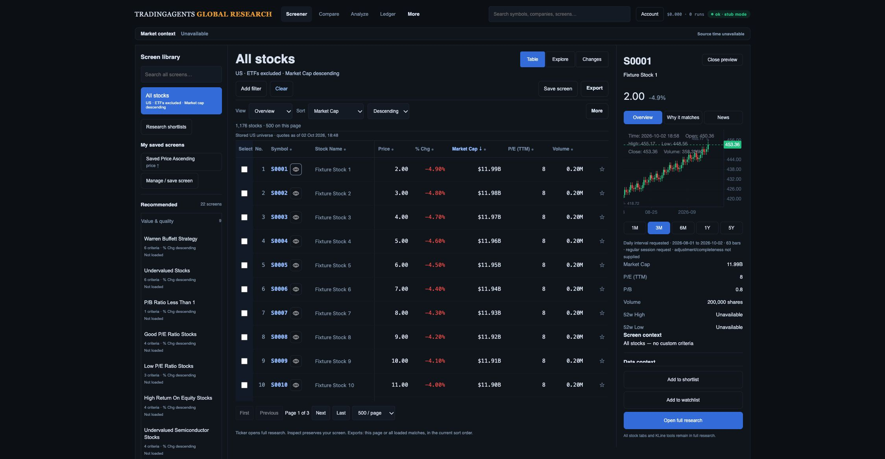
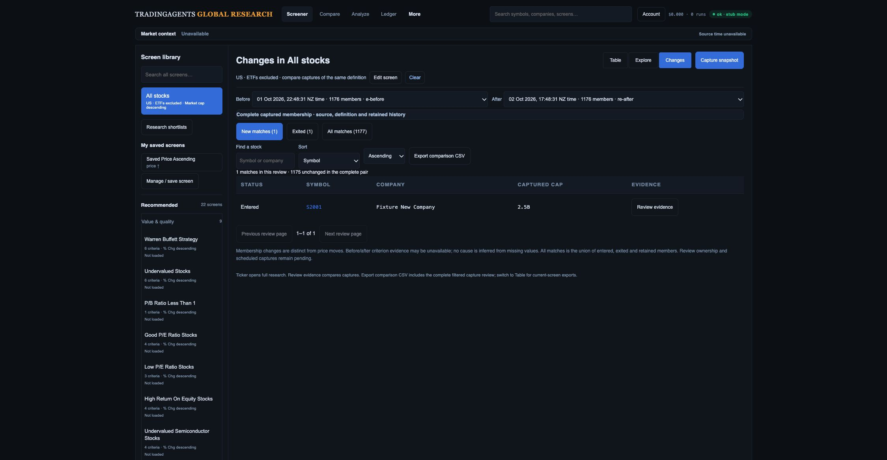

# Build-to-design review and remaining delivery plan

**Latest build-to-mockup review:** [fresh Desk → Inspector → Explorer → Changes comparison and ordered build checklist](design-gap-audit/latest-plan-review/README.md). Region preview/apply/save/reload is now implemented locally with 85 passing JavaScript tests and an exact 240-row downloaded CSV reconciliation. Collision/keyboard, qualified taxonomy/factors/peers, pair review, monitoring, full continuity and live/platform/release acceptance remain open. This supersedes older “region handoff absent” notes below.

**Latest presentation checkpoint:** [compact provider coverage and inspector hierarchy](design-gap-audit/compact-provider-desk/README.md). Default table top 357.625 px at the original 1487 × 1058 viewport; warning-bearing laptop state is about 45 px shorter. Coverage counts/quality remain visible, phone controls measure 44 px with no document overflow, and preview metrics precede the simplified chart. 82 JavaScript tests pass; broader D02–D04/data/release gates remain open.

**Current mockup review:** [fresh retained-build audit and D01–D09 tickets](investment-workspace-design-review-latest.md) supersedes older design status below. Desk reset was checked, all four views freshly captured, and the next packet specifies compact scope/quality, company/criterion context and reload/Compare continuity before Explorer region-to-save, review queue and monitoring. Latest tested build: 379 API/worker and 81 JavaScript tests; live-data and production release gates remain open.

**Latest navigation/refresh checkpoint:** [retained provider pages and explicit refresh](screener-preset-retention.md) preserves opened pages through expired-cache navigation/full-research return, commits replacement only after successful explicit refresh, revalidates selection and moves coverage/quality disclosure above rows. 379 API/worker and 81 JavaScript tests plus controlled actual-route browser checks pass. Reload/deep links, full-feature/data/device/platform and release gates remain open.

**Latest preset consistency checkpoint:** [provider membership and quote display hydration](screener-preset-generation-hydration.md) pins quote fills across pages/capture, retains valid zero and field origins, renders unknown/hydration warnings and separates requested annual basis from actual period. 378 API/worker and 75 JavaScript tests pass; real API/capture routes were exercised with controlled offline provider transport. Preset membership consistency, expired-cache page retention, live/platform and release gates remain open.

**Current design review:** [fresh four-step comparison and D01–D09 delivery tickets](investment-workspace-design-review-latest.md) rechecks Desk, inspector, Explorer and Changes at 1280 × 720 against the original three mockups. That earlier review had 368 API/worker and 70 JavaScript tests; the current review above supersedes its pending-change status. The review and plan are complete; feature and production acceptance remain open.

**Latest capture/export handoff:** [viewed-generation provenance](screener-generation-capture-handoff.md) binds capture retries/reloads to the viewed cohort and retains generation IDs in observations and downloaded CSVs. 362 API/worker and 70 JavaScript tests pass; two actual 1,176-row synthetic browser downloads reconcile. Remaining readers, native capture/PostgREST, live data, retention/cutover and full release gates remain open.

**Latest R01 API checkpoint:** [generation-consistent API readers](screener-generation-api-readers.md) pin stored screener rows/server pages/downloads and derive facets, previews, groups and coverage from validated generations. 360 API/worker and 68 JavaScript tests pass, plus actual API/native worker-generation round-trip. Remaining direct readers, capture provenance, frontend handoff, PostgREST, retention and production cutover remain open; R01 is not closed.

**Latest R01 worker checkpoint:** [actual worker/native database evidence](screener-generation-worker-integration.md) verifies staged atomic publication, exact replay after a lost commit response and successor fencing. 347 API/worker and 68 JavaScript tests pass. API readers still use legacy mirrors; pinned paging/capture/export, PostgREST, retention and production cutover remain open. R01 is not closed.

Reviewed 2 October 2026 against local commit `bab57b2`, the three original mockups and the original product proposal. This review supersedes the build-order/status summaries in the older comparison checkpoints; those remain historical evidence. The local implementation has not been merged or deployed by this review.

## Decision

Keep one workflow: **screen → inspect → full research → compare → shortlist/export → review changes**. Research Desk is the default; Explorer and Changes use its screen definition and canonical identities. The structure is built, but the complete mockup workflows and investment-team qualification are not finished. Do not replace the 22 original presets with the shorter illustrated library, or copy illustrative prices, counts, factors or vendor names into production.

## Latest comparison checkpoint

[Fresh three-view audit and concrete UI tasks](design-gap-audit/worker-plan-review/README.md) reopens the current local Desk, Explorer and Changes at 2249 × 1168, scrollY 0, and compares the saved/opened renders with the three original references. The synthetic fixture and mismatched quote/chart do not qualify financial accuracy. No UI code changed in this checkpoint. R03, R06, R08 and R09 remain open.

## Fresh comparison evidence

The existing in-app browser preview was inspected and captured at 2249 × 1168 CSS px, scrollY 0. Each of the three saved screenshots was opened and inspected alongside the original mockups. Different source/preview widths mean this is a hierarchy and workflow comparison, not pixel fidelity acceptance. The preview uses 1,176 synthetic stocks and 24 ETFs, recorded company/chart responses and in-memory research storage. In particular, its S0001 price is 2.00 while the recorded chart is around 453: this fixture mismatch cannot qualify instrument or price accuracy. No production data reconciliation or private production write occurred.

| Step | Observed health | Remaining difference |
| --- | --- | --- |
| 1 — Desk → Inspect | Library, 22 preset entries, default stock-only/cap sort, permanent Clear, inspector tabs/ranges and three visible footer actions exist. | Secondary text and company context are less readable/rich than the concept; no row trends, qualified sector/industry/website or complete metric evidence. The fixed action footer protects reachability but requires scrolling to read provenance. |
| 2 — Explorer | Labeled axes/scales, missing-data disclosure, numeric-region entry, linked rows and region exports exist. Unsupported advanced axes are disabled. | No sector legend, cap bubble sizing, peer-cohort/rank panel or explicit region → editable screen/save handoff. Constant fixture P/E produces overlapping points; disambiguation needs implementation/qualification without altering values. |
| 3 — Changes | Compact date pair, New/Exited/All, search/sort, retained-history disclosure, evidence action and comparison CSV exist. | No row selection/bulk handoff, pair-specific review status/notes, Next unreviewed or capture schedule controls. This default no-filter fixture cannot demonstrate criterion columns or threshold causes. Code already implements criterion columns/capture-side sorts and the before/after matrix; qualify these rather than rebuilding them. |

### 1 — Research Desk

### 2 — Factor Explorer

### 3 — Change Monitor

Original references: [Research Desk](design-gap-audit/references/02-research-desk.png), [Factor Explorer](design-gap-audit/references/03-factor-explorer.png), [Change Monitor](design-gap-audit/references/04-change-monitor.png), [product proposal](design-gap-audit/references/screener-product-proposal.md). The fuller [combined workflow and original preservation inventory](investment-workspace-build-plan.md#product-decision) remains binding.

## Gap register

Status means **local implementation**, not production acceptance. “Qualify” requires fresh real-data/browser evidence. P1 affects trustworthy decisions or task completion; P2 affects clarity or efficiency. All listed gaps remain open.

| ID / priority | Design element / present state | Concrete work | Closure evidence |
| --- | --- | --- | --- |
| R01 / P1 | Storage, worker and core API generation readers are verified locally; remaining direct readers and browser/platform qualification are open. | Acquire a fenced per-market lease; publish complete immutable generations atomically; pin reader paging and capture/export to one generation. Separate source times from publication/cache time. | Actual two-connection overlap/expired-owner tests; later-batch failure publishes nothing; reader pages never mix generations; retries are idempotent; prior successful rows/status remain available. |
| R02 / P1 | Field observations/source-cache separation implemented partially. Full factor/currency/period coverage unqualified. | Validate canonical identity, source timestamp, quote/session semantics, actual currency, factor units and fiscal/TTM/forward definitions. Audit missing/stale eligible coverage; qualify delisted/unknown identities and complete exchange membership separately from observed plate/slice union. | Dated per-field eligible coverage and identity/clock reconciliation. No inferred USD/HKD, fabricated annual period or claim that a successful requested-cohort refresh proves complete market coverage. |
| R03 / P2 | Desk shell/inspector/selected actions built; presentation differs. | Tighten masthead, typography and provenance hierarchy using current tokens; show qualified sector/industry/website and criterion-led columns/evidence. Optional lazy batched row trends must disclose span/interval and avoid per-row eager requests. | Matched viewport/state visual comparison; actions and source detail reachable at 390/768/1280/1487 px and 200% zoom; table begins ≤360 CSS px in the specified 1487 × 1058 default state. |
| R04 / P1 | Full-research and Compare return foundations built; original feature qualification incomplete. | Group chart/study/drawing controls for narrow widths; clarify Run agent analysis. Restore originating screen/list, filters, sort, columns, page, scroll and selection through Back, reload and deep links. Settings/private-list routes currently lack complete hash restoration. | Real-data seven research tabs, six financial subtabs, full KLine inventory and every existing Compare layout/session/sync path; drawing persistence/disposal; correct return/reload/focus and canonical identity. |
| R05 / P1 | Owner-private shortlist CRUD/search/status UI built locally. | Qualify real Auth and additive migrations; add scoped team roles; explicitly map legacy shared saved screens/watchlists/history to owners with rollback. Retain sign-in intent and conflict drafts. | Two owners/two roles, revocation and account-switch isolation; 501+ item paging/export; concurrent writes; no client-selected ownership; original saved definitions and 22 preset keys/rules/sorts unchanged. |
| R06 / P1 | Immutable history and v3 nonmember observations built locally; private pair review absent. | Store review by owner/team + screen version + before/after IDs + canonical code. Add status/notes, Next unreviewed across pages, row selection and revision-safe selected/bulk shortlist/export. Keep general company shortlist status separate. | Same company in different pairs has independent state; concurrent edits preserve draft; Next unreviewed respects search/pair scope; changing pair clears/revalidates selection; exact downloaded selected/filtered membership. |
| R07 / P1 | Criterion matrix/columns built; cause qualification incomplete. | Exercise every criterion, repeated bounds and entered/exited nonmembers with compatible observations. Distinguish observed crossing, financial update, price move, provider correction and definition incompatibility only when evidence supports it. | Real before/after values have compatible units/currency/periods/identity/clocks; incomplete or incompatible captures cannot infer exits/causes; legacy missing-side evidence remains unavailable. First row ≤500 CSS px in specified 1487 × 1058 closed/open inspector states. |
| R08 / P2 | Explorer region preview/apply/save/reload built locally; collision/keyboard and live acceptance open. | Add Apply region as filters with inclusive bounds, visible criteria preview, Modified state and explicit save. Add exact-point collision picker, selection summary and keyboard-equivalent region/inspection path. | Pointer/numeric/keyboard selections yield identical canonical IDs; log/outlier view exclusions are explicit; save/reload reproduces cohort; Clear restores default and does not silently save temporary brush state. |
| R09 / P1 | Sector/cap/peer ranks and advanced factors absent/gated. | Add actual normalized sector legend, cap-sized bubbles with currency-consistent encoding, cohort-labelled percentile panel and qualified forward P/E/growth. Validate ROIC/debt derivations before enabling them; define missing/negative values, rank ties and small peer cohorts. | Coverage/eligibility accompanies each axis/rank; same period/currency/cohort; absent classifications remain unknown; rank direction explains higher multiple ≠ higher quality. No mockup/vendor placeholder becomes a data claim. |
| R10 / P1 | Manual captures built; opt-in capture automation absent. | Add screen-specific schedule consent/settings and durable, bounded, idempotent jobs. Surface running/last success/failure/retry; append only complete qualified captures and retain prior success. Universe refresh cadence is a different setting. | Duplicate dispatch and worker restart create one capture; failed/partial runs produce no false exits; time-zone/session handling and schedule off/on qualify. |
| R11 / P1 | Export scope/preservation foundations built; complete downloads unqualified. | Keep page/loaded/selected, Explorer region, pair review and shortlist scopes explicit. Pin query/version/generation/revisions, disclose provider totals vs stocks/exclusions, and retain existing CSV/SpreadsheetML Excel compatibility. | Actual downloaded files reconcile row IDs/count/sort/values/source metadata; formula injection, partial pages, changing revisions, account clearing and interrupted-download recovery tested. Native XLSX remains optional, not a replacement that removes current export. |
| R12 / P1 | Settings cadence/failure UX fixed locally; other recovery defects remain. | Render Data & coverage independently of model catalog availability; display unavailable automatic model prices as unknown rather than negative costs. Qualify loading/empty/failed/offline states across all views. | Catalog failure leaves coverage/cadence usable; no negative sentinel price display; obsolete responses cannot replace new screen/account state; prior data labelled clearly until request commits. |
| R13 / P1 | Responsive fixture checks and automated tests exist; complete F gate absent. | Run keyboard/focus, screen reader, contrast, reduced motion, zoom, phone/tablet; instrument warm/cold p95/network completion/long tasks/memory. Run 5–8 analyst tasks, including accurate justification and reset. | Record device/dataset/network/cache conditions. Proposed budgets: warm feedback <100 ms p95, cached inspector <150 ms, warm usable results <1 s; no unmeasured speed claim. No hover-only or colour-only task state. |
| R14 / P1 | Earlier Moomoo reconciliation exists; fresh final-release reconciliation absent. | Recheck all 22 definitions and stock-only default by canonical membership, session/as-of and classification. Separate provider totals, retrieved pages, stocks, ETFs and unknowns. Resolve both RSI-dependent screens or retain honest unavailable state while preserving definitions. | Dated raw source samples, like-for-like counts and explanation of discrepancies. Earlier 9,454 versus 10,605 unlike universes and sparse enrichment are historical observations, not current missing-stock estimates. |
| R15 / P1 | Current richer build remains local/unreleased. | Qualify migrations/Auth/PostgREST, schema grants, deployment cutover and rollback. Merge/deploy the fully qualified build and run production preservation/data/download smoke checks. | Exact migration/commit/deployment identifiers, asset fingerprint, real Auth isolation, original definitions count/hash, production evidence and tested rollback; no open P1/P2 presented as closed. |

## Dependency-aware build sequence

Every packet delivers code, preservation tests, browser evidence and an updated closure record. Begin performance instrumentation immediately; advance safe presentation work alongside data qualification. No calendar estimates are asserted before provider/Auth qualification.

| Packet | Build scope / code touchpoints | Dependency and exit gate |
| --- | --- | --- |
| 1 — coherent data publication | R01 + R02 groundwork: `universe_refresh.py`, worker/API DB clients, additive migration, `_stored_universe`/facets/groups/capture readers. | Storage and actual worker/native SQL integration now pass locally. Core stored readers and explicit server-page/download pinning now pass. Next: finish preset source/warning presentation and remaining direct readers; qualify native capture/PostgREST limits, browser publication-between-pages/capture/export, retention and cutover, then runtime failure/concurrency/end-to-end verification. Stored capture retry and CSV provenance foundations are now implemented locally. Worker-only progress does not close R01. |
| 2 — desk and continuity | R03/R04/R12: `web/api/static/index.html`, `research-workspace.js`, `research-workspace.css`, private-list routing/UI. | Can proceed alongside packet 1; preserve current engine/features. Close routing/catalog recovery, matched presentation, narrow-toolbar, focus and fresh original-feature checks. |
| 3 — ownership and pair review | R05/R06/R07: Auth/list modules, additive team/pair-review migration/API, Changes UI and immutable capture contracts. | Ownership/legacy mapping precedes shared review; qualified paired observations precede cause claims. Deliver selected/bulk actions, pair-specific status/notes, Next unreviewed and exact review exports. |
| 4 — complete analytical exploration | R08/R09: factor field registry/provider pipeline, cohort/rank contract, Explorer UI. | Ship supported region handoff/collision handling first; only then enable advanced axes/peer encodings supported by R02 coverage. Pointer, keyboard, save and export membership must agree. |
| 5 — opt-in monitoring | R10: capture scheduling API, worker job/retry path, saved-screen schedule UI. | Packets 1 and 3 reliability/ownership contracts required. Prove restart/duplicate/failure behaviour and prior-success preservation. |
| 6 — investment-team release | R11/R13/R14/R15 across every packet. | Reconcile all downloaded scopes and fresh Moomoo membership; complete devices/accessibility/p95/analyst tasks and all original features; qualified migration/cutover/rollback → merge/deploy → production smoke. |

## Preservation checklist for every packet

- [ ] All 22 preset IDs, definitions, declared sorts and saved definition counts/hashes retained.
- [ ] Initial/Clear/second-click return to selected-market stocks excluding ETFs, market-cap descending and defined default presentation; active criteria/sort remain explicit.
- [ ] Share classes and US/HK canonical identities preserved; unknown types and unverifiable criteria fail closed.
- [ ] Switching Table/Explore/Changes does not silently alter a saved screen; rule edits mark Modified.
- [ ] Ticker opens full research; inspector preserves screening context; Back/Compare/reload/deep link recover origin.
- [ ] All original research/KLine/Compare controls and export formats/scopes remain reachable and verified.
- [ ] Every package closes only with implementation + data contract + browser evidence; fixture success is not production acceptance.

## Evidence limits and plan corrections

The original comparison checkpoint was 331 API/worker and 68 JavaScript tests at `bab57b2`. The latest design review reran 368 API/worker and 70 JavaScript tests successfully; see its scoped evidence and pending-change limits above. No fresh live financial/Moomoo count, production Auth/migration, p95 or accessibility compliance claim is made. Screenshots support visible desktop findings, not full phone/keyboard usability.

Older plan paragraphs saying only two captures are retained, no shortlist UI is wired, or criterion columns are absent are historical: those foundations are now implemented locally. Conversely, local shortlist status is not pair-specific review, owner privacy is not team ACLs, universe cadence is not capture automation, and successful batch validation is not atomic publication. This register makes those distinctions explicit and remains the current closure checklist.
