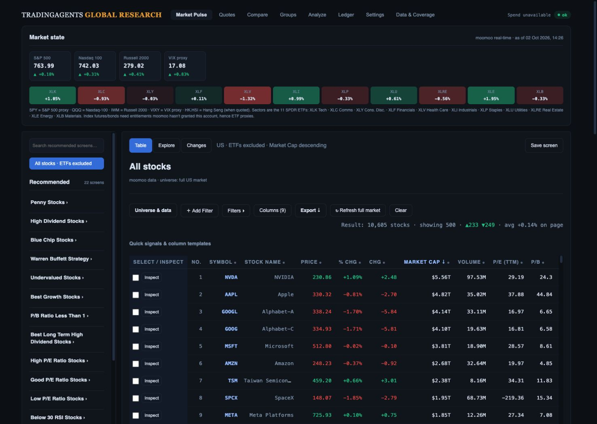
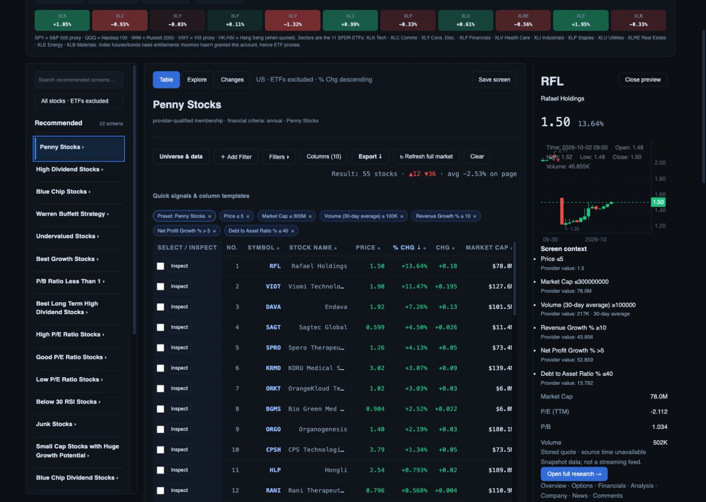
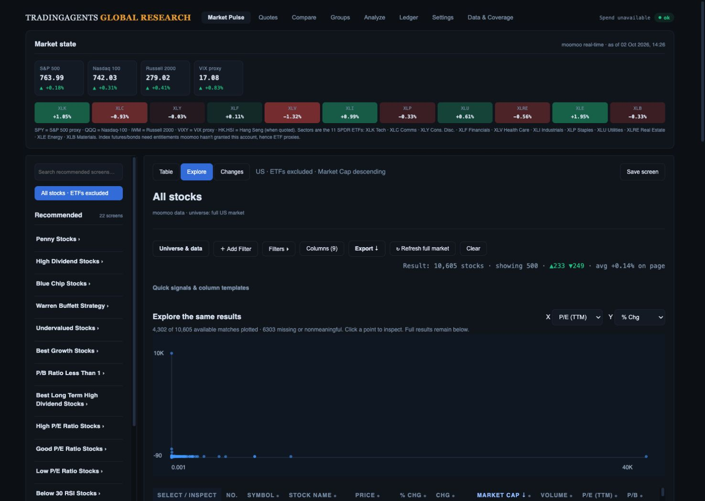
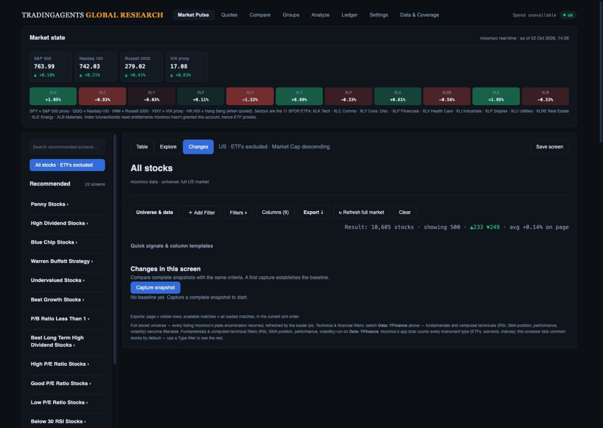
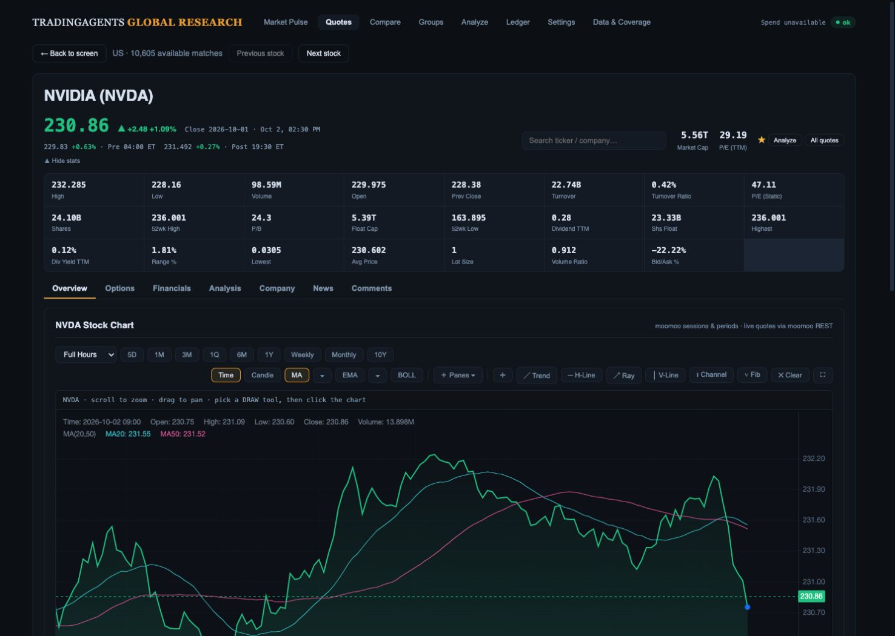
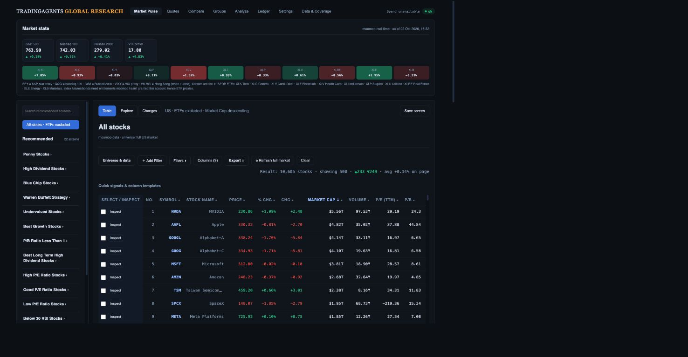
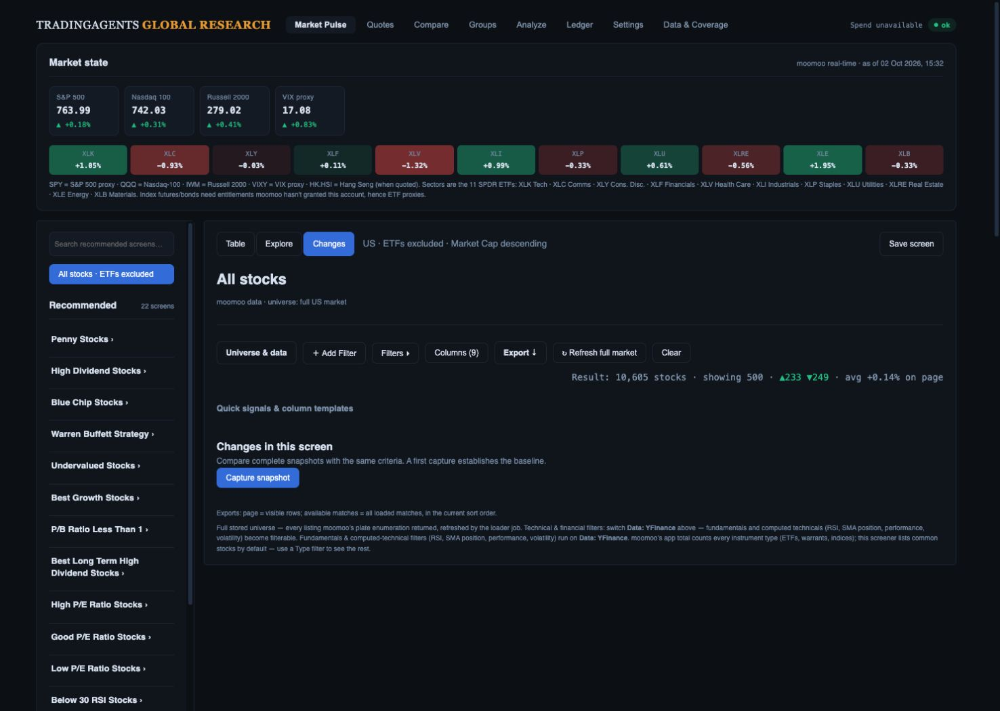
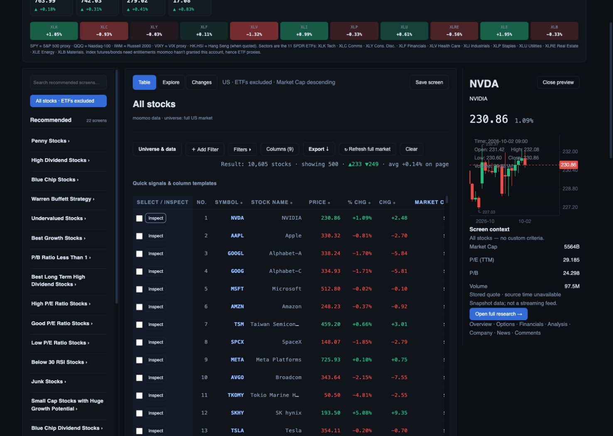
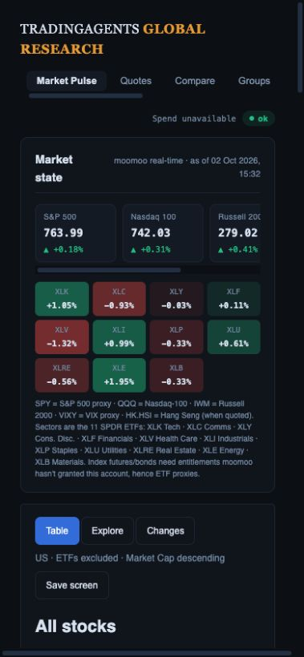

# Design fidelity review and remaining build plan

Reviewed 2 October 2026 against the live workspace and local release `8b7b019` (merged release `1f3bd19`). This initial browser/code audit updates delivery status. Later local implementation checkpoints below record fixes made after that baseline.

## Verdict

The build is a functional first version of the combined workflow, but **the full approved design is not complete**. Reset correctness, the 22-screen inventory, criteria columns, inspector, research continuity and scoped exports form a useful foundation. Information hierarchy, desktop/mobile navigation, richer selection, visual exploration and the change-review workflow remain incomplete.

The earlier “ready for investment-team review” statement means a supported demonstration with disclosed limits. It does not mean full mockup fidelity, completion of every plan phase, measured responsiveness or institutional-factor readiness. Functional test totals are not substitutes for those gates.

The concepts contain illustrative counts, factors and securities. Retain their hierarchy and interaction goals; do not copy invented values, shorten/replace the 22 real presets, imply FactSet is connected, or unlock unsupported factors simply to match an image.

## References and captured steps

References: [Research Desk](design-gap-audit/references/02-research-desk.png), [Factor Explorer](design-gap-audit/references/03-factor-explorer.png), [Change Monitor](design-gap-audit/references/04-change-monitor.png), [combined workflow](research-workspace-evidence/05-combined-research-workflow.png), [original proposal](design-gap-audit/references/screener-product-proposal.md).

Desktop captures use 1487 × 1058 CSS pixels, matching the concepts. The inspector capture follows browser scrolling to the clicked row, so do not derive top-page spacing from that pair. Mobile uses 390 × 844. All six screenshots were saved and inspected during this run. No production saved-screen, watchlist or snapshot writes were made.

| Step | Task and health | Evidence |
| --- | --- | --- |
| 1 | Default Table: functional; hierarchy/navigation incomplete. Market Pulse is highlighted while the screener is open. | [Desk](design-gap-audit/01-desk.png) |
| 2 | Penny → Inspect RFL: numeric provider evidence appears; width, formatting and inspector actions need work. | [Inspector](design-gap-audit/02-inspector.png) |
| 3 | Clear → Explore: scope disclosure works; outliers make the plot difficult to use. | [Explore](design-gap-audit/03-explore.png) |
| 4 | Changes: honest first-run explanation; intended review queue absent. No capture performed. | [Changes](design-gap-audit/04-changes.png) |
| 5 | Mobile Table: no document overflow (381 px scroll width within 390 px viewport); core stock task below first screen. | [Mobile](design-gap-audit/05-mobile.png) |
| 6 | NVDA → Back to screen: chart/seven tabs present; return works; action naming and toolbar hierarchy need polish. | [Research](design-gap-audit/06-research.png) |

## Gap register

P1 completes the core design and team presentation experience. P2 expands the workflow. Data gates constrain advanced features, not supported UI work.

| ID | Priority | Intended design → current gap | Required change |
| --- | --- | --- | --- |
| G01 | P1 | Dedicated Screener navigation, compact context/global search → eight legacy buttons, wrong active label, large market card, no global search. | Screener / Compare / Analyze / Ledger / More with route aliases; accessible symbol/company/screen search; compact expandable market strip. Label SPY/QQQ/IWM/VIXY proxies next to their values. |
| G02 | P1 | Collapsible organized library with accessible saved screens → 22-item list, saved screens underneath, recommended-only search. | Pin All stocks; independently accessible saved section; collapse/groups/search across both lists; purpose/sort disclosure. Keep exact preset keys and criteria. Count badges need scope/time or explicit unknown/unavailable. |
| G03 | P1 | One pinned toolbar, View/Sort, readable criteria → separate mode/save/header/filter rows, hidden templates and tiny chips. | Responsive sticky query toolbar with Add filter, Clear, View, Sort, Save, Export, advanced menu. Keep all filter/column capabilities. Format short units and reporting periods. Clear always remains visible with the same reset contract. |
| G04 | P1 | Readable evidence-led rows, stable identity, trends → wide repeated Select/Inspect column, monospaced/truncated company names, cramped open-inspector table. | Freeze selection+ticker/company, ordinary text names/tabular numbers, density control, labeled icon-library Inspect, usable Overview columns. Optional sparklines use cached sufficiently complete history; no cold history call for every row. |
| G05 | P1 | Inspector Overview / Why it matches / News, ranges and shortlist → one long panel, fixed 3M preview, no watchlist/range/tabs. | Tabbed inspector, chart ranges and existing watchlist action. Evidence shows value/threshold/unit/period/source/status. RFL growth `43.956` needs `%` formatting; market-cap thresholds need short units. Separate source time/retrieval time/currency, including unknown. Full research stays available. |
| G06 | P1 | Selected-row highlighting and removable ticker chips → checkbox count/Compare/Clear only. | Stable row highlight, per-ticker remove chips, selected CSV/XLS export. Comparison remains 2–4; larger selection remains exportable. Selection bar cannot obscure results. |
| G07 | P2 | Add to shortlist / next unreviewed → row watchlist exists but no independent shortlist or review state. | Expose watchlist accurately first. Add named persisted shortlists/notes/review state separately with defined ownership and permissions. Keep watchlist, shortlist, screen definition and comparison selection distinct. |
| G08 | P1 | Useful linked Explorer with brush → raw linear min/max outliers, endpoint ticks, equal blue dots and click-only inspection. | Labeled units/grid/ticks/tooltips, zoom/reset, valid linear/log controls, explicit optional robust display range with out-of-range counts/full-range access. Rectangle selection plus equivalent numeric inputs; linked selected table, Compare/export; explicit action to turn bounds into filters; resize handling. Never silently drop outliers. |
| G09 | P2 + data | Growth/valuation axes, sector color/bubble cap/peer ranks → four quote axes only. | Cap bubbles can use current data. Normalize sector/fundamentals before advanced axes/ranks. Show cohort/eligibility/source/period/freshness. Broad-cohort target ≥95% valid/fresh eligible coverage, otherwise named covered subset. ROIC and debt/EBITDA need validated derivations. Previous 2.07% enrichment figure is historical, not remeasured here. |
| G10 | P1/P2 | Daily New / Exited / All review queue → manual capture plus membership button lists. | P1: setup/completeness badge, count tabs, search/sort rows, inspect and explicit no-change/failure states. P2: dated history/date pair, saved-screen schedules, reviewed/unreviewed and comparison export. Keep completeness checks; incomplete fetch never creates exits. |
| G11 | P2 + data | Before/after explanation → two member-only snapshots and no paired evidence UI/API. | Versioned history with source/financial-period metadata. Obtain before/after evidence for the union of membership sets, including when an instrument was outside the screen. Show unavailable if absent. Only claim a threshold crossing with comparable values; distinguish membership change from proven cause. |
| G12 | P1 | Phone compact rows/sheets, laptop collapse → desktop table on phone, library below results, 36 px controls, banner fills first screen. | Mobile identity/price/two selected metrics with expandable detail and optional table; screen/filter/inspector sheets; reachable count/sort/Clear. Laptop collapsed library/drawer. Target 44 px touch controls; verify 390/768/1280/1487 widths and 200% zoom. |
| G13 | P1 | Consistent research workflow and retained KLine → return works, but Analyze names both job/workspace and tools remain crowded. | Rename job action Run agent analysis; retain Analysis tab, seven tabs/six financial subtabs. Expandable studies/drawings at narrow widths; preserve sessions/ranges/intervals/drawings/fullscreen and Compare layouts. |
| G14 | P1 | Accurate taxonomy and Modified/recovery states → Industry includes OTC, screen-slice, exchange/vendor lists; no clear modified-saved-screen badge. | Typed Sector / Industry / Theme / Exchange / Provider list provenance. Retain unmapped legacy selections as provider lists. Modified relationship + Save copy/update; explicit zero-result rule suggestions; previous results labeled by query on failure. |
| G15 | P1 | Measured speed/accessibility → default 500-row DOM, recurring first-stale warming, p95 and keyboard/focus gates unproven. | Baseline instrumentation, demand-driven fair bounded prefetch, stable state/render/chart lifecycles. Smaller pages/virtualization only as profiling warrants, with stable focus. Keyboard/form plot alternative, dialogs/drawers/Escape/focus, aria-sort/selection/status, contrast/reduced motion and screen-reader checks. |

## Implementation evidence at the audited release

These findings describe release `8b7b019`, before the local implementation checkpoint below. They must not be read as the state of the newer unmerged working files.

- `research-workspace.js`: `scrWorkspaceMount` wraps/relocates legacy home DOM. `researchLibrarySearch` searches `.preset` only. `researchSelectionMount` has no ticker chips/export. `researchInspectRow` lacks tab/range/watchlist, period-aware value formatting, explicit focus restoration and a resize observer. Drawer accessibility remains unverified.
- `researchPlot` uses raw min/max, endpoint labels and fixed dots/click handler. No brush/zoom/tooltip/keyboard point navigation/resize observer. The live plot clusters most observations near the origin. Axes are window globals and are not in saved settings; reproducible Explore state is also incomplete.
- `research-workspace.css`: toolbar is not sticky. Mobile moves the library below results instead of a sheet; several minimum heights are 36 px.
- `index.html`: `scrWarmPresets` scans the first five stale definitions every 30 seconds instead of user priority/fair scheduling. Legacy coverage help broadly encourages YFinance factors without per-field availability. Saved edits need an explicit Modified relationship.
- `main.py`: snapshot capture stores member evidence and retains `[-2:]` in app_settings. Changes returns added/exited plus unchanged count, not paired criterion evidence. An entering instrument may have no prior evidence by construction. UI work alone cannot create the mockup's explanation.

## Sequenced implementation packages

Deliver each package as a reviewable PR with browser evidence and rollback; use a rollout flag where appropriate. No framework/chart-engine rewrite. UI and storage changes should remain independently reversible.

### A — shell, hierarchy and responsive results

Covers G01–G04, G12 and G14. Extract the screen layout adapter, retain existing query/export functions, then build navigation/search, compact proxy context, collapsible library/saved section, pinned View/Sort/filter toolbar, table typography, mobile rows/sheets and typed taxonomy labels.

**Acceptance:** all 22 keys/criteria/sorts and saved count/hash unchanged; compatibility routes/history work; full default/reset holds. At 390 × 844 a stock row and query controls appear in the first viewport. At 1487 × 1058 the result header starts within the top 360 px with compact context, and key Overview columns are usable. Compare screenshots at matching viewport/state, closed/open inspector and all presentation modes.

### B — evidence inspector, selection and research continuity

Covers G05–G07 and G13. Add a typed value/unit/period/source/time/status presentation contract. Build inspector tabs/ranges/watchlist/focus lifecycle, selected ticker chips/export and research toolbar grouping. Named shortlist persistence follows separately after defining ownership.

**Acceptance:** inspect/close preserves query/page/scroll and returns focus to its exact row; late requests cannot replace another ticker; annual/TTM/forward values remain distinct. Existing chart/financial/options/Compare controls survive. Exports preserve scope/IDs/columns/sort/source. No eager detail requests for every result.

### C — useful quote-based Explorer

Covers G08 and reproducible state. Save axes/scales/configuration additively, implement ticks/tooltips/outlier/scale controls and container resizing, then brush/form selection, selected table and Compare/export linking using current supported axes.

**Acceptance:** extreme P/E/day-move fixtures remain readable without silently removing stocks. Separate missing/stale/nonmeaningful/out-of-range counts. Selection → table → inspect → Compare → return retains cohort. Test zero points/constant axes/negative values/touch/keyboard/resize. Advanced factors stay gated until E passes.

### D — review queue, then historical evidence

Covers G10–G11. First build setup/count tabs/search/sort/inspection around the validated manual comparison. Then versioned persistent history/retention, date-pair selection, requested saved-screen schedules, union-member evidence, review state and comparison export.

**Acceptance:** baseline/no-change/incomplete/stale/changed-definition/failure states produce zero false exits. Fixtures contain controlled entry/exit with comparable values and a case without evidence; only supported cases receive threshold-crossing reasons. Changes export carries both snapshot IDs/dates/status/evidence, not silently the current cohort. Do not schedule every preset by default. Storage/ownership/access checks precede shared-team scheduling.

### E — coverage recovery and advanced factors

Covers G09. Re-measure eligible universe/field freshness, backfill in bounded batches, reconcile normalized sector/industry, estimates/growth periods and sampled financial statements. Add axes/colors/peer ranks only after coverage gates; formally define/reconcile ROIC and debt ratios before introducing them.

**Acceptance:** documented eligibility/source/period/currency, ≥95% valid/fresh eligible coverage for unqualified broad-cohort views or an explicitly named subset. One successful NVDA fetch proves no bulk coverage. Keep both RSI-dependent preset definitions visibly unavailable until provider support or a validated equivalent is established.

### F — quality gates throughout A–E

Begin by measuring the current release. Record reference desktop/mid-range phone, cold/warm cache, throttled network, p50/p95, long tasks/memory/request counts. Distinguish feedback, usable results and network time. Align previous conflicting targets as provisional: immediate feedback ≤100 ms, warm local query/sort ≤300 ms p95, cached inspector feedback ≤150 ms. These are targets, not measured claims; cold requests need visible asynchronous states.

**Acceptance:** keyboard/touch tasks, screen-reader labels, dialog/drawer focus, aria-sort/live status, contrast, reduced motion/zoom/resize. Repeat Moomoo checks with dates, exact criteria/session/instrument types, provider/stock/ETF/excluded counts and instrument reconciliation. Do not demand equal totals from unlike universes. Run 5–8 intended-user tasks: find, justify, compare, shortlist/export, reset and review changes; record completion/time/errors, not investment return.

## Execution checklist

- [x] Inspect three concepts and combined mockup.
- [x] Capture/inspect six current flow screenshots.
- [x] Compare visual intent, current flow and code; distinguish UI/data dependencies.
- [x] Update plan and separate functional-release proof from design-completion gates.
- [ ] A: dedicated shell/navigation/context/library/toolbar/table/mobile/taxonomy.
- [ ] B: evidence inspector/ranges/watchlist/selection/export/research; shortlist separately.
- [ ] C: Explorer scales/selection/linking/accessibility/saved config.
- [ ] D1: membership review UI with explicit export scope.
- [ ] D2: history/schedules/paired evidence/review state.
- [ ] E: fresh coverage/backfill/validation/gated advanced visuals.
- [ ] F: measured performance/accessibility/team usability acceptance.

## Captured flow

### 1 — Default Table: functional, hierarchy incomplete

### 2 — Inspector: evidence present, usability incomplete

### 3 — Explorer: honest scope, outlier-dominated plot

### 4 — Changes: honest setup, review queue incomplete

### 5 — Mobile: fits width, core task below first screen

### 6 — Research: chart/return preserved, hierarchy incomplete

## Review limits

This run did not repeat the previous 216 automated checks, all 22 live executions, full export verification or database coverage audit. Their release-checklist evidence remains the preservation baseline, not fresh design acceptance. We did not create production snapshots or test real entries/exits, schedules, shortlist persistence, every Compare layout, screen-reader behavior or p95 timing. Screenshots identify risks; they do not establish WCAG compliance or complete data accuracy.

## Follow-up review of the current build

Rechecked the deployed workspace on 2 October 2026, with market context displaying 15:32 NZDT. Browser DOM reported 1487 × 1058 for desktop and the mobile override was 390 × 844. Screenshots were saved and inspected; the first desktop capture uses the browser screenshot's displayed extent, so it must not be used for pixel-distance measurements. The inspector is scrolled to its row and its initial loading frame was replaced with the loaded chart frame. These five captures confirm the findings below; the earlier six-step capture is retained as a separate audit run.

| Step | Task | Health and confirmed design gaps |
| --- | --- | --- |
| 1 | Default desk | Functional table; incorrect Market Pulse active navigation, oversized market context, tiny row typography, saved section below the long preset list. G01–G04. |
| 2 | Explore | Scope is honestly disclosed (4,302 plotted / 10,605 available); raw extremes compress ordinary observations. Brush, readable ticks, zoom and linked subset actions missing. G08. |
| 3 | Changes | First-run setup is honest; New/Exited/All review tabs, searchable evidence rows and date-pair workflow missing. Capture was not performed. G10–G11. |
| 4 | Inspect NVDA | Chart loads and full research remains reachable; Overview/Why/News tabs, labeled ranges, watchlist, formatted cap units and clear session/interval/source context missing. G05–G06. |
| 5 | Mobile desk | Width fits, but market context occupies the first viewport; no stock row or Clear visible in this captured view. G12. |

### Plan corrections

The initial implementation delivered an adapter around the old home-page DOM, not the complete approved desk. Replace that layout incrementally while retaining the query/export/chart functions. Measure visual fidelity independently from functional correctness. Existing checkbox completion records describe the initial release only.

1. Start performance instrumentation before layout work, not at the end of the project. Record warm and cold behavior separately.
2. Ship A and B together as the first cohesive desk acceptance: a usable table, inspector and mobile flow. Preserve all original preset definitions and saved settings before migrating presentation state.
3. Complete C with currently supported quote axes. Advanced factor availability must never block scale, selection or accessibility improvements.
4. Split D into review UI and evidence storage. Member-only snapshots cannot prove a threshold crossing for a security that was previously outside the screen; capture comparable evidence for the union of members or show cause unavailable.
5. Run E as a bounded coverage repair alongside UI delivery. Re-measure coverage before enabling each advanced axis; the historical 2.07% figure is not a fresh measurement.
6. Close F only with measured performance, keyboard/touch checks and intended-user task results. A screenshot or automated-test count alone cannot close it.

Inspector chart acceptance also needs an explicit contract: selected range, actual returned start/end, bar interval, trading session, adjustment and completeness must be consistent and visible. A fixed `range=3M` request with an unlabeled chart does not establish that contract. Verify returned data rather than inferring history coverage from the initially visible candles.

### Presentation-ready gate

- [ ] A/B: matching-viewport default and open-inspector screenshots align with the combined design hierarchy; readable identity/metrics remain visible.
- [ ] 390 × 844: Clear, result count/sort and at least one stock row are reachable in the first viewport; sheets have keyboard/Escape/focus recovery.
- [ ] All 22 presets retain exact definitions and individual sort behavior; existing saved definition hashes remain unchanged.
- [ ] Table → Inspect → research → Compare → return preserves the complete screen and chart contract; selected export is reconciled.
- [ ] Explore handles extremes, missing values and linked selection without silently changing the underlying cohort.
- [ ] Changes distinguishes baseline, no change, partial/stale failure and proven membership changes; paired evidence and export scope are accurate.
- [ ] Advanced factors have measured eligible coverage, units/periods/freshness and validated definitions; unavailable factors remain explicit.
- [ ] Fresh end-to-end, export, Moomoo membership/count reconciliation, accessibility and performance evidence is recorded for the final deployed commit.

This follow-up did not re-run the full automated suite, exercise every KLine control, perform production writes, measure bulk coverage, or repeat Moomoo reconciliation. Those remain explicit release gates.

## Local implementation checkpoint — inspector and selection

The working tree now implements part of B; this checkpoint is **unmerged and undeployed**, and does not close A/B acceptance.

- Inspector: Overview / Why it matches / News, five requested chart ranges, watchlist action, percent/cap units, criterion periods and explicit unknown provenance. History displays actual returned span/count and discloses unknown adjustment/completeness. Chart responses are guarded against stale generations; disposal disconnects resize observers. Result remounts no longer deliberately move focus into the inspector.
- Selection: removable ticker chips, checked-row highlighting, selected CSV/XLS export in the current cohort's sort order. Export rejects selections outside the loaded cohort rather than silently exporting a partial selection. Compare remains restricted to 2–4 stocks.
- Verification: all **23 JavaScript tests pass**, including actual CSV BOM/contents, Excel XML row count/order, missing-selection rejection, criterion units/periods, invalid OHLC/future timestamps, chart disposal and an actual late-response race between two stocks. Offline browser checks exercised tabs/ranges, Escape/focus return, chip removal and disabled single-stock comparison. CSV control activation was observed; the browser download-event wait did not return a file, so a downloaded-file browser check remains open.
- Evidence: [inspector work in progress](design-gap-audit/implementation/01-inspector-progress.png). This is a **synthetic offline harness**, with recorded history used for interaction testing; its quote/chart values are not a financial reconciliation or a presentation-ready investment screen.

Still open in B: modal background/focus behavior across breakpoints, every range and stale-response scenario in browser, all stock/Compare/chart preservation checks, selected downloaded-file reconciliation, research toolbar grouping and independent named shortlist persistence. Shell readability/mobile/toolbar gaps remain in A. The **199 API/worker tests also pass** in this checkpoint. No fresh Moomoo universe reconciliation, bulk coverage measurement or production verification is claimed.

## Local implementation checkpoint — direct desk and responsive flow

This newer checkpoint supersedes the earlier 23-test progress statement for current working files. It is **unmerged and undeployed**; all packages retain their full acceptance gates. The current [design QA](../design-qa.md) compares normalized source and rendered implementation together and records remaining P1/P2 findings.

- A now renders the desk directly: Screener/Compare/Analyze/Ledger/More, global symbol/company/screen search, compact market context, grouped search across all 22 recommended and saved screens, View/Sort/filter/Clear/Save/Export controls, Overview's seven core fields, frozen identity offsets and phone result cards/library sheet. Existing saved column arrays and preset definitions are preserved.
- B now keeps research/watchlist actions visible while inspector content scrolls. Selection mirrors desktop/mobile; 44 × 44 mobile selection target and cross-breakpoint modal focus return were browser-verified. Closing the inspector restores Inspect S0001 after resizing from desktop while Export had focus. Interval/session copy says requested; actual returned history span/count and unknown metadata remain explicit.
- Desktop query spacing was iterated against the mockup: table top **428.6 → 356.6 px** at 1487 × 1058, meeting the plan's ≤360 px target. Main stock task and Clear remain in the initial phone viewport at 390 × 844. See [latest synthetic desk](design-gap-audit/implementation/09-desk-compact-reviewed.jpg).
- **30 JavaScript checks pass**; **199 API/worker checks passed** in this checkpoint before subsequent frontend-only changes. Diff whitespace check passes. Latest browser console warning/error check was empty.
- Preliminary same-host synthetic sort timings: 12 warm sorts, nearest-rank p50 **104.7 ms**, p95 **157.4 ms**, 1,176-stock dataset/500 rendered rows. [Raw measurements](design-gap-audit/implementation/local-render-timings.json). These exclude asynchronous panels and predate final spacing/frozen-column refinements; they do not close F or establish production performance.

Next execution order: finish A/B empty/modified/status states, export descriptions and typography; verify complete inspector/data/research contracts and persisted shortlists; then C linked Explorer, D change review/history, E fresh coverage and comparable Moomoo reconciliation, and F accessibility/performance/production gates. E/F measurements run alongside UI work. No fresh live row-count or whole-universe coverage claim is made here.

### Local linked Explorer checkpoint

Core C now supports labeled linear/log axes, outlier-view disclosure, numeric/pointer region selection, zoom/clear, a linked results table, shared selection/inspection and explicit region CSV/Excel exports. Advanced forward-P/E/growth/ROIC/sector comparison remains gated on E; C acceptance is not closed. Numeric workflow, linked selection and Clear reset were browser-verified. Pointer dragging and full real-cohort/device qualification remain open.

A/B status work adds no-match library recovery, per-export counts, retained-column labels and Modified saved-screen relationships. Applying saved settings now clones nested arrays/objects so UI edits cannot mutate the saved definition in memory. **37 JavaScript tests pass**; evidence and remaining findings are in [design QA](../design-qa.md). This is a local, unmerged, undeployed checkpoint.

### Local Change Monitor D1 checkpoint — 2 October 2026

Basic D1 is implemented locally: New/Exited/All queues, search, sort, pagination, explicit capture pairs, unavailable/paired evidence inspection and complete filtered comparison CSV. Snapshot safeguards reject incomplete/classification-unknown cohorts, incompatible versions, invalid dates and identities; provider financial evidence cannot borrow unrelated quote fields. Current-screen and review counts/exports are labeled separately. **208 API/worker tests and 43 JavaScript tests pass.** Desktop/phone fixture evidence and remaining fidelity gaps are recorded in [design QA](../design-qa.md). This is unmerged and undeployed, with no production capture writes or fresh financial reconciliation.

D1/D2 are not complete: criterion-specific table fields/sorting, selection, Next unreviewed, notes/shortlists, authenticated ownership, concurrency-safe durable history and scheduling remain open. Storage currently keeps only two captures. Entering/exiting records often lack an observation on the other side, so numeric causes are explicitly unavailable. Do not infer a threshold crossing from absent membership.
