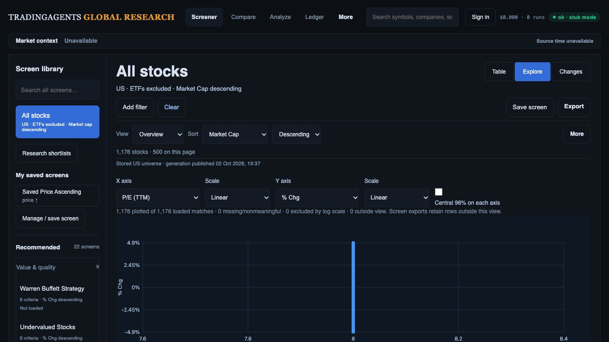
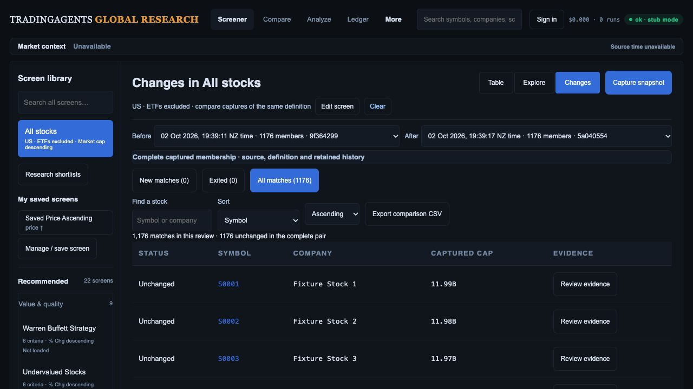

# Design review: implementation, original mockups and delivery plan

Reviewed 2 October 2026, local branch `codex/investment-team-release-evidence`, committed baseline `ebb8e11` with pending preset-hydration changes. This review supplements the [R01–R15 checklist](investment-workspace-current-gap-plan.md); it does not close those release gates.

## Verdict

The approved architecture is present: one screen definition with Table, Explore and Changes, a searchable library retaining 22 recommendations, explicit sort, permanent Clear, contextual inspection and access to full research. The build is a functional foundation. It does not yet deliver the complete investment-team workflow illustrated in the mockups. Keep the architecture and implement the missing handoffs; a second redesign or framework rewrite would distract from those gaps.

The original references are concept illustrations, not production data specifications. Preserve original preset IDs/rules/sorts, seven research tabs, six financial subtabs, the entire KLine/Compare inventory and CSV/SpreadsheetML exports. Do not substitute the illustrated shorter library, vendor labels, sample counts or financial values.

## Fresh audit steps and evidence

The existing in-app preview at port 8892 was inspected without restarting its server. It uses 1,200 synthetic instruments, 1,176 classified stocks, recorded chart responses and fake research storage. It does not exercise the pending actual-provider preset changes. Screenshots below were freshly saved and opened. Viewport: 1280 × 720 CSS px; Desk, Explorer and Changes scrollY 0; opening the inspector moved document scrollY to 71. This is a laptop workflow comparison against larger original references, not matched-pixel acceptance. No production write occurred.

1. **Desk — usable foundation, presentation needs refinement.** All stocks, ETF exclusion, market-cap descending, library, Save and Export are visible. Secondary labels are small; controls occupy multiple rows; no row trends or qualified company taxonomy appear. The default state cannot demonstrate criterion-led columns or filtered-screen evidence.

   

   Reference: [Research Desk](design-gap-audit/references/02-research-desk.png).

2. **Inspect — actions reachable, evidence hierarchy incomplete.** At this width the drawer overlays the table. Shortlist/watchlist/full-research actions remain visible; source and company evidence require inner scrolling. The chart's dense OHLC labels compete with the plot. Fixture S0001 quote 2.00 and recorded chart near 453 are incompatible; these screenshots cannot qualify instrument accuracy.

   

3. **Explorer — supported plot works, region-to-screen workflow incomplete.** Axis labels, scales and loaded/excluded counts are explicit. The table's column-view control remains above the plot even though it does not describe the axes. Constant fixture P/E stacks points at x=8; individual point selection needs collision handling. Region inputs/export exist below the viewport, but an Apply region → criteria preview → Modified → Save handoff is absent. Sector legend, cap bubbles and peer ranks remain absent/gated.

   

   Reference: [Factor Explorer](design-gap-audit/references/03-factor-explorer.png).

4. **Changes — readable evidence table, review queue incomplete.** Date pair, New/Exited/All, search/sort and comparison export are visible. This identical-generation default pair has zero entries/exits and no numeric screen criteria; it does not qualify threshold-crossing explanations. Pair-specific status/notes, selected/bulk actions, Next unreviewed and screen capture schedules are missing. Existing criterion columns/matrix must be tested with a filtered pair, not rebuilt as though absent.

   

   Reference: [Change Monitor](design-gap-audit/references/04-change-monitor.png).

## Concrete build tickets

Each ticket closes only with code, preservation tests and fresh browser/data evidence. Cross-references map to the existing R-register rather than introduce a competing checklist.

| Ticket / priority | Gap and implementation | Acceptance |
| --- | --- | --- |
| D01 / P1, R01–R02 | Finish preset membership/display-source separation. Pending code pins quote hydration, preserves zero, rejects mismatched identities and retains source per displayed field. Render hydration/classification warnings; replace the current blanket “financial criteria: annual” label with requested-basis versus actual-period disclosure. Keep provider pagination distinct from immutable display quotes. | Publication between pages cannot mix quote cohorts; unknown classifications/exclusions are visible; no provider value inherits an incompatible snapshot observation; capture cannot imply that provider membership is frozen by a quote-generation ID. |
| D02 / P2, R03 | Tighten query hierarchy and raise secondary text readability using existing tokens. Keep screen name, criteria, count, source scope and declared sort; collapse optional controls. Make company identity/context and coverage visible before chart detail. Reduce preview OHLC label clutter while retaining full chart features in research. | Default and filtered matched-state captures at 1487 × 1058; first table ≤360 CSS px in specified default state. At 1280/768/390 and 200% zoom, Clear, close, evidence and primary actions remain reachable. Measured contrast/focus checks. |
| D03 / P1, R02–R03 | Add criterion-led columns and qualified sector/industry/website to the inspector. Audit existing column behavior before editing it. Optional lazy/batched row trends follow later, with span/interval/source/cache labels. Missing fundamentals remain unavailable. | Every enabled criterion has correctly labelled value/evidence or an explicit unavailable state; actual reporting periods/currencies verified. No eager chart request per row; request/latency budget recorded. |
| D04 / P1, R04/R12 | Complete screen → ticker → full research → Compare → return continuity, including reload, hash/deep links, Settings and private lists. Group narrow chart/study/drawing controls; label job action “Run agent analysis.” Keep coverage controls available after catalog failure and suppress negative unknown-price sentinels. | All seven research tabs, six financial subtabs and original KLine/Compare inventory exercised. Origin filters/sort/columns/page/scroll/selection/focus recover; stale symbol/account requests cannot overwrite current state. |
| D05 / P2, R08 | Give Explorer its own compact axis toolbar; move table-only column-view controls to the linked table. Add region summary and “Apply region as filters” with inclusive-bound preview, explicit Modified state and Save. Add exact-coordinate collision picker and keyboard inspection. | Pointer/numeric/keyboard paths produce identical canonical membership; apply/save/reload reproduces results; axis changes reconcile bounds; Clear restores default; no point jitter or silent rule mutation. |
| D06 / P1, R02/R09 | Build actual sector legend, currency-consistent cap bubbles and cohort-labelled peer percentiles. Enable forward P/E/growth/ROIC/debt only after field-level qualification. Define missing/negative values, rank ties and small cohorts. | Coverage and eligibility shown per factor/cohort. Currency/period consistent; unknown sector remains unknown; valuation percentile does not imply quality. No illustrative factor enabled solely to match the image. |
| D07 / P1, R05–R07 | Add pair-scoped review status/notes, cross-page Next unreviewed, row selection and revision-safe bulk shortlist/export. Review key includes owner/team, screen version, both capture IDs and canonical code. Qualify team roles/Auth and legacy ownership before sharing. | Same company in different pairs has independent review state; pair switch clears/revalidates selection; conflicts preserve drafts; two accounts/roles remain isolated. Full filtered/selected downloads reconcile exactly. |
| D08 / P1, R07/R10 | Qualify before/after evidence and implement explicit opt-in saved-screen capture schedules with durable bounded/idempotent jobs. Separate universe refresh cadence from screen monitoring. | Comparable period/currency/identity/source clocks required for crossing/cause claims. Incomplete captures yield no false exits; duplicate dispatch/restart appends one capture; previous success survives failure. |
| D09 / P1, R11/R13–R15 | Finish all export scopes, responsive/accessibility/performance qualification, current like-for-like Moomoo reconciliation, migration/PostgREST/cutover/rollback and production smoke. | Exact downloaded IDs/count/order/values/provenance across page/loaded/selected/region/pair/list. All 22 presets preserved; both RSI screens honestly qualified/unavailable. Real Auth and deployment IDs, asset fingerprints and rollback evidence recorded. |

## Delivery order and presentation gate

1. Close D01 source consistency and platform reader/capture qualification. Start latency instrumentation now; retain cached results during refresh with clear prior-data status.
2. Implement D02/D03 safe presentation and D04 continuity/recovery alongside data work. Company/factor additions depend on D01 field qualification; optional trends must stay outside the critical interaction path.
3. Implement D05 supported Explorer handoff/collisions. Build D06 analytical encodings only for qualified data; offer a named covered subset when broad-cohort coverage is insufficient.
4. Qualify ownership and implement D07 review queue. Complete compatible before/after evidence before D08 causal claims and opt-in schedules.
5. Close D09 with real data, all downloaded scopes, devices/keyboard/screen reader/zoom, 5–8 analyst tasks and measured p95. Then merge/deploy and re-run production preservation/data smoke checks under the existing authorization.

The presentation-ready demo must cover a real filtered screen → criterion evidence → full financial/chart research → Compare → return → shortlist/export → compatible Changes pair. It must demonstrate reset and a failed/partial-data state. A polished screenshot or an identical synthetic default pair does not close that gate.

## Plan corrections and verification limits

- Core stored readers, capture retry binding and CSV generation provenance have progressed since the original plan. Stop listing those foundations as absent; retain PostgREST, native capture, browser concurrent-publication, retention and production cutover as open acceptance work.
- Criterion matrix/columns, private shortlist CRUD and numeric Explorer selection already exist locally. Pair review, team permissions, region-to-save and scheduled captures are separate missing features.
- Keep source/publication/cache clocks distinct. The current preset header overstates annual-period evidence; API warning metadata is not useful until the UI renders it.
- Fresh regression: **368 API/worker tests and 70 JavaScript tests pass**, including pending hydration changes. The running preview predates those backend changes; they remain uncommitted and browser-unqualified. This review changes documentation only.
- No current live Moomoo reconciliation, financial currency/period coverage, production migration/Auth, full-feature end-to-end, performance or accessibility compliance claim is made. Earlier test counts/screenshots remain historical checkpoints.

Visible accessibility risks: small secondary/source text, dense chart labels and crowded toolbars. Existing semantic buttons/axis inputs are visible in the DOM; full keyboard/focus, screen-reader, contrast, touch, zoom and reduced-motion tests remain required. The review is complete; the investment-team release is not.
