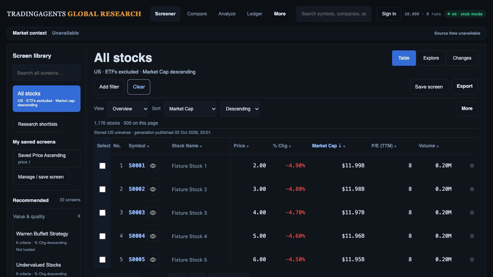
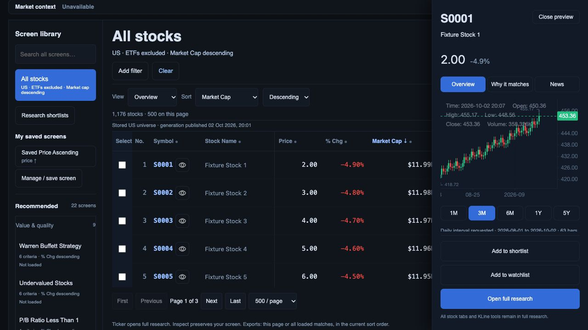
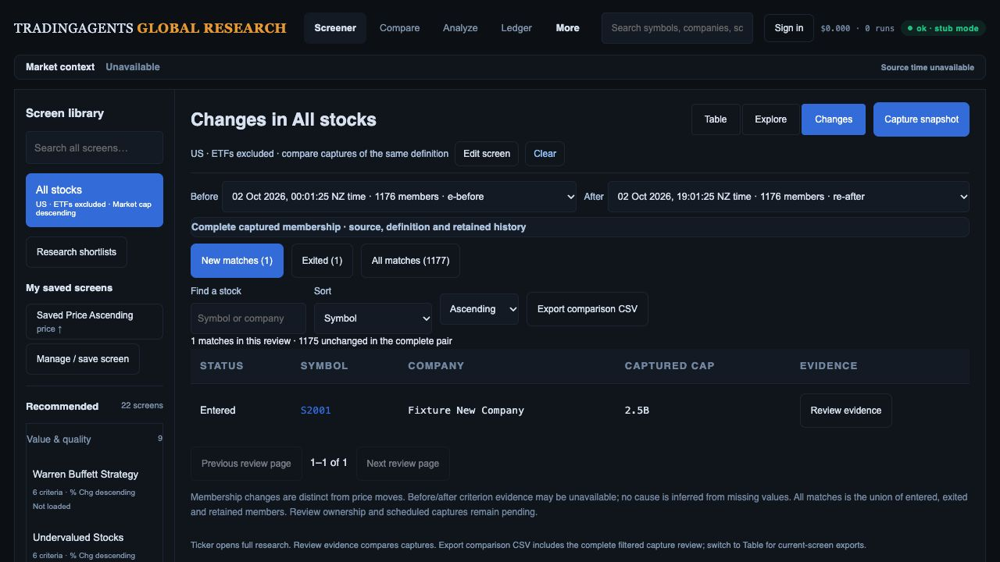

# Design review: implementation, original mockups and delivery plan

**Latest Explorer checkpoint:** [coordinate collision picker and keyboard inspection](design-gap-audit/explorer-collisions/README.md) adds exact-coordinate company selection, arrow/Home/End/Enter navigation, Escape/focus return, phone targets and presentation-specific counts. 87 JavaScript tests pass; pointer and keyboard pickers exercised in the controlled actual-route preview. R08 remains open for complete selection/export/accessibility/live acceptance.

**Latest build-to-mockup review:** [fresh Desk → Inspector → Explorer → Changes comparison and ordered build checklist](design-gap-audit/latest-plan-review/README.md). Region preview/apply/save/reload is now implemented locally with 85 passing JavaScript tests and an exact 240-row downloaded CSV reconciliation. Collision/keyboard, qualified taxonomy/factors/peers, pair review, monitoring, full continuity and live/platform/release acceptance remain open. This supersedes older “region handoff absent” notes below.

**Latest presentation checkpoint:** [compact provider coverage and inspector hierarchy](design-gap-audit/compact-provider-desk/README.md). Default table top 357.625 px at the original 1487 × 1058 viewport; warning-bearing laptop state is about 45 px shorter. Coverage counts/quality remain visible, phone controls measure 44 px with no document overflow, and preview metrics precede the simplified chart. 82 JavaScript tests pass; broader D02–D04/data/release gates remain open.

Reviewed 2 October 2026 against local baseline `062bb60` plus the tested preset-retention/explicit-refresh changes. This is the current design review; the [R01–R15 checklist](investment-workspace-current-gap-plan.md) remains the release closure register. No merge/deployment is implied.

## Verdict

The approved architecture is present: one screen definition with Table, Explore and Changes, a searchable library retaining 22 recommendations, explicit sort, permanent Clear, contextual inspection and access to full research. The build is a functional foundation. It does not yet deliver the complete investment-team workflow illustrated in the mockups. Keep the architecture and implement the missing handoffs; a second redesign or framework rewrite would distract from those gaps.

The original references are concept illustrations, not production data specifications. Preserve original preset IDs/rules/sorts, seven research tabs, six financial subtabs, the entire KLine/Compare inventory and CSV/SpreadsheetML exports. Do not substitute the illustrated shorter library, vendor labels, sample counts or financial values.

## Fresh audit steps and evidence

This run used the existing in-app preview at port 8894, without restarting it. The actual API routes use controlled offline provider transport, 1,200 synthetic instruments (1,176 stocks), fake research storage and recorded chart responses. All four screenshots were newly saved and opened beside the user’s original three references. Viewport 1280 × 720; default Desk scrollY 0, table top 357.625 CSS px. This is a workflow/hierarchy review, not matched-pixel acceptance against the 1487 × 1058 originals. Final warning/error browser log was empty.

1. **Desk — reset works; company/evidence hierarchy is incomplete.** Clear returned from the P/B provider screen to 1,176 stocks excluding ETFs, market-cap descending, page one and Overview. All 22 original recommendations remain in the library. The default table begins at 358 px here, but this does not qualify the specified larger-viewport gate. Secondary/source text is small, rows lack trends and company taxonomy, and criterion-first evidence needs filtered-state qualification. The provider warning-bearing state from the retention checkpoint reaches 570.2 px: compact its scope/refresh/quality disclosures without hiding loaded-versus-total counts or verification limits.

   

   Reference: [Research Desk](design-gap-audit/references/02-research-desk.png).

2. **Inspect — research actions reachable; plot/context compete.** The bounded drawer overlays the table at laptop width and keeps shortlist/watchlist/full-research actions visible. Company identity and evidence should appear before chart detail; dense OHLC labels obscure the preview. Source context requires inner scrolling. Synthetic S0001 quote 2.00 and recorded chart near 453 are incompatible, so this fixture cannot qualify instrument accuracy. Preserve full chart controls in research while simplifying this preview.

   

3. **Explorer — supported plot is functional; selection handoff is incomplete.** Axes/scales and missing/excluded counts are explicit. Table-only column controls still occupy the plot toolbar. Constant fixture P/E places points at x=8 and repeated coordinates need a collision picker. Numeric region and linked/export foundations exist; Apply region → criteria preview → Modified → Save is absent. Sector legend, currency-qualified cap bubbles and peer ranks remain gated. The chart's lower controls are below the first laptop viewport.

   

   Reference: [Factor Explorer](design-gap-audit/references/03-factor-explorer.png).

4. **Changes — membership review works; analyst queue is incomplete.** The controlled pair shows one entered, one exited, 1,175 unchanged and a 1,177-member union. Date pair, cohort controls, search/sort, evidence and comparison export are present. Pair-specific review status/notes, cross-page Next unreviewed, selected/bulk actions and opt-in capture schedules are missing. This all-stocks pair has no financial criteria and cannot qualify threshold-crossing causes. Existing filtered criterion columns/matrix need acceptance tests rather than replacement.

   

   Reference: [Change Monitor](design-gap-audit/references/04-change-monitor.png).

Visible accessibility risks: small secondary/source labels, dense chart overlays, icon-only row affordances and several toolbar rows. DOM labels/semantic controls are present; complete keyboard/focus, screen-reader, contrast, touch, zoom and reduced-motion checks remain open.

## Concrete build tickets

Each ticket closes only with code, preservation tests and fresh browser/data evidence. Cross-references map to the existing R-register rather than introduce a competing checklist.

| Ticket / priority | Gap and implementation | Acceptance |
| --- | --- | --- |
| D01 / P1, R01–R02 | Finish preset membership/display-source separation. Quote hydration pinning, zero preservation, identity guards, per-field origins, visible quality warnings and requested-basis disclosure are implemented locally. Finish actual-provider membership consistency, financial currency/period qualification and native capture/PostgREST/cutover acceptance. Keep provider pagination distinct from immutable display quotes. | Publication between pages cannot mix quote cohorts; unknown classifications/exclusions are visible; no provider value inherits an incompatible snapshot observation; capture cannot imply that provider membership is frozen by a quote-generation ID. |
| D02 / P2, R03 | Tighten query hierarchy and raise secondary text readability using existing tokens. Keep screen name, criteria, count, source scope and declared sort; collapse optional controls. Make company identity/context and coverage visible before chart detail. Reduce preview OHLC label clutter while retaining full chart features in research. | Default and filtered matched-state captures at 1487 × 1058; first table ≤360 CSS px in specified default state. At 1280/768/390 and 200% zoom, Clear, close, evidence and primary actions remain reachable. Measured contrast/focus checks. |
| D03 / P1, R02–R03 | Add criterion-led columns and qualified sector/industry/website to the inspector. Audit existing column behavior before editing it. Optional lazy/batched row trends follow later, with span/interval/source/cache labels. Missing fundamentals remain unavailable. | Every enabled criterion has correctly labelled value/evidence or an explicit unavailable state; actual reporting periods/currencies verified. No eager chart request per row; request/latency budget recorded. |
| D04 / P1, R04/R12 | Opened preset pages now survive expired-cache navigation and research return, with explicit refresh replacing results only on success. Complete screen → ticker → full research → Compare → return continuity across reload, hash/deep links, screen-version transitions, Settings and private lists. Group narrow chart/study/drawing controls; label job action “Run agent analysis.” Keep coverage controls available after catalog failure and suppress negative unknown-price sentinels. | All seven research tabs, six financial subtabs and original KLine/Compare inventory exercised. Origin filters/sort/columns/page/scroll/selection/focus recover; stale symbol/account requests cannot overwrite current state. |
| D05 / P2, R08 | Give Explorer its own compact axis toolbar; move table-only column-view controls to the linked table. Add region summary and “Apply region as filters” with inclusive-bound preview, explicit Modified state and Save. Add exact-coordinate collision picker and keyboard inspection. | Pointer/numeric/keyboard paths produce identical canonical membership; apply/save/reload reproduces results; axis changes reconcile bounds; Clear restores default; no point jitter or silent rule mutation. |
| D06 / P1, R02/R09 | Build actual sector legend, currency-consistent cap bubbles and cohort-labelled peer percentiles. Enable forward P/E/growth/ROIC/debt only after field-level qualification. Define missing/negative values, rank ties and small cohorts. | Coverage and eligibility shown per factor/cohort. Currency/period consistent; unknown sector remains unknown; valuation percentile does not imply quality. No illustrative factor enabled solely to match the image. |
| D07 / P1, R05–R07 | Add pair-scoped review status/notes, cross-page Next unreviewed, row selection and revision-safe bulk shortlist/export. Review key includes owner/team, screen version, both capture IDs and canonical code. Qualify team roles/Auth and legacy ownership before sharing. | Same company in different pairs has independent review state; pair switch clears/revalidates selection; conflicts preserve drafts; two accounts/roles remain isolated. Full filtered/selected downloads reconcile exactly. |
| D08 / P1, R07/R10 | Qualify before/after evidence and implement explicit opt-in saved-screen capture schedules with durable bounded/idempotent jobs. Separate universe refresh cadence from screen monitoring. | Comparable period/currency/identity/source clocks required for crossing/cause claims. Incomplete captures yield no false exits; duplicate dispatch/restart appends one capture; previous success survives failure. |
| D09 / P1, R11/R13–R15 | Finish all export scopes, responsive/accessibility/performance qualification, current like-for-like Moomoo reconciliation, migration/PostgREST/cutover/rollback and production smoke. | Exact downloaded IDs/count/order/values/provenance across page/loaded/selected/region/pair/list. All 22 presets preserved; both RSI screens honestly qualified/unavailable. Real Auth and deployment IDs, asset fingerprints and rollback evidence recorded. |

## Delivery order and presentation gate

1. Close D01 source consistency and platform reader/capture qualification. Start latency instrumentation now; explicit preset refresh already retains prior rows until success. Finish failure/device qualification and reload reconstruction.
2. Implement D02/D03 safe presentation and D04 continuity/recovery alongside data work. Company/factor additions depend on D01 field qualification; optional trends must stay outside the critical interaction path.
3. Implement D05 supported Explorer handoff/collisions. Build D06 analytical encodings only for qualified data; offer a named covered subset when broad-cohort coverage is insufficient.
4. Qualify ownership and implement D07 review queue. Complete compatible before/after evidence before D08 causal claims and opt-in schedules.
5. Close D09 with real data, all downloaded scopes, devices/keyboard/screen reader/zoom, 5–8 analyst tasks and measured p95. Then merge/deploy and re-run production preservation/data smoke checks under the existing authorization.

The presentation-ready demo must cover a real filtered screen → criterion evidence → full financial/chart research → Compare → return → shortlist/export → compatible Changes pair. It must demonstrate reset and a failed/partial-data state. A polished screenshot or an identical synthetic default pair does not close that gate.

## Plan corrections and verification limits

- Core stored readers, capture retry binding and CSV generation provenance have progressed since the original plan. Stop listing those foundations as absent; retain PostgREST, native capture, browser concurrent-publication, retention and production cutover as open acceptance work.
- Criterion matrix/columns, private shortlist CRUD and numeric Explorer selection already exist locally. Pair review, team permissions, region-to-save and scheduled captures are separate missing features.
- Keep source/publication/cache clocks distinct. The preset header now distinguishes requested annual basis from unverified reporting periods, and warnings are visible. This disclosure is implemented; actual period/currency evidence remains unqualified.
- Latest regression: **379 API/worker tests and 81 JavaScript tests pass** for quote hydration and preset retention/refresh. The port 8894 controlled preview exercises the actual API routes. These are development checks, not production or live-data acceptance. This latest review adds documentation and fresh screenshots; it does not add another redesign.
- No current live Moomoo reconciliation, financial currency/period coverage, production migration/Auth, full-feature end-to-end, performance or accessibility compliance claim is made. Earlier test counts/screenshots remain historical checkpoints.

Visible accessibility risks: small secondary/source text, dense chart labels and crowded toolbars. Existing semantic buttons/axis inputs are visible in the DOM; full keyboard/focus, screen-reader, contrast, touch, zoom and reduced-motion tests remain required. The review is complete; the investment-team release is not.

## Next implementation packet: Desk, Inspector and continuity

Work inside the existing JavaScript/CSS shell and design tokens. Do not change preset definitions or replace the research/chart adapters.

- [ ] **Compact evidence header (D02):** one primary screen/criteria/action hierarchy; show loaded stock count, provider total scope, latest page retrieval and quality count together. Expand detailed provenance on demand. Keep Clear and Refresh distinct and reachable. Measure default and filtered states at the original viewport before accepting; retain the ≤360 px default table-start target.
- [ ] **Company and criterion context (D03):** audit existing criterion-led columns, then fill missing value/unit/period/source states. Put company identity and qualified sector/industry/website before the preview. Vendor lists must stay labelled as vendor lists. Optional row trends load lazily/batched after the table, with no chart request for every row on first render.
- [ ] **Continuity (D04):** specify reload/deep-link reconstruction and screen-version behavior, preserve columns/sort/page/scroll/selection/focus through research and Compare, and test late-response rejection. Group narrow research controls without losing studies/drawings/session/layout tools.
- [ ] **Next packet (D05):** separate axis toolbar from table columns; expose selected region bounds/count and Apply region as filters. Preview inclusive canonical bounds before creating a Modified definition; Save must round-trip those rules. Provide collision selection and keyboard access before sector/rank expansion.

Each packet must carry default/reset/second-click and all-22-preset preservation, actual downloaded membership reconciliation, fresh desktop/phone evidence and measured interaction/request budgets. Cached transitions target p95 ≤300 ms; feedback ≤100 ms. These are proposed acceptance budgets, not measured current production performance.
