# Current build against the approved design

**Latest refresh checkpoint:** [universe refresh integrity](universe-refresh-integrity.md) adds strict batch/paging/classification validation, market-specific success/failure clocks, cohort fingerprints and a working cadence save. 331 API/worker and 68 JavaScript tests pass; synthetic desktop/phone evidence verifies status/save and 390 px document fit. Atomic publication/concurrency, complete market coverage and live reconciliation remain open.

**Latest producer checkpoint:** [real quote provenance and remaining acceptance checks](design-gap-audit/quote-provenance-checkpoint/README.md). Cloud normalization now produces field observations and distinct source/cache clocks; the inspector no longer infers currency from market prefix. 298 API/worker and 68 JavaScript tests pass, with a fresh single AAPL quote and desktop/phone verification. Currency, fiscal/session contracts and full-universe coverage remain unqualified; all broader mockup/release gates remain open. Earlier counts/status paragraphs are dated evidence.

**Latest plan recheck:** [2 October comparison and remaining build sequence](#plan-recheck-against-the-three-original-mockups). Earlier checkpoints below remain dated evidence; they are not cumulative release sign-off.

Latest follow-through: [paired screen observations](paired-screen-observations.md). Stored-universe entrants/exits now retain both sides in locally verified v3 captures; exact criterion slots and persisted membership are validated. Real provenance producers/provider-wide coverage, private pair review, schedules and release qualification remain open. Fresh regression total: 272 API/worker and 67 JavaScript tests. The earlier uncommitted status in the plan-recheck section describes that review's point in time.

Reviewed 2 October 2026. This is the latest design review of the local working tree on `codex/investment-team-release-evidence`, initially based on HEAD `92c7cd2`; follow-through checkpoints below cover committed `b7ffd7a` and the newer local retained-history build. Initial screenshots/findings are dated comparison evidence, not the current status of fixes documented below. It does not describe a newly deployed release. The private-research migration is still unapplied to production.

## Verdict and scope

The Research Desk now follows the combined concept's main structure. Explorer and Changes have working foundations, but their complete analyst workflows remain unfinished. The build is **not yet investment-team presentation ready**. Preserve the three concepts as one workflow: discover → inspect → full research → compare → shortlist/export → review changes.

This review compares the current browser render with the earlier combined mockup, Factor Explorer and Change Monitor, and checks the original product proposal and implementation plan. References are illustrative: their securities, counts, prices, factors and provider names are not factual acceptance values. Do not replace the 22 original screen definitions with the shorter illustrated list.

## Fresh flow evidence

Local browser: `http://127.0.0.1:8891/#/screener`, synthetic 1,176-stock/24-ETF preview, fake local research account and in-memory lists. No real credentials, production account creation, production research writes or market-data verification occurred. Desktop CSS viewport was 1487 × 1058; mobile was 390 × 844. The signed-out capture uses the restored default viewport. Browser screenshots have a slightly different output raster; no pixel-perfect claim is made. All nine saved screenshots were opened and inspected. Desktop reference/current images were opened together for the three concept comparisons.

| Step | Task | Health and finding |
| --- | --- | --- |
| 1 | Table → select two → Inspect → Export | Main combined structure works. Export has per-item scope/counts; selection and three inspector actions are visible. Text hierarchy, compact identity/header and provenance layout still differ. |
| 2 | Explore | Scales, plotted/excluded disclosure, numeric bounds and linked table exist. Advanced factors, sector context, cap bubbles and peer ranks are absent. Constant synthetic P/E creates overlapping points; this is a collision/usability test case, not evidence of real market distribution. |
| 3 | Changes → inspect entrant evidence | New/Exited/All and date pair exist; missing numeric cause is honestly labeled. Repeated current-screen controls delay review rows. At scrollY 0, the first row starts at 735.0 CSS px, failing the ≤500 px plan target in this tested closed-inspector state. The separate evidence-inspector frame is scrolled 241 px and must not be used to claim top-page alignment. |
| 4 | Sign in → shortlist → Inspect | Synthetic login and owner-list rendering work. List context correctly differs from screen qualification. Shortlist inspector footer actions fall below the captured desktop viewport; its layout does not yet provide the desk's bounded inspector behavior. Owner-private lists are not shared-team permissions. |
| 5 | Review note dialog → Close | Note/status form and compare-latest action exist. Dialog is top-left aligned rather than centered and the accessibility tree exposes an unnamed dialog. Conflict recovery is not freshly browser-tested here. |
| 6 | Phone shortlist | Document fits: 379 px scroll width within 390 px. A 680 px internal table leaves Review/Remove off-screen; the library consumes substantial first-screen space. Fitting the document is insufficient task accessibility. |
| 7 | Ticker → full research → Back to shortlist | Seven stock tabs and KLine controls remain visible; return restores the originating list. Crowded studies/drawing controls and the ambiguous Analyze action remain. Fixture data reuses recorded company detail and does not match the synthetic row; no identity/price reconciliation claim. |
| 8 | Sign out → public screener | Private list content clears; public two-stock selection remains. No console warnings/errors were captured during these tasks. Real Auth/revocation and multi-owner production isolation are still release gates. |

### 1 — combined Research Desk

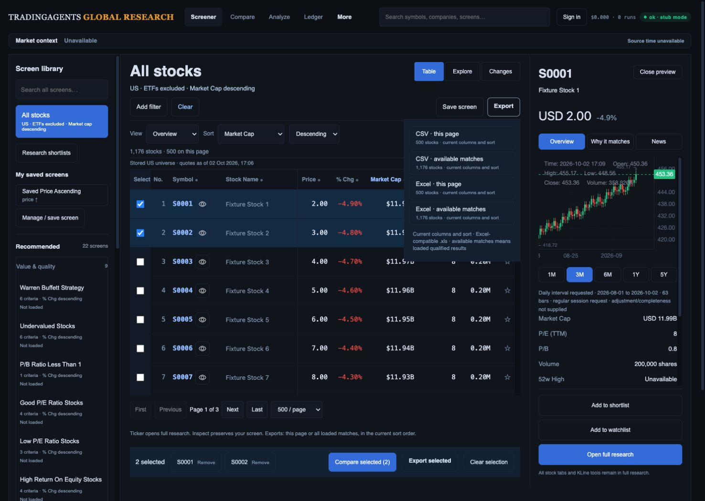

### 2 — Explorer

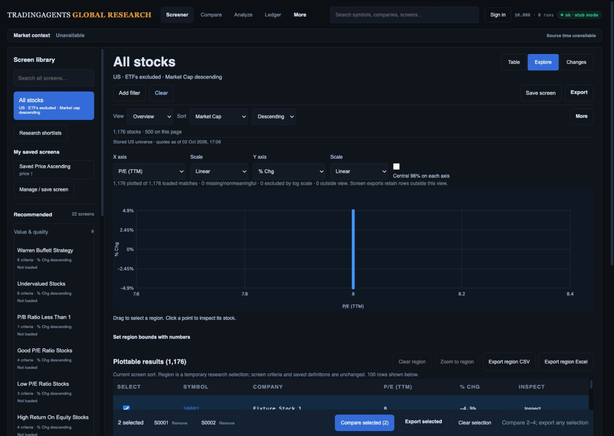

### 3 — Change Monitor, at the top of the page

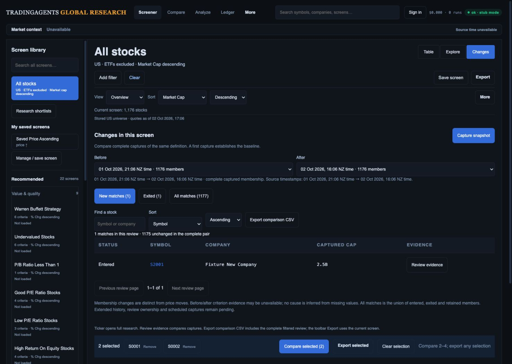

The evidence panel state below is scrolled; compare its information and actions, not header position.

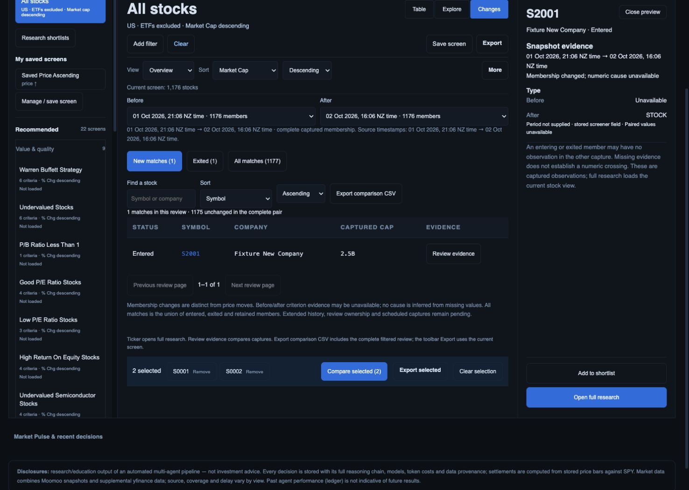

### 4 — shortlist and inspector

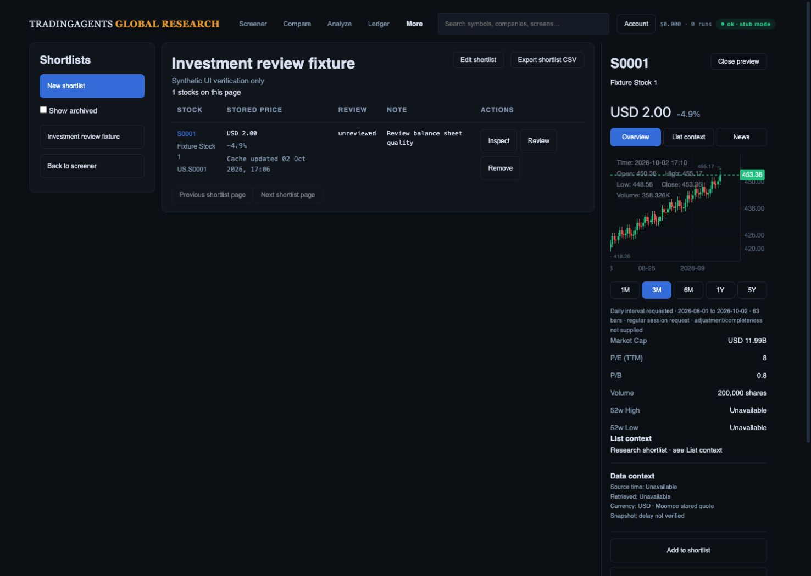

### 5 — note review

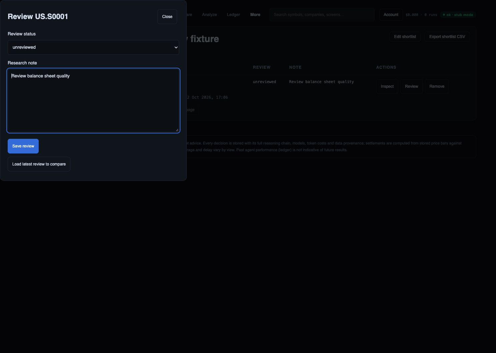

### 6 — phone shortlist

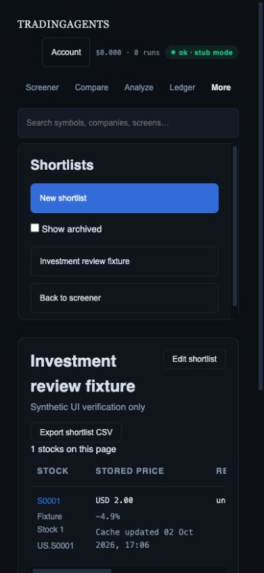

### 7 — full research

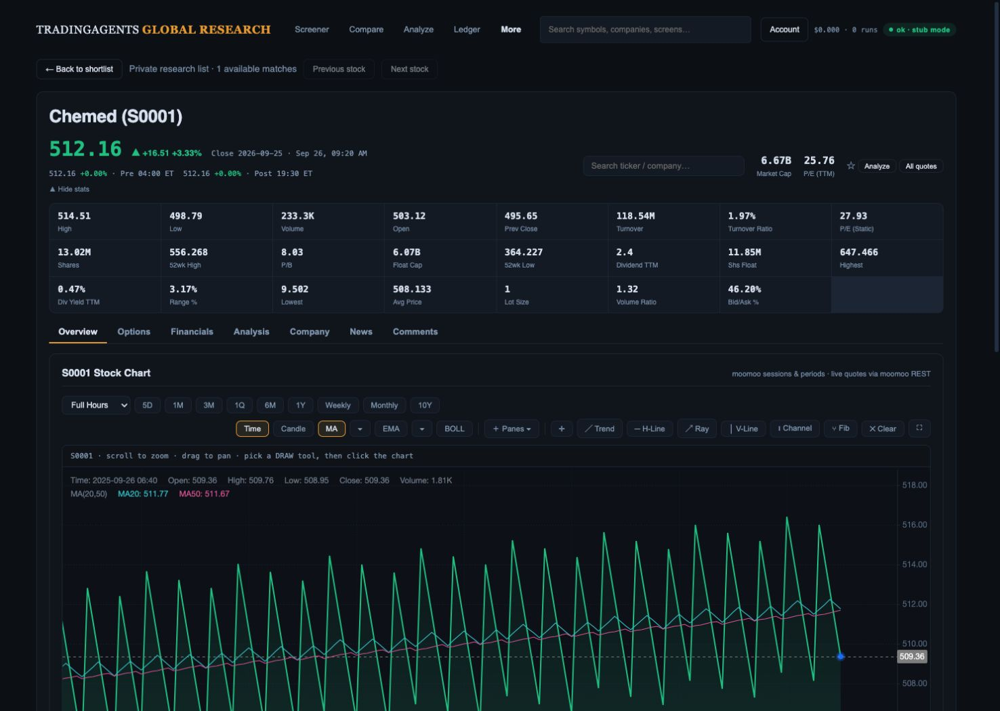

### 8 — signed out

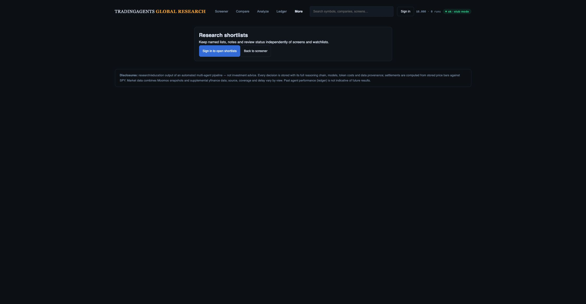

## Gap-to-build mapping

All rows remain open until their acceptance evidence passes. Existing implementation is a foundation, not a completed package.

| Order / gap IDs | Build missing elements | Acceptance evidence |
| --- | --- | --- |
| 1. Workflow completion — G05/G07/G12/G15 | Center and name account/review dialogs; bound height and scroll, Escape/focus restoration and draft recovery. Reuse bounded inspector layout on shortlist. Collapse phone list library into a chooser/sheet and provide stock cards with visible Review/Remove. Preserve pending Add-to-shortlist intent through sign-in. Add list search, status filter and Next unreviewed across pages; recover removed/conflicting records explicitly. | At 390/768/1280/1487 widths and 200% zoom, inspector primary actions remain reachable and dialogs fit. Keyboard-only open/save/cancel paths restore origin. Two-tab conflicting edits preserve draft and require explicit comparison before retry. No account-switch or sign-out response restores private notes. Test 501-member export and mutation between pages. |
| 2. Team ownership and persistence — G07/G10/G11 | Qualify real Auth and the additive list migration; define team/member roles and scoped permissions before sharing notes/lists. Migrate shared legacy saved-screen/watchlist/history records with an explicit ownership mapping and rollback. Keep public recommended screens, screen definitions, watchlists, shortlists and transient comparison selections separate. | Real authenticated two-owner/two-role isolation and revoked/expired sessions. Service/anonymous grants audited. Existing 22 preset keys/criteria/sorts and saved definitions preserved. Fresh isolated native parent-revision and archive/add locking contracts pass; production migration and real Auth qualification remain open. No ownership inference from a deployment default or client-supplied ID. |
| 3. Change-review workflow — G10/G11 | Contextual “What changed in [screen]?” heading, compact date/completeness summary, one review toolbar and explicit review export. Hide irrelevant current-column controls in Changes. Add criterion-specific sortable columns, selection/bulk shortlist, review status/notes and Next unreviewed scoped to capture pair. Render before/after criteria as a matrix. | First review row ≤500 CSS px at 1487 × 1058, scrollY 0, closed/open inspector. Counts state union versus current membership. Export identifies pair/definition/evidence and exact selected/filtered scope. Historical review status is not confused with a company's general shortlist status. |
| 4. Durable history and causes — G10/G11/D2 | Replace shared `app_settings` read/append/last-two writes with immutable versioned captures and observations. Retain dated history and full eligible/union observations so entrants/exits can have both sides. Add opt-in saved-screen capture schedules with running/success/failure state, idempotency and bounded provider work. | Concurrent captures lose no history. Partial, stale, unknown-classification or changed-definition runs produce no false exits. Missing or incompatible period/currency evidence produces no numeric cause. Scheduler retries preserve last success; capture time and provider source time remain distinct. Legacy captures remain marked with their actual evidence limits. |
| 5. Factor Explorer — G08/G09/C/E | Add cap-sized bubbles and normalized sector legend/peer panel. Qualify forward P/E, growth periods, sector ranks and separately derived ROIC/debt metrics. Connect brush to an explicit editable filter action and saved definition. Handle overlapping points without invented coordinate jitter or inaccessible hit targets. | Fresh eligible-universe coverage/age/source/period/currency report. ≥95% qualified coverage for broad views, or a clearly named covered subset. Inclusive region membership agrees across table/Compare/export. Pointer, numeric and keyboard paths work for constant/extreme/negative/missing values. Percentile identifies cohort and direction; high valuation does not imply quality. |
| 6. Desk and research polish — G01–G06/G13/G14 | Compact brand; brighter readable body/provenance hierarchy and consistent sourced icons. Keep original presets grouped/searchable, with accurate unavailable/modified states. Group KLine studies/drawings at narrow widths, rename job action Run agent analysis, retain every tab/subtab/tool. Replace blanket “live” copy with actual request/source/session/age status where needed. | Paired same-state mockup comparison; no copied illustrative counts or unverified fields. Full real-instrument research and Compare preservation matrix passes, including drawings, session/range/interval/fullscreen and return query/page/selection/scroll/focus. Source/period/currency formatting agrees with exports. |
| 7. Investment-team release — E/F | Fresh comparable Moomoo reconciliation, downloadable export reconciliation, device/network performance, accessibility and intended-user tasks. Then merge/deploy the passing build with migration/UI rollback and production smoke evidence. | Universe counts split provider/stock/ETF/unknown/exclusions; compare exact criteria/session/date and canonical membership, not unlike totals. Measure p50/p95, long tasks, memory and request counts; provisional feedback ≤100 ms and warm sort/query ≤300 ms p95. Keyboard/screen-reader/contrast/reduced-motion/zoom checks and 5–8 analyst task results. No remaining unexplained P1/P2. |

## Corrections to the earlier plan

- Replace “selected export later” with a current preservation requirement: selected export already exists and must survive each new view.
- Login/list/review UI is now wired locally. Earlier backend-only checkpoint statements remain historical; do not use them as current status.
- A, B, C and D1 are partially implemented. Their unchecked package gates are intentional; feature presence alone does not close them.
- Run layout/accessibility fixes and performance measurement throughout implementation. Do not postpone all F work until after data expansion.
- Owner-private persistence advances the shortlist dependency but does not provide investment-team sharing. Team role/access acceptance needs its own implementation and evidence.
- Before numeric change explanations, capture both observations. Before advanced axes, qualify coverage. UI polish can proceed while those data contracts are built.
- Use the existing KLine engine and incremental modules. No framework/chart rewrite or eager per-row history fetch is required to match the concepts.

## Current verification and limits

Freshly run on this working tree: **230 API/worker tests pass; 49 JavaScript tests pass**. They include reset/preset inventory, canonical identity, saved-state isolation, request races, region/selected/comparison exports and private-session generation safeguards. Fresh browser tasks above used synthetic fixtures only. This audit did not exercise every preset live, all seven tabs/six financial subtabs, every chart/Compare control, completed browser downloads, two-tab note conflict, the changed SQL migration, real Auth, fresh provider coverage, Moomoo counts, screen readers, contrast or production p95.

The full approved build remains active. This review updates the construction and acceptance sequence; it is not a release sign-off.

## Follow-through checkpoint: shortlist workflow

After the comparison above, the working tree implements centered named native dialogs, bounded shortlist inspector/footer, a compact list chooser, phone cards with Review/Remove, ticker and review-status filters, Next unreviewed across pages, pending Add intent through sign-in, in-memory draft restoration and explicit latest-revision comparison. Return to shortlist retains ticker/status/page context. Debounced search now cancels its navigation when the user leaves or switches lists. Company-name search is still missing and requires a trustworthy quote join. Drafts are discarded on reload/sign-out; they are not durable notes until saved.

Fresh verification: **232 API/worker tests and 54 JavaScript tests pass**. Updated isolated PostgreSQL contracts pass, including parent revision changes and an actual concurrent archive/add lock test. The test database was stopped afterward. The production migration remains unapplied. Full-list export tests retrieve 501 members across pages, ignore display filters by its explicit label, and reject changes before producing a file; completed browser downloads remain an open release check.

The synthetic two-tab browser task saved a remote edit, rejected the first tab's stale revision without losing its draft, loaded the latest revision for comparison without replacing that draft, and then saved the explicitly reconciled note/status. Desktop full-research action ends at 982 CSS px within the 1058 px viewport. At 390 × 844, the phone document is 379 px wide and native review dialog spans x=16.5–362.5, y=156.9–687.1. Phone card actions are 44 px tall and keyboard reachable; their initial position is below the first fold (Review starts at 839.5 px), so first-screen density remains a polish gap. This is not a 768-width/200%-zoom or screen-reader sign-off. All four checkpoint screenshots were opened and inspected.

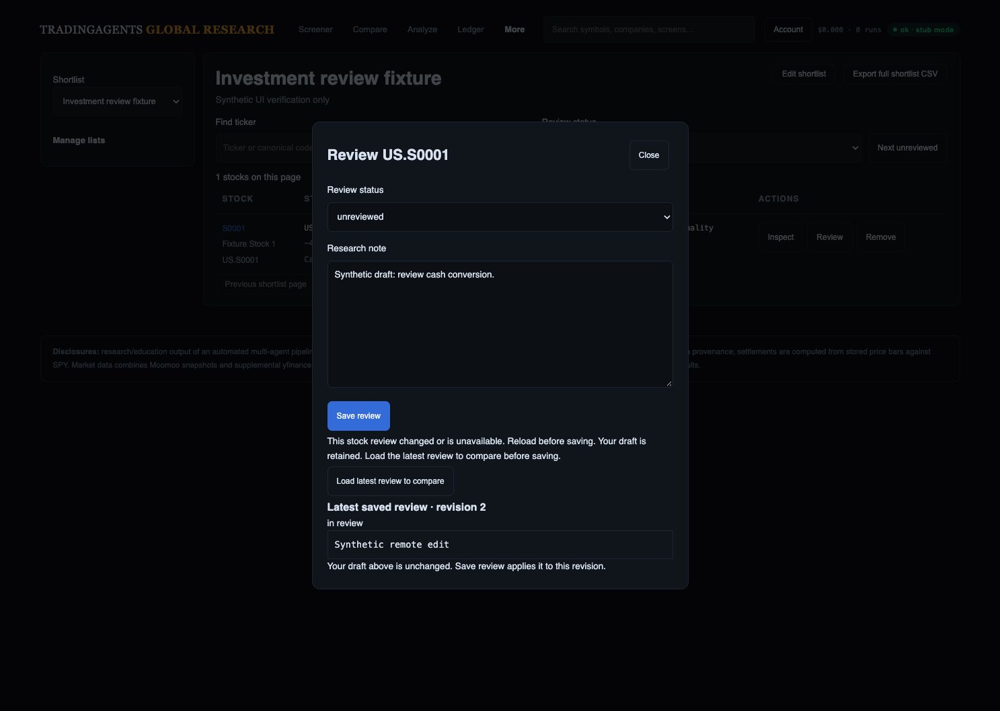

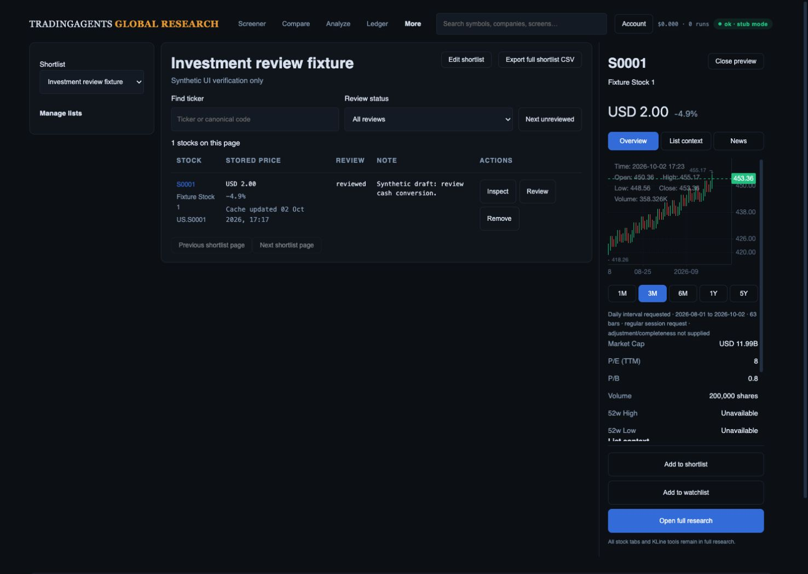

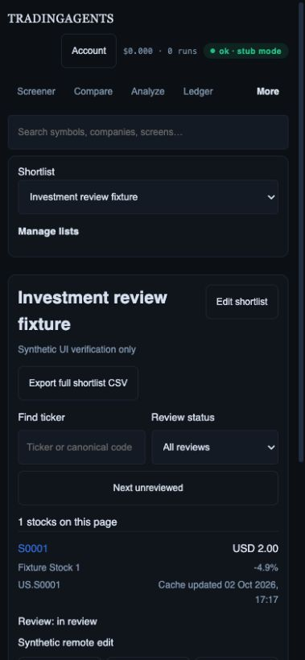

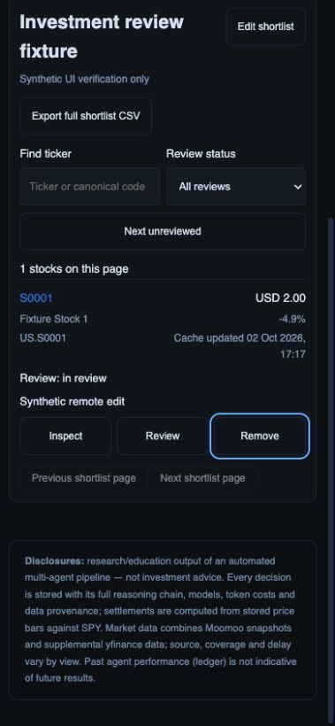

The seven build packages above remain the delivery plan. Package 1 is implemented in part and locally verified, not fully closed. Packages 2–7 retain all ownership, historical evidence, provider coverage, original-feature preservation and investment-team release gates. No merge, deployment or production data reconciliation occurred in this checkpoint.

## Follow-through checkpoint: compact historical review

Changes now has a contextual screen heading, capture button and Edit screen return. Clear remains visible and was browser-verified to return to All stocks, ETFs excluded, Table view and market-cap descending. Current column/sort/filter/export controls remain in Table, while Changes exposes its capture pair, source/definition disclosure, cohort search/sort and full filtered comparison export. The first review row is **491.4 CSS px at scrollY 0** in both tested closed/open inspector states at 1487 × 1058 (previously 735.0 px). Historical inspector full-research action remains in the viewport. This qualifies this layout/state only; long names, many criteria, zoom and additional tablet widths still need testing.

Numeric definition criteria now add before/after columns and explicit capture-side sort options. Sorting happens over the full union before pagination, reads capture evidence rather than current quote metrics, and leaves missing/nonfinite/boolean values last in both directions. Contract tests exercise zero, negative values, entrants/exits with an absent side, missing values and unsupported-field rejection. The inspector uses a narrow two-column before/after matrix with rule, period and source alongside it; the wide source/definition disclosure retains the full matrix. Exclusive bounds remain exclusive. No numeric crossing is inferred merely from membership changes.

At 390 × 844 the evidence dialog contains a 342 px matrix, the document remains 379 px wide, and the full-research action ends at y=826. Escape returns focus to the evidence row and releases all inert state. Three checkpoint screenshots were saved and inspected. Evidence is synthetic; actual numeric cohorts have unit/API evidence but are not yet browser-qualified with real provider observations.

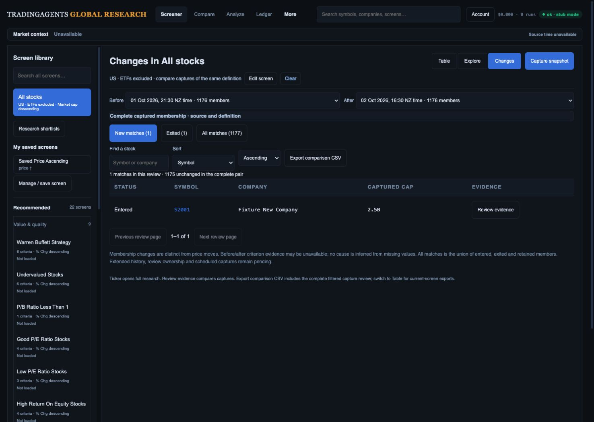

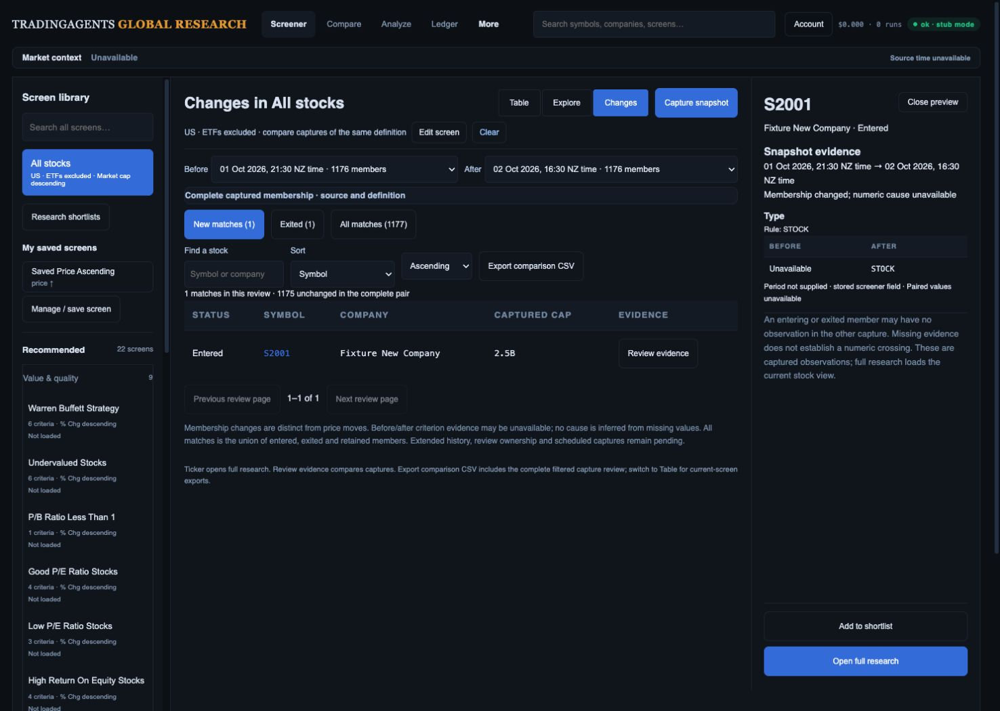

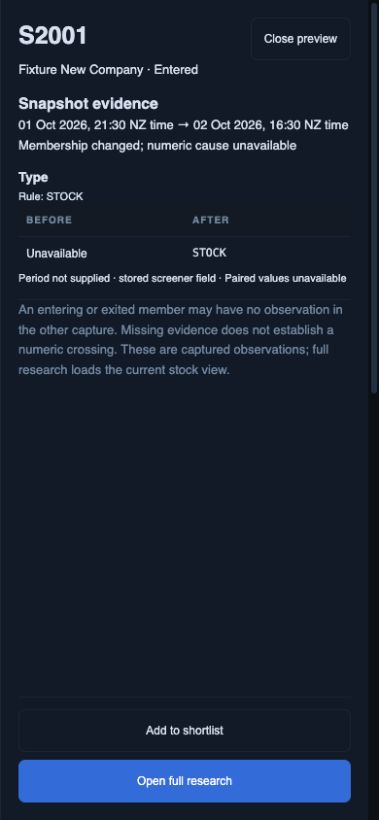

Fresh regressions: **233 API/worker tests and 57 JavaScript tests pass**. Durable retained history, paired nonmember observations, capture scheduling, pair-scoped review ownership, bulk selection/shortlisting and production financial reconciliation remain open. This closes the measured top-page layout defect and advances criterion review; it does not close the entire Changes package or investment-team release gate.

## Follow-through checkpoint: retained history and provenance

The approved dated-history interaction now has immutable append storage, legacy-ID preservation, retry identities, metadata-only pages and explicit older-pair lookup. A two-connection PostgreSQL test retains both concurrent new captures and the legacy record. The browser's 105-capture fixture keeps its original comparison and cohort through Older → Newer paging; the source disclosure and keyboard focus survive rerender. Seconds and short IDs distinguish nearby captures. Source copy separately labels capture time and provider retrieval/cache update, and does not claim either is quote source time. The definition disclosure now lists rules rather than a misleading empty before/after matrix.

At 1487 × 1058, scrollY 0, provenance collapsed, the first review row remains **491.4 CSS px**. Four retained-history screenshots were saved/opened; no browser warnings/errors were captured in the final check. Fresh suites: **239 API/worker and 62 JavaScript tests pass**. [Storage, test evidence and migration/recovery gates](durable-screen-history.md) describe the scope.

Package 4 remains open: storage is implemented locally, but capture ownership is still deployment-shared, version-2 snapshots still lack full nonmember observations, and pair review/schedules are unfinished. Production PostgreSQL/PostgREST, legacy cutover/rollback, large-cohort performance and real financial reconciliation remain required. Packages 1–7 retain the acceptance gates in the mapping above. No deployment or investment-readiness claim is made.

## Follow-through checkpoint: searchable and responsive shortlists

Company-name search now runs over the verified owner's complete list before pagination. It uses literal substrings in canonical tickers or matching canonical stored quote names; missing/mismatched quotes do not hide ticker matches or supply another instrument's name. It does not search note content. Status and Next unreviewed retain the company query and cursor semantics. A 1,200-item native PostgreSQL fixture qualifies matching, second-page membership, cursor, private scope and RPC grants; production Auth/PostgREST and large-list latency remain open.

At 390 × 844, scrollY 0, card Inspect/Review/Remove are 44 px tall and span y=729.5–773.5, improving the earlier below-fold Review at y=839.5. Edit/Export remain reachable under List actions; list management stays in its disclosure beside the chooser. At 768 × 1024, the compact library gives the table 678 px (previously 446 px); table client/scroll widths agree and document width equals 768. Tablet review dialog is x=104, width=560, y=240.9–783.1; Escape restores Review S0001 notes focus. These are two tested layouts with synthetic names, not long-content/200%-zoom or screen-reader acceptance. Three screenshots were saved/opened.

1. Company search + status filter: healthy in the fixture; matching and empty reviewed state verified.
2. Phone review actions: visible on first screen in the tested default state; grouped actions remain accessible.
3. Full shortlist export: an actual downloaded CSV was parsed for one synthetic item, canonical identity/name, note/status/revision and BOM. Browser download-event waits timed out despite the file arriving in Downloads; `download-check.json` records file time/hash and this limitation. A prepared download link now remains for five minutes and private URLs are revoked on sign-out. 501-item export scope/revision protections have automated evidence, not newly downloaded large-cohort evidence.
4. Tablet review dialog + Escape: fits and restores origin focus; final warning/error check empty.

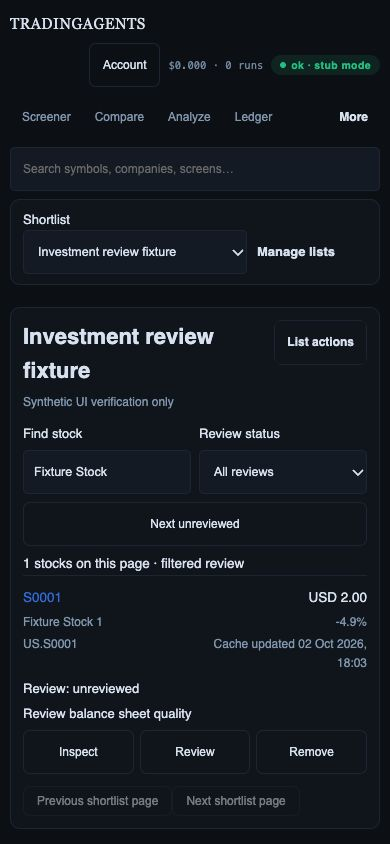

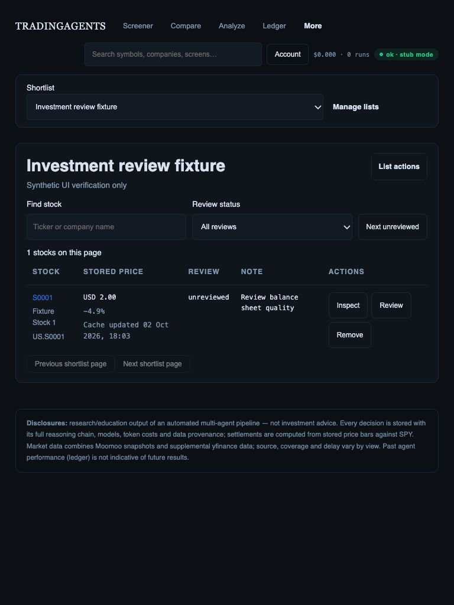

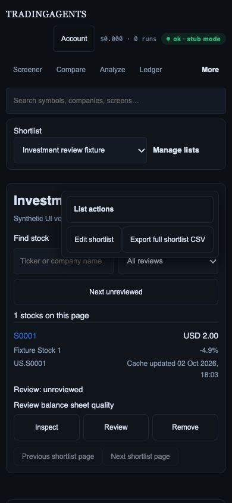

Fresh regressions: **240 API/worker and 65 JavaScript tests pass**, including company punctuation/caret continuity, private download revocation and late-error suppression after account change. The additive company-search migration is unapplied to production. This advances package 1; real ownership/team roles, paired historical observations/review/schedules, richer provider coverage, complete original-feature/export verification, accessibility/performance and release qualification remain open.
## Plan recheck against the three original mockups

Reviewed again on 2 October 2026 against the original Research Desk, Factor Explorer and Change Monitor images and the product proposal. This recheck is of the local build, not production. HEAD is `f018fa7`; the working tree also contains uncommitted version-3 observation work. The running preview uses the earlier in-memory synthetic API, so the screenshots do **not** verify that new capture implementation.

Fresh in-app-browser evidence was saved and opened for all three steps. CSS viewport: 2249 × 1168, scrollY 0. This differs from the illustrated 1487 × 1058 references, so the comparison concerns hierarchy, missing elements and workflow, not pixel fidelity. The preview contains 1,176 synthetic stocks and 24 ETFs; its recorded inspector chart does not reconcile to the synthetic stock price. None of these values qualifies market accuracy.

| Step | Current health | Gap against the original design | Required build and acceptance |
| --- | --- | --- | --- |
| 1 — Research Desk → Inspect | Working library/table/inspector structure; Clear restores stocks excluding ETFs, market-cap descending. All 22 recommended screens remain visible. | Muted small secondary text; long brand; sparse company context; no row trend column. Full rule evidence, sector/industry and metric-specific provenance do not match the concept's depth. | Polish type/contrast and compact header using existing tokens. Add qualified company context and criterion-led evidence. Add optional lazy, batched row trends only after canonical identity, actual bar span and cache coverage are verified; no eager history call per market row. Preserve saved columns, declared preset sort and export scopes. |
| 2 — Factor Explorer | Axes, scales, missing-data counts and linked table exist. Forward P/E and growth are explicitly disabled pending coverage. | No sector legend, cap-sized bubbles, peer rank panel or explicit region → editable saved criteria handoff. Constant fixture P/E collapses points onto a vertical line. | Qualify factor/sector/cap observations first; build size/sector encodings, cohort-labelled ranks, overlap disambiguation and an explicit Apply region as filters action. Numeric and keyboard paths must equal pointer membership and exported rows. Keep original coordinates; do not fabricate spread. |
| 3 — Change Monitor | Contextual heading, capture pair, New/Exited/All, review evidence and CSV exist. First row is 491.4 CSS px; no document overflow in this viewport. | No row selection/bulk shortlist, pair-scoped review notes/status or Next unreviewed. Scheduled capture state is absent. Legacy entrant/exit evidence lacks the other side. | Finish trustworthy full-universe observations and provider provenance; then implement pair-scoped review persistence and bulk actions, followed by opt-in capture schedules with explicit failure/retry states. No threshold/cause claim from membership alone. |

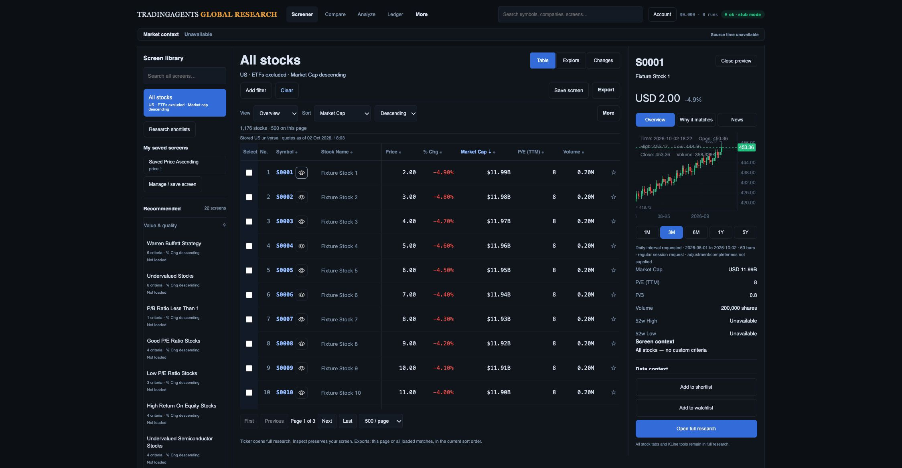

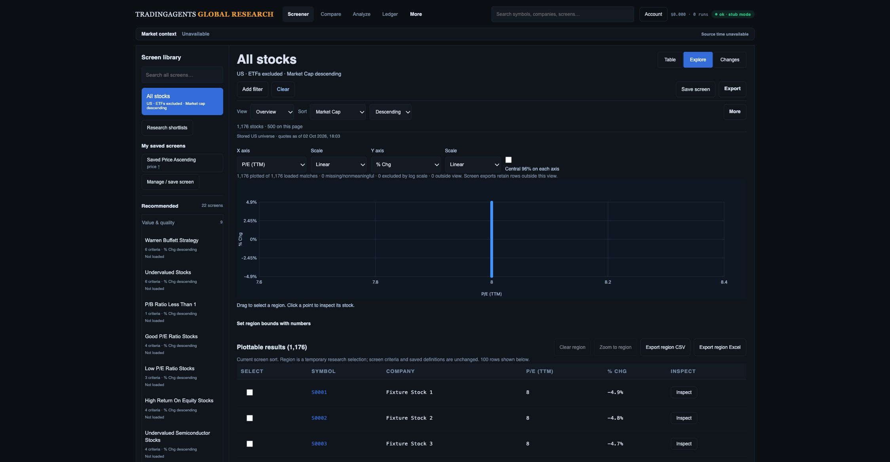

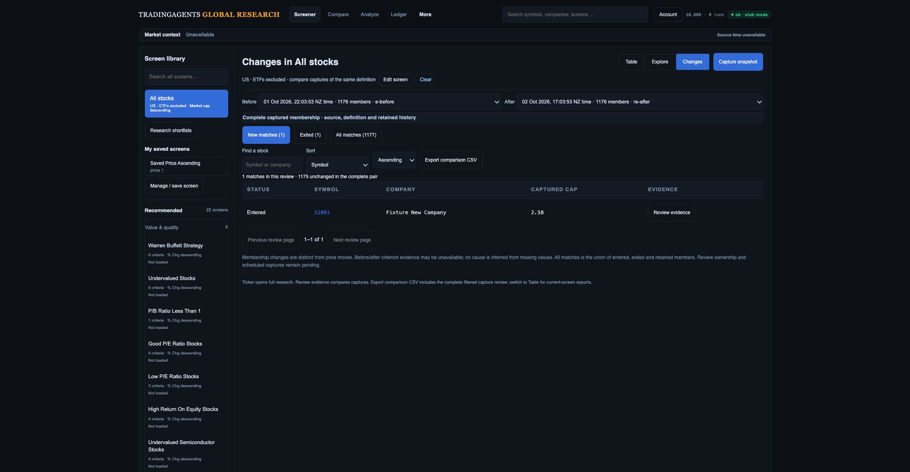

Cross-cutting gaps remain: private-owner lists are not shared investment-team ACLs; production migrations/Auth are unqualified; the full research toolbar needs narrower-width grouping; every research tab, financial subtab, KLine tool, Compare mode and return-state path needs a fresh preservation run. General shortlist review status must not be reused as capture-pair review status. Reload/deep-link restoration must include the shortlist route rather than silently returning to the public screener.

### Revised build order

1. **Preservation and presentation:** freeze the 22 presets and saved-definition hashes, retain Clear/toggle/sort/export contracts; improve readable hierarchy and company/evidence context; group existing research tools without removing functionality. Fix shortlist route restoration. Carry phone/tablet/zoom and keyboard checks through every increment.
2. **Observation reliability:** finish version-3 storage/read validation, full eligible observations, repeated-criterion identity and real source/period/unit/currency/clock contracts. Qualify the actual producer and provider paging; legacy data stays explicitly limited. Current local implementation has passing synthetic API tests, not verified provider coverage.
3. **Team and review workflow:** qualify owner Auth and additive migrations, implement team/member access and explicit legacy ownership mapping, then pair-specific notes/status, Next unreviewed and selected/bulk actions. Test conflicts, revocation, cross-owner leakage and revision-safe exports.
4. **Explorer completion:** measure eligible-universe coverage; add only qualified advanced factors, sector/cap encodings and cohort ranks, then region-to-filter/save handoff and collision handling. Unsupported fields remain gated; do not substitute illustrative mockup values.
5. **Capture automation:** opt-in schedules, bounded provider work, immutable retry identities, running/last-success/failure state and recovery that preserves prior successful captures.
6. **Investment-team release:** fresh like-for-like Moomoo instrument/count reconciliation, downloaded-file reconciliation, full research/KLine/Compare preservation, real-device/network p95, accessibility and analyst task checks; then merge/deploy with migration/cutover/rollback and production smoke evidence.

Each package requires working UI, qualified data, preservation checks and browser evidence before closure. The latest full local regression run passes **255 API/worker tests and 66 JavaScript tests**. The first Python invocation lacked the required PYTHONPATH and failed collection; the correctly configured full run passed. Neither these tests nor the three synthetic screenshots establish real financial accuracy, production readiness, full accessibility or p95 latency. No merge, deployment or production write occurred in this recheck.
