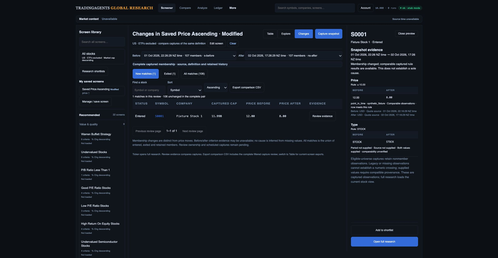
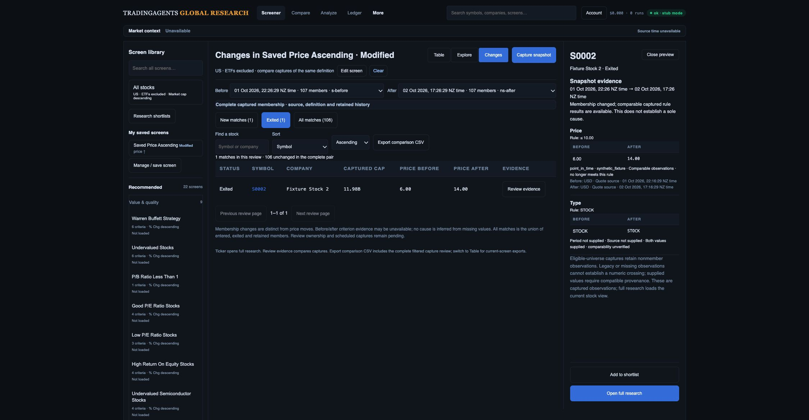
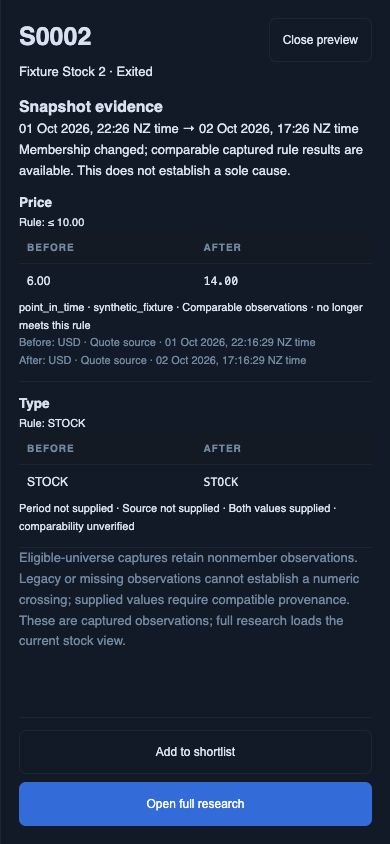

# Paired screen observations — local contract

2 October 2026. This advances the approved Change Monitor's evidence workflow. It does not close D2 or establish investment-team readiness. Production migrations are unapplied; capture ownership remains deployment-shared.

## Capture and comparison behavior

Stored-universe captures use version 3. They retain every eligible observation, including nonmembers, then evaluate membership against that same dataset. Each criterion has its own ordered slot and exact rule definition, so repeated fields with different windows cannot share a flat value. Canonical identities, verified stored-row identity and per-row cache times are required. Missing/ambiguous criterion values, stale quotes, conflicting values, incomplete classification and truncated universes reject the entire capture before append.

The comparison reader validates the persisted definition, market/instrument identity, eligible count, classification, cache times, exact criterion slots and values, flattened unique-field evidence, and equality between member records and their universe observations. It recomputes qualifying membership from the captured criteria. An inconsistent record produces no rows/counts or inferred entries/exits. Immutability alone is insufficient evidence of correctness.

Numeric assessment requires two finite observations of the exact criterion with matching nonempty source, period, unit, currency and clock contracts. Supported clocks distinguish quote source time, computed bar time and financial report time; cache update alone does not qualify numeric assessment. Observation times must advance, carry timezones and fall within their capture's permitted age. Unsupported, missing or incompatible provenance yields supplied-but-unverified values, not a crossing claim. An assessable rule can say now meets/no longer meets this rule, but does not establish a sole cause of overall membership change.

Default captures without criteria remain supported. Classification/enum values are retained but do not receive numeric rule assessments. Legacy member-only captures are not silently upgraded; comparing version 2 with version 3 requires another matching baseline. Original recommended provider captures currently remain version 2 and retain their evidence limitations. All 22 original criteria/sort definitions remain preserved.

## Verification

- Full local regression: **272 API/worker tests and 67 JavaScript tests pass**. Seventeen corruption cases explicitly reject altered definitions, nonfinite values, wrong slots, identities, classification, clocks, counts and inconsistent/missing/extra members. Independent 30/60-day criterion columns/sorts are covered.
- Isolated PostgreSQL 16.14: `web/api/tests/observation-db-contract.py` round-trips both full observations, a canonical share class, repeated windows, typed provenance and member count unchanged; exact replay is idempotent and all writes roll back. Existing capture grant/immutability/atomicity contract passes. The database was stopped afterward. This is not production PostgreSQL 17/PostgREST qualification; the database's generic JSON contract does not independently re-evaluate all v3 criteria.
- Fresh in-app browser: saved price screen, entrant 12 → 8 and exit 6 → 14 against ≤10; both observations remain available on each date. Capture membership is 107 on each side, union 108, unchanged 106; eligible observations are 1,176 on each side. All are explicitly synthetic fixtures, not real instruments or provider coverage.
- Desktop 2249 × 1168: review row top 491.4 CSS px at scrollY 0, provenance closed, inspector open. Phone 390 × 844: evidence dialog fits, full research action is 44 px high and ends at 826 px; Escape restores the originating evidence control and removes inert state. Viewport reset afterward; final warning/error log empty. Three screenshots below were saved/opened/inspected.
- Actual downloaded comparison CSV: all 108 unique union members in symbol order, exact definition and pair IDs, 1 entrant/1 exit/106 retained, both typed observations, source/period/unit/currency/clock and assessments checked for every row. The file did not exist before clicking Export. Filesystem modification time/hash and parsed rows support the download claim; no browser download event was observed. [Machine-readable result](design-gap-audit/observation-checkpoint/download-check.json).

## Remaining delivery work

The [latest cloud quote producer](design-gap-audit/quote-provenance-checkpoint/README.md) supplies per-field observations that capture can bind to noncontextual criteria. It does not populate qualified currency, fiscal/session or derived-window evidence. A fixture declaring source/time is not proof of provider provenance. Implement and qualify actual snapshot/financial/bar producers, their period and unit mappings, full provider-universe observations and bounded paging. Do not derive quote source time from retrieval/cache time or infer financial periods from a column name. Real financial report-time semantics and update/correction handling require qualification before relying on numeric explanations.

Capture ownership/team ACLs, pair-scoped review notes/status/selection, opt-in schedules, production cutover/rollback, real coverage/Moomoo membership reconciliation, large-capture storage/memory/network performance and full research/export/accessibility/device gates remain open. No merge, deployment or production write occurred in this checkpoint.
