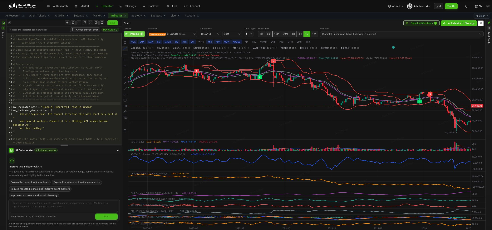

# QuantDinger KLine review

Reviewed 3 October 2026. Research only; no chart implementation changed.

## Scope and evidence

The matching repository is [JoshuAI-888/QuantDinger-AI-trading-platform](https://github.com/JoshuAI-888/QuantDinger-AI-trading-platform), rather than a repository literally named quantdigger. Reviewed backend commit `a5a9f4c79a263113504e882531585a9f2d3b24f9`, its indicator guide and KLine API, and the separately published frontend at commit `f4ccc9313509b534655f7e16691b0083c39b8050`.

The frontend's [KlineChart.vue](https://github.com/OpenByteInc/QuantDinger-Vue/blob/f4ccc9313509b534655f7e16691b0083c39b8050/src/views/indicator-analysis/components/KlineChart.vue) is the main implementation. Its [package manifest](https://github.com/OpenByteInc/QuantDinger-Vue/blob/f4ccc9313509b534655f7e16691b0083c39b8050/package.json) specifies KLineCharts 9.8. Our application also uses KLineCharts, so these concepts can be implemented within our existing engine. Vue components are not drop-in replacements for our vanilla JavaScript hosts.

Also inspected the existing local QuantDinger installation at port 8888: Indicator workspace, chart-type menu, and indicator parameter drawer. That installed UI may differ from the latest repository commit. No code, settings, strategy, notifications or orders were saved or executed. Restored the browser to its original AI Research page.

## Recommended additions

Effort labels describe relative complexity, including validation, rather than delivery commitments.

| Capability verified in QuantDinger | Our current position | Recommendation | Effort |
| --- | --- | --- | --- |
| Active indicator chips with parameters, visibility, settings and remove actions | Main analysis uses MA/EMA period pickers and a lower-pane menu; Compare has a larger catalog | Share one searchable catalog and chip/settings model across stock, analysis and Compare; hide without deleting settings | Medium |
| Ruler showing price change, percentage, bar count and elapsed time; Shift gesture in source | No ruler in our exposed drawing tools | Add Measure to the shared host with explicit button, keyboard escape and optional Shift-drag | Small–medium |
| Vertical drawing rail: rectangles, arrows, horizontal rays/segments, price channels plus existing line/Fibonacci tools | Trend, horizontal/vertical line, ray, parallel channel and Fibonacci already exist | Add rectangle zones and arrows first; move drawing controls to a compact rail with accessible tooltips | Small–medium |
| Candles, three hollow-candle variants, OHLC bars and area menu observed | Candle and Time/area exposed | Add hollow candles and OHLC bars as optional styles; keep ordinary candles default | Small |
| Scroll-triggered history paging with cooldown, in-flight request deduplication, timestamp filtering and end-of-history state | Our hosts replace data for selected ranges; no history-on-pan path found | Add history paging after API/provider support is verified; preserve viewport and drawing anchors | Medium–large |
| Last-bar updates via updateData, frame-coalesced painting and ResizeObserver | Main host uses applyNewData and rebuilds for several configuration changes | Preserve viewport during indicator/style changes; coalesce resizing and incremental refresh rather than rebuilding unnecessarily | Medium |
| Indicator plots, sparse signal markers and line/zone/label layers | We already support static overlays and numerous local indicators | Add a bounded, typed research annotation format, with source/as-of and visibility control | Medium |
| Python Indicator IDE, AI code editing, versioning, signal notifications and strategy conversion | Outside agreed Desk + analysis MVP | Defer; substantial execution/runtime/monitoring work with little immediate screening benefit | Large |

Do not treat the basic indicator count as the main gap. Our Compare catalog already includes ATR, MFI, OBV, DMI/ADX, VWAP, SAR, Supertrend, Donchian, Keltner, pivots and more. The smaller main-analysis catalog is a discoverability and consistency problem. Existing fullscreen, drawings, multi-chart Compare and replay should be retained, not rebuilt as new features.

## Suggested investment-team workflow

1. Open a ticker from the US/HK Desk, keeping the selected screen, filters, sorting, page and scroll position in the return context.
2. Use a chart-first analysis view: symbol/market/currency/session/source/as-of above the chart; timeframe and chart-style controls on one row; selected indicator chips below.
3. Keep Volume plus at most one oscillator visible by default. Offer additional panes through Indicators; enforce a readable minimum pane height and collapse unused panes.
4. Put Measure, trend, horizontal line, zone, Fibonacci and clear-drawings in a left rail. Keep research levels distinguishable from user drawings; clearing drawings must not remove analysis levels.
5. Show technical evidence and financial context in a collapsible right panel. A Focus chart action hides that panel without losing analysis context.
6. Export the existing screener results as before. A future chart image export should separately include symbol, market, timeframe, session/adjustment and source/as-of; this is a proposed feature, not one verified in QuantDinger.

Borrow the control hierarchy rather than the full IDE layout. The observed QuantDinger workspace has many overlays and lower panes, dense legends and a large code panel. That works for indicator development but is too crowded for the default investment-team view. We should not copy raw internal indicator identifiers into user-facing legends.

## Data fit and limits

- Measurement, candle styles, manual zones, arrows and parameter controls use existing OHLCV; they need no new vendor. Existing computed indicators can be surfaced in analysis, subject to formula/warmup parity checks and enough bars.
- History-on-pan requires an earlier-than cursor or bounded date request, provider entitlement, retention, rate-limit handling and cache support. QuantDinger implements `before_time`; our current stock candles route exposes range/ext rather than that cursor. The pattern is reusable, but full US/HK history coverage is not proven by this research.
- Incremental refresh is an implementation pattern, not proof of real-time exchange coverage. Keep market timezone, session, adjusted/unadjusted policy, delay and last-bar status explicit. Do not label an intraday line converted into synthetic OHLC as genuine candles.
- QuantDinger's chart price-change calculation compares the latest two bars. We should retain session previous-close semantics for the headline quote, independent of chart timeframe.
- True volume-at-price/order-flow, bid/ask depth and tick analytics are not provided by ordinary OHLCV. Our existing volume profile is an approximation and should remain labelled accordingly. Session VWAP needs suitable intraday bars and session resets; daily bars do not establish an exact intraday VWAP.
- The indicator guide supports single-chart OHLCV calculations and visual events, not full Pine execution or cross-symbol/multi-timeframe requests. Do not imply those capabilities merely by adding visual markers.

## Delivery order and checks

First: share the indicator catalog, add selected chips/parameter controls, measurement and zones, and preserve chart viewport on control changes. Second: history paging and incremental refresh once the data contract is verified. Optional: extra candle styles and provenance-rich chart snapshots. Defer the Python IDE, indicator marketplace, strategy conversion and trading dock.

Acceptance checks: US and HK symbol identity/currency/session; indicator values against fixed OHLCV fixtures; warmup values remain missing rather than zero; ruler calculations including gaps and zero denominators; drawing isolation and retention across ticker/timeframe/navigation; hide versus remove behavior; pan/zoom retention during refresh and stale-request rejection; history boundary deduplication and end-of-history; readable 1280/1440px desktop layouts; keyboard and tooltip access; existing 20 working presets/two unavailable presets and screener exports untouched.

## Source reuse boundary

The backend advertises Apache 2.0, but the separately published frontend uses a [source-available licence](https://github.com/OpenByteInc/QuantDinger-Vue/blob/f4ccc9313509b534655f7e16691b0083c39b8050/LICENSE) with a separate commercial-use requirement and attribution conditions. Recommend implementing these interaction concepts independently in our existing chart engine; do not assume the frontend can be copied under the backend licence.

Additional sources: [KLine API](https://github.com/JoshuAI-888/QuantDinger-AI-trading-platform/blob/a5a9f4c79a263113504e882531585a9f2d3b24f9/backend_api_python/app/routes/kline.py), [indicator development contract](https://github.com/JoshuAI-888/QuantDinger-AI-trading-platform/blob/a5a9f4c79a263113504e882531585a9f2d3b24f9/docs/trading/INDICATOR_DEV_GUIDE.md). Local comparison: `web/api/static/index.html` shared engine, Compare catalog and live loader, and `web/api/tradingagents_api/main.py` stock candles route.
