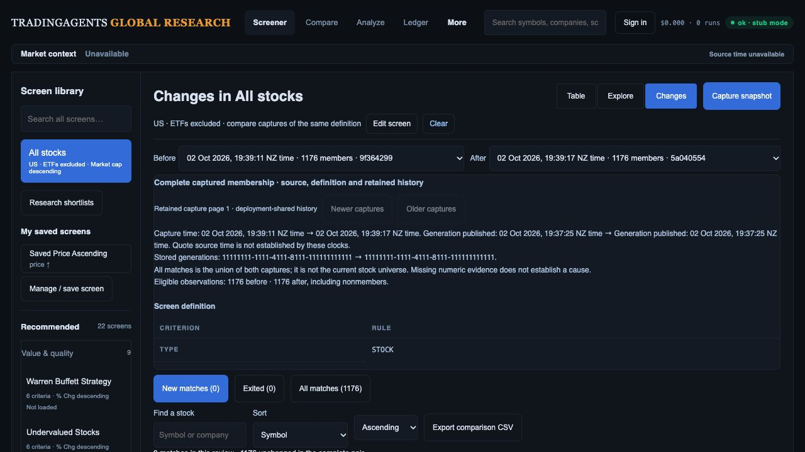

# Viewed-generation capture and export handoff

Local checkpoint, 2 October 2026, following `53e8d71`. This advances R01/R11 without closing the full generation, live-data or investment-team release gates. No production migration, merge or deployment occurred.

## Implemented behavior

The frontend stores generation identity with its in-memory and IndexedDB dataset, restores it on reload, and carries it into the rendered dataset context. A capture request binds its UUID and viewed generation once; retries and reload recovery retain that binding even after a newer dataset arrives. The binding is separate from the saved screen definition/history key, allowing two generations of the same screen to be compared.

The capture API accepts `X-Screener-Generation` for stored market screens. It reads that exact generation, records `source_generation_id` on the snapshot and the same identity on every eligible observation, and validates agreement when capturing or comparing. Reusing an existing capture request with a different explicit generation returns 409. Provider presets/watchlist capture requests reject market-generation pinning; their scope is distinct.

Generation publication, per-row cache receipt and actual provider source time remain separate. The table labels generation publication as such; Changes discloses both generation IDs and publication clocks. Legacy stored-cache labels remain distinct. A generation ID establishes the cloud quote cohort, not a shared financial/enrichment as-of date or currency qualification.

Local screener CSV/SpreadsheetML exports preserve canonical code, row generation and cache time where available. Server fallback downloads can pin the viewed generation. Comparison CSV appends both generation IDs. Formula-like string cells are guarded in local CSV without altering numeric values; Excel strings remain typed strings. Existing preset keys/rules/sorts, column choices and formats are retained; additive provenance columns do not remove selected columns.

## Verification

Full regressions pass **362 API/worker and 70 JavaScript tests**. Tests cover a newer publication before an old-generation capture, exact old membership/observation identity, same-ID retries, different-generation conflict, missing/mismatched provenance rejection, unsupported capture scope, frontend retry/reload binding and actual header transmission, and local export identity/formula guarding.

The synthetic generation preview ran on loopback port 8892 with an opt-in fixture in `research-preview.py`. It retains 1,200 classified synthetic securities (1,176 stocks/24 ETFs). Two actual browser captures produced compatible 1,176-observation baselines; both show the same known generation and zero entrants/exits. The first capture compared with a legacy version-2 fixture honestly requested another matching baseline.

The screenshot was saved and opened. Browser viewport is 1280 × 720; the later All-matches/export state measured scrollY 321 and document width 1280. No new phone, 200% zoom, keyboard, contrast, p95 or analyst-task acceptance is claimed. Final captured warning/error log was empty. Recorded chart fixtures still do not reconcile to the synthetic quoted prices.

Two actual CSV downloads were parsed and reconciled: 1,176 unique canonical stock identities, exact current screener ordering/numeric market caps/cache receipts, comparison pair IDs, generation IDs, publication clock labels, unchanged statuses and eligible counts. [Download evidence](design-gap-audit/generation-capture-checkpoint/download-check.json) records modification times and byte hashes. The native download event timed out; files and parsed contents support these scoped checks. Excel identity/type behavior is covered by automated tests here, not a new actual browser Excel download.

## Remaining checks

- [ ] Replace remaining direct compatibility readers in preset hydration and canonical hints/search. Preserve and label provider-screen membership and outside-generation live fills separately.
- [ ] Qualify captured generation provenance through actual native capture storage and PostgREST, including conflicting concurrent appends and publication during actual browser capture/download.
- [ ] Complete enrichment period/currency/snapshot policy and provider-wide financial/classification/source freshness qualification. This generation contract does not prove full exchange coverage.
- [ ] Qualify bounded generation retention with in-flight pages and captured references; migration/grants/schema cache/payload/timeout/cutover/rollback in the target environment.
- [ ] Reconcile every export scope/format (including actual Excel files), account/revision changes, interrupted downloads and formula handling across all server/client exports.
- [ ] Finish all R02–R15 mockup workflow, team review, factor context, capture schedules, Moomoo membership, original feature/device/accessibility/performance/analyst and production release gates.
