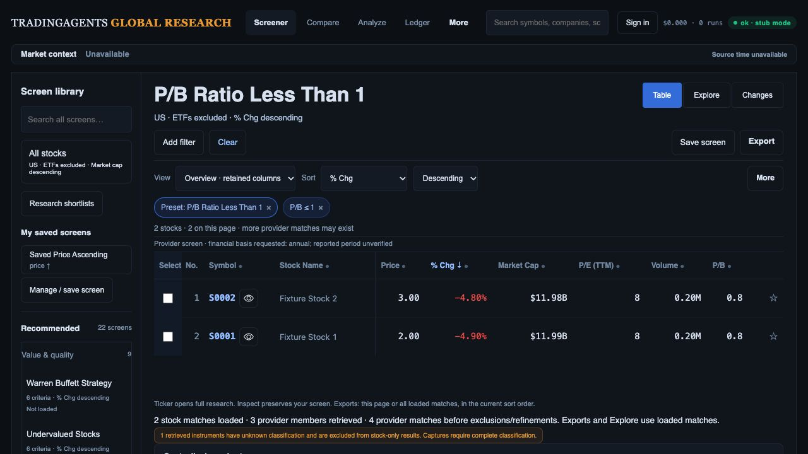
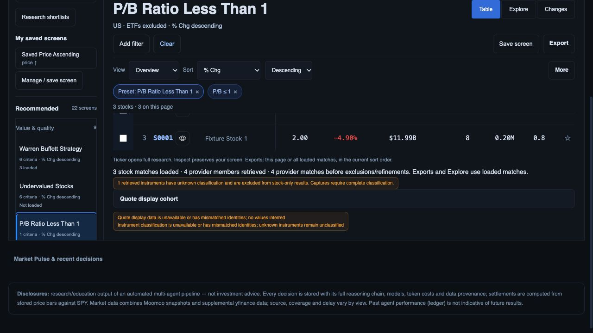
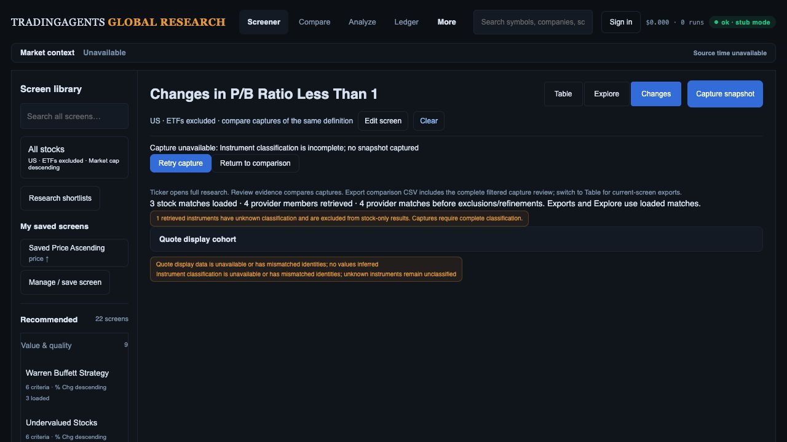
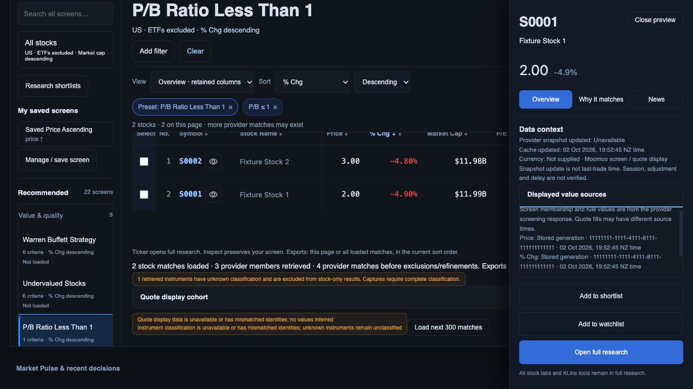

# Preset membership and quote display consistency

2 October 2026. Local implementation checkpoint after `a36441c`; not a production/data reconciliation sign-off. D01 source disclosure advances here; R01/R02 and the overall investment-team release remain open.

## Changes

- Provider screen membership retains its own retrieval clock and rule values. Missing display fields hydrate from one validated immutable quote generation; protected identity/rule fields are not copied over. Out-of-cohort live fills are separate sources and do not pretend to belong to that generation.
- Preset cache keys include resolved definition, sort, cursor and quote cohort. The generation reader validates before cache hits; replies are deep copies and the cache is bounded. Explicit subsequent-page hydration uses the first page's quote cohort.
- Zero remains zero. Copied snapshot observations survive only when canonical identity, final value and displayed-field origin agree. Malformed membership identities, criterion record structures, missing membership arrays and malformed pagination fail closed.
- Snapshot/basic-info hydration requires the exact requested canonical identity set. Mismatches copy no values/classifications. Provider membership stays available with a warning; unknown classifications remain excluded from stock-only results and block complete capture.
- Capture pins display hydration across provider pages and refuses a changed cohort. This is not proof that the provider's independently paged membership is frozen; that live contract remains to be qualified.
- UI separates loaded stock matches, retrieved provider members and provider totals before exclusions/refinements. It discloses unknown classifications and hydration warnings, quote display cohort and out-of-cohort members. Field source detail separates provider screening, stored generation, legacy cache, live snapshot and provider classification. Requested annual basis no longer claims a verified reported period.
- Later page responses/errors cannot replace a newer cache entry for the same preset. Warnings from earlier pages are retained rather than discarded after a later successful page.

## Verification

**378 API/worker tests and 75 JavaScript tests pass.** Tests cover publication/new-cache/explicit-old-cohort reads, cached-response mutation, corrupt-pointer rejection, valid zero and conflicting observations, mismatched quote/classification identities, malformed records/pagination, capture cohort changes, exact warning/count semantics, retained page warnings and late response/error races. Existing default/Clear/second-click, declared-sort and 22-preset preservation checks remain passing. `git diff --check` passes.

The browser used an opt-in offline harness at port 8893 with the real `screener_execute` and capture routes, validated synthetic generation storage and controlled provider transport. This mode does not replace the API route with the old fake execute function. It deliberately returns three members on page one (two classified stocks and one out-of-cohort unknown instrument), then a third classified stock on page two. It supplies wrong snapshot/basic-info identities to exercise safe warnings. It does not evaluate real financial screening rules or contact live providers.

1. **Preset opened:** two stock matches, three retrieved provider members, four provider matches, one unknown classification. % change descending retained. Header shows requested annual basis/reporting-period uncertainty.

   

2. **Next page loaded:** three stock matches, four retrieved members, unknown classification and earlier hydration warnings retained. DOM row order S0003, S0002, S0001. Quote cohort remains `11111111-1111-4111-8111-111111111111`; later successful page does not erase earlier warnings.

   

3. **Capture refused:** actual capture route reports “Instrument classification is incomplete; no snapshot captured.” Retry remains available; no fabricated complete baseline/exit comparison appears.

   

4. **Source detail inspected:** final frontend reload shows “Moomoo screen / quote display,” missing currency/source time honestly unavailable, and generation/cache source labels for hydrated values. Source disclosure is reachable through the inspector's scroll area while research actions remain visible.

   

All four saved screenshots were opened/inspected. Viewport 1280 × 720; first capture document scrollY 0, later page/source views scrolled. The sticky query header obscures some upper rows in scrolled captures; DOM row order is the paging evidence. A first full-page screenshot produced unsuitable sticky-layout evidence and was replaced with the accepted viewport image. Final warning/error browser log was empty.

## Remaining acceptance work

The running preview loaded the API before the final malformed-record guards; those guards have fresh full-suite qualification, not a fresh browser transport exercise. The final frontend source label was verified after reload. The preview uses fake database storage and synthetic/recorded instruments/chart values; no PostgREST/native capture, production Auth/migration, live financial period/currency, true provider pagination consistency, Moomoo count or latency acceptance is claimed.

Returning to Table after the preset cache expires currently reloads its first provider page, dropping previously loaded extra pages. That scope change is disclosed by counts but still needs explicit preservation/refresh UX in R04/R12/R11. Unknown/hydration warnings currently sit below the table; D02 must improve their above-fold hierarchy without inflating the default query stack. Full release gates, original KLine/financial/Compare coverage, selected exports, retention/cutover and rollout/rollback remain open in the [current plan](investment-workspace-current-gap-plan.md).
