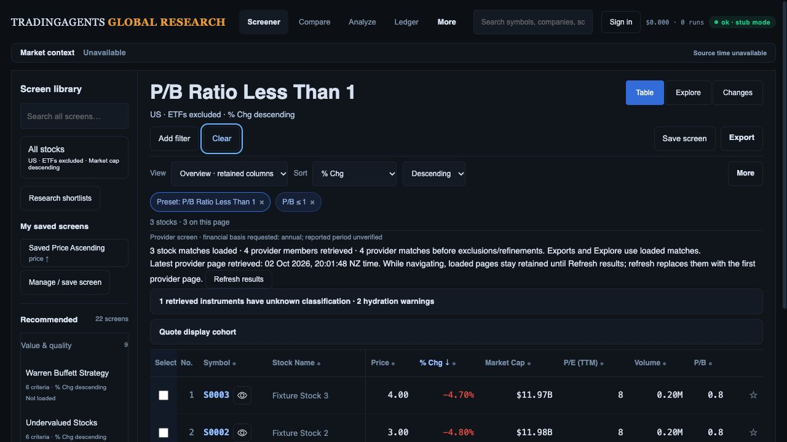
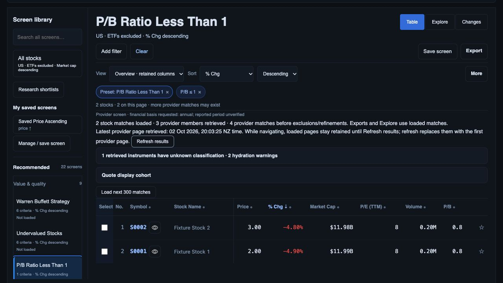

# Retained preset pages and explicit refresh

2 October 2026. Local checkpoint following `062bb60`; no production deploy or live financial acceptance.

## Implemented behavior

Opened provider results stay retained in memory during navigation, sorting, filtering, presentation changes and full-research return. Unopened warmed results still expire after 60 seconds. Intent warming cannot overwrite a retained result merely because it is older. Loading another page marks the merged result retained.

**Refresh results** explicitly requests the provider again, bypassing the API execution cache. It starts from page one with the current quote generation. Prior rows remain visible while refreshing; only success commits a replacement. Successful refresh resets the screen page to one and retains only selected identities still present in the qualified loaded result. Failed refresh preserves rows, page and selection and displays a retryable failure. Duplicate refreshes and simultaneous paging/refresh are guarded; a late result cannot replace a newer cache entry.

Provider scope, latest-page retrieval time, explicit refresh and data-quality summaries now appear before analytical rows. Unknown classification and hydration-warning counts are visible in a disclosure summary; detailed warnings and quote-generation context remain expandable. Provider retrieval time does not claim a common source time or immutable provider membership. While navigating, loaded pages stay retained; explicit refresh restarts at page one, as the UI states.

## Evidence

**379 API/worker tests and 81 JavaScript tests pass.** New tests exercise the actual home renderer with an expired retained result, intent warming, successful/failed refresh, selection revalidation, duplicate requests, newer-cache guards and paging/refresh exclusion. API verification proves explicit refresh bypasses a warm execution cache while retaining the validated quote cohort. The original reset, preset sort, retained-feature and export regression tests continue passing; whitespace check passes.

Fresh browser evidence uses port 8894, the actual API execute/capture routes and the controlled offline provider/generation harness. It uses fake storage and synthetic/recorded instrument/chart data; financial-rule correctness is not its purpose.

1. Opened the original P/B Ratio Less Than 1 preset, loaded page two and observed three stocks/four retrieved provider members, one unknown and two hydration warnings. % change descending retained. Latest provider page retrieval was displayed as 20:01:48 NZ time.

   

2. Moved to Explore (3 plotted of 3 loaded), Changes and back to Table. The same three identities/order remained. Opened S0003 full research, saw “US · 3 available matches,” then returned to Table with S0003/S0002/S0001 still present. Immediately following that return, explicit refresh produced a new 20:03:25 retrieval time and replaced the result with two stocks/three retrieved members and the next-page control. The return was approximately 97 seconds after the latest loaded page, exceeding the old 60-second cache window. Exact older-cache behavior is also verified by the automated two-minute-aged renderer test.

   

Both screenshots were saved/opened. Viewport 1280 × 720. The first accepted capture was at scrollY 0 with table top 570.2 CSS px in this filtered, warning-bearing state; the second captured scrolled context. This does not satisfy the matched 1487 × 1058 default table-position/complete D02 presentation gate. The source-data additions must be incorporated into that wider hierarchy refinement. Final captured warning/error browser log was empty.

## Remaining gates

Retention is in memory. Reload/deep-link reconstruction, complete origin focus/scroll restoration and saved-definition version transitions still require R04 qualification. The full-research fixture deliberately contains recorded company/chart responses unrelated to synthetic S0003; this verifies navigation/cohort retention only, not company or quote accuracy, original chart completeness, Options or Financials.

Failed-refresh/race cases have automated evidence; controlled browser failure and all device/AT/zoom/performance cases remain open. No current live provider counts, frozen provider-pagination guarantee, production migration/Auth/PostgREST/retention/cutover or merge/deploy qualification is claimed. All 22 original definitions remain binding. The [R01–R15 checklist](investment-workspace-current-gap-plan.md) still governs complete investment-team acceptance.
