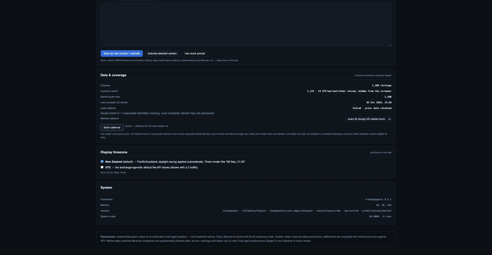
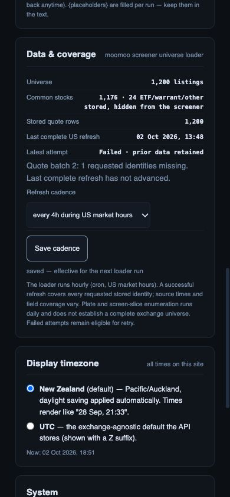

# Universe refresh integrity — 2 October 2026

**Latest R01 storage checkpoint:** [immutable generation publication contract](screener-generation-publication.md) passes native PostgreSQL lease/fencing/atomicity/replay/20,000-row tests and isolated Supabase advisors; 331 API/worker and 68 JavaScript regressions pass. The worker/API are not yet wired to generations, so runtime atomic publication, production migration and full release acceptance remain open.

This checkpoint strengthens the actual enumeration and quote producer. It is local development evidence, not a new deployment or proof of complete market coverage.

## Fixed behavior

- Quote batches require every requested canonical identity exactly once. Missing, duplicate, foreign-market, unrequested or malformed records fail before that batch writes. Empty cohorts and stored cohorts beyond the qualified 20,000-identity limit fail rather than silently truncate.
- Stored reads have deterministic code ordering and read one beyond the cap to detect overflow. Success records carry the requested count, exact sorted-code fingerprint and `requested_stored_universe` scope. A changed cohort cannot borrow a recent success clock.
- Plate traversal rejects repeated identities/cursors, empty pages carrying another cursor, malformed pagination and bound exhaustion. A valid terminal page retains every observed listing. Oversized pages/slices fail.
- Enumeration stages classification in memory before publishing rows. Missing/duplicate/foreign classification, plate failures and slice failures do not publish a newly collected partial cohort or advance enumeration success. Database chunk failure can still leave partial writes: publication is not atomic yet.
- Market-specific `universe_state_US` / `universe_state_HK` keys separate success/failure clocks. The legacy `universe_state` retains configured cadence; its ambiguous clocks are not adopted as either market's success. No saved screen, preset, watchlist or history is removed.
- Failed attempts preserve prior successful `last_quotes` and `last_result`, record a bounded validation reason/stage, emit failure and propagate to the job retry path. Successful earlier batches may have landed; those per-row cache clocks remain accurate. A failed attempt bypasses the cadence skip on retry. Naive, invalid and future success timestamps are not fresh.
- Settings separates stored row count, last complete US refresh and latest attempt. It no longer calls the last whole-cohort completion time quote source time. It discloses that a plate/screen-slice union does not establish complete exchange coverage.
- Save cadence now accepts the UI's JSON body: `ScheduleIn` is defined before route registration. Previously the endpoint interpreted `inp` as a required query parameter and returned 422. The API exposes per-market status with the shared configured cadence.
- Settings model selectors now fit phone width and touch controls have a 44 px minimum height. The stylesheet URL is versioned so a previously cached stylesheet cannot conceal the update.

## Evidence

Full API/worker suite: **331 passed**. JavaScript preservation suite: **68 passed**. Tests include a 401-identity two-batch refresh with a successful first batch and missing second batch, preservation of the previous success, a successful retry, US/HK isolation, legacy-clock refusal, changed-cohort invalidation, malformed paging, valid multi-page exhaustion, classification failure and incomplete storage acknowledgement. The original 22-preset golden and Clear/toggle/sort contracts remain in the passing suites.

The offline browser harness used `RESEARCH_REFRESH_FAILURE_FIXTURE=1`: 1,176 synthetic stocks/24 ETFs, a dated prior success and a missing-identity failure. Desktop cadence 4→8 and phone 8→4 both showed `saved — effective for the next loader run`; failure and prior success remained unchanged. Reloading the page retained the saved cadence in the synthetic server. No production setting was changed. Final browser warning/error log is empty.

Desktop screenshot was saved/opened at the normal 2249 × 1168 viewport. Initial phone checks showed document width 627 px caused by the long model selectors; the first CSS reload used a cached stylesheet. After the versioned stylesheet loaded, document width is **390 px at a 390 × 844 viewport**, with 338 px Settings content. Final phone screenshot was saved/opened; viewport reset. Screenshots 02/03 are diagnostic pre-fix evidence and must not be used for acceptance.

## Rollout and remaining acceptance

No schema migration is required for these additive settings JSON keys. Worker and API/UI must be rolled out together; legacy-only state intentionally shows no verified per-market success until the new worker completes a run. Existing rows are retained. No merge, deployment, live provider-wide refresh, native PostgreSQL rerun or production write occurred in this checkpoint.

- [ ] Introduce fenced same-market run ownership and atomic generation publication so simultaneous cron/manual refreshes cannot overwrite success state or expose a mixed generation.
- [ ] Qualify actual plate/basicinfo/pagination response contracts across US/HK, instrument classification exceptions and provider failures. Traversal completion is not complete-exchange coverage.
- [ ] Reconcile observed listing union versus authoritative eligible exchange listings, including delisted/inactive instruments, without deleting historical evidence or silently dropping saved memberships.
- [ ] Integrate verified generation status into capture completeness and user-facing coverage; preserve source/cache/report clocks separately.
- [ ] Qualify monetary currency, financial/session/derived-window evidence and provider-wide field coverage, then repeat dated like-for-like Moomoo membership/count reconciliation.
- [ ] Finish team/pair review, richer Explorer, opt-in capture schedules, full research/KLine/export preservation and accessibility/performance/release checks in the build plan.
